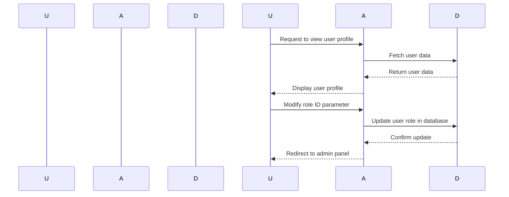

## Introduction to Access Control Vulnerabilities

Access control vulnerabilities are among the most critical issues in web application security. These vulnerabilities occur when an application fails to properly restrict access to resources based on user roles or permissions. In this chapter, we will delve deep into a specific type of access control vulnerability: the ability to modify user roles in a user profile. We will explore the underlying mechanisms, real-world examples, and practical steps to prevent such vulnerabilities.

### Background Theory

Access control is a fundamental aspect of web application security. It ensures that users can only perform actions and access resources that they are authorized to use. Typically, access control is implemented using roles and permissions. Each user is assigned a role, and each role has a set of permissions associated with it. For example, an "admin" role might have full access to all features, whereas a "user" role might have limited access.

#### Role-Based Access Control (RBAC)

Role-Based Access Control (RBAC) is a widely used method for implementing access control. In RBAC, users are assigned roles, and roles are assigned permissions. This separation allows for flexible management of permissions and reduces the complexity of assigning permissions directly to individual users.

### Real-World Example: CVE-2021-3116

One real-world example of an access control vulnerability is CVE-2021-3116, which affected the popular open-source project GitLab. In this case, an attacker could exploit a flaw in the role assignment mechanism to gain elevated privileges. Specifically, an authenticated user could modify their role to an admin role, thereby gaining unauthorized access to sensitive administrative functions.



### Lab Setup: User Role Modification

In the given lab, we are tasked with exploiting a broken access control vulnerability to access the admin panel and delete the user "Carlos." The lab environment is set up on the PortSwigger Web Security Academy platform. To begin, we need to log in using the provided credentials and navigate to the lab.

#### Logging In

To log in, we use the following credentials:

- Username: `your_username`
- Password: `your_password`

Once logged in, we navigate to the lab by following these steps:

1. Click on **Academy**.
2. Scroll down and select the **learning path**.
3. Scroll down again and select **Access Control**.
4. Finally, scroll down one more time to reach **Lab Number 4: User Role can be modified in user profile**.

### Exploiting the Vulnerability

The core of the vulnerability lies in the fact that the user role can be modified through a client-controllable parameter. This means that an attacker can manipulate this parameter to assign themselves an admin role.

#### Identifying the Vulnerable Parameter

To identify the vulnerable parameter, we need to inspect the HTTP request sent when modifying the user profile. Typically, this request would include a parameter that specifies the user role.

```http
POST /profile/edit HTTP/1.1
Host: example.com
Content-Type: application/x-www-form-urlencoded

username=your_username&role_id=1
```

Here, the `role_id` parameter is crucial. By default, a regular user might have a `role_id` of 1, while an admin might have a `role_id` of 2. The vulnerability arises because the application does not properly validate whether the user is authorized to change their role.

#### Exploiting the Vulnerability

To exploit this vulnerability, we need to modify the `role_id` parameter to a value that corresponds to an admin role. For example, changing the `role_id` to 2 would assign the user an admin role.

```http
POST /profile/edit HTTP/1.1
Host: example.com
Content-Type: application/x-www-form-urlencoded

username=your_username&role_id=2
```

After submitting this request, the user's role is updated to an admin role, allowing them to access the admin panel.

### Accessing the Admin Panel

With the user role now set to admin, we can access the admin panel at `/admin`. This panel is only accessible to users with a `role_id` of 2.

```http
GET /admin HTTP/1.1
Host: example.com
Cookie: session_id=your_session_id
```

Upon accessing the admin panel, we can see various administrative functions, including the ability to delete users. We can then proceed to delete the user "Carlos."

### How to Prevent / Defend

Preventing access control vulnerabilities requires a combination of proper validation, authorization checks, and secure coding practices.

#### Secure Coding Practices

1. **Input Validation**: Ensure that all input parameters are validated to prevent unauthorized modifications.
2. **Authorization Checks**: Implement robust authorization checks to ensure that users can only perform actions they are authorized to do.
3. **Least Privilege Principle**: Assign the minimum necessary permissions to users based on their roles.

#### Example: Secure Role Assignment

Here is an example of how to securely handle role assignments in a web application:

```python
# Vulnerable Code
def update_user_role(user_id, new_role_id):
    user = get_user_by_id(user_id)
    user.role_id = new_role_id
    save_user(user)

# Secure Code
def update_user_role(user_id, new_role_id):
    user = get_user_by_id(user_id)
    if is_authorized_to_change_role(user):
        user.role_id = new_role_id
        save_user(user)
    else:
        raise UnauthorizedAccessException("User is not authorized to change role")
```

In the secure code, we added an `is_authorized_to_change_role` function to check if the user is authorized to change their role. This prevents unauthorized modifications.

#### Configuration Hardening

1. **Disable Unnecessary Features**: Disable any features or functionalities that are not required for the application.
2. **Use Strong Authentication Mechanisms**: Implement strong authentication mechanisms, such as multi-factor authentication (MFA).

### Detection and Monitoring

Detecting access control vulnerabilities often involves monitoring and logging user activities. Tools like intrusion detection systems (IDS) and security information and event management (SIEM) systems can help in identifying suspicious activities.

#### Example: Logging Suspicious Activities

```python
import logging

logger = logging.getLogger(__name__)

def update_user_role(user_id, new_role_id):
    user = get_user_by_id(user_id)
    if is_authorized_to_change_role(user):
        user.role_id = new_role_id
        save_user(user)
    else:
        logger.warning(f"Unauthorized attempt to change role by user {user.username}")
        raise UnauthorizedAccessException("User is not authorized to change role")
```

In this example, we log any unauthorized attempts to change the role, which can help in detecting and responding to potential attacks.

### Hands-On Practice

For hands-on practice, you can use the following labs:

- **PortSwigger Web Security Academy**: This platform offers a variety of labs that cover different aspects of web security, including access control vulnerabilities.
- **OWASP Juice Shop**: This is an intentionally vulnerable web application that you can use to practice various security techniques.
- **DVWA (Damn Vulnerable Web Application)**: Another intentionally vulnerable web application that you can use to practice security testing.

By working through these labs, you can gain practical experience in identifying and exploiting access control vulnerabilities, as well as implementing secure coding practices to prevent them.

### Conclusion

Access control vulnerabilities are a significant threat to web applications. By understanding the underlying mechanisms, identifying real-world examples, and implementing secure coding practices, you can effectively prevent and mitigate these vulnerabilities. Always remember to validate inputs, implement robust authorization checks, and follow the principle of least privilege to ensure the security of your applications.

---
<!-- nav -->
[[Web Security (PortSwigger)/12-Access Control Vulnerabilities/05-Lab 4 User role can be modified in user profile/00-Overview|Overview]] | [[02-Access Control Vulnerabilities Modifying User Roles|Access Control Vulnerabilities Modifying User Roles]]
