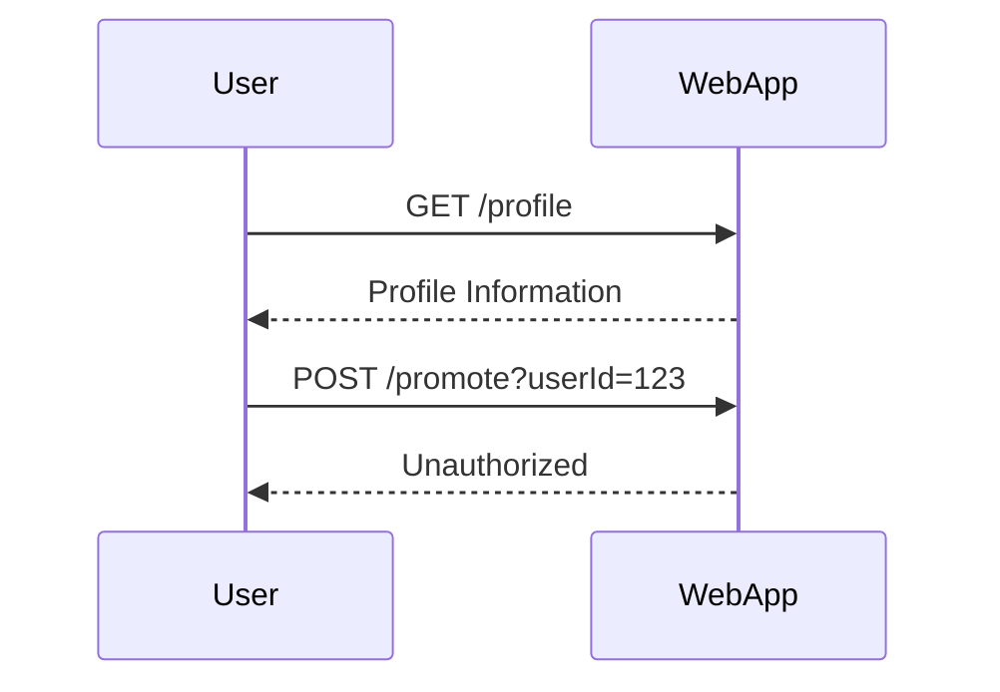
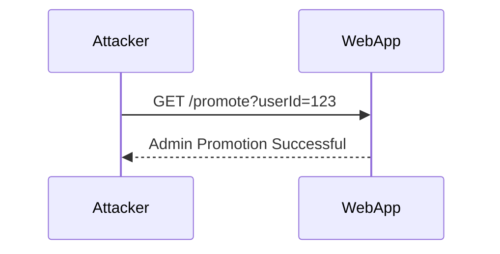

## Understanding Access Control Vulnerabilities

Access control is a fundamental aspect of web application security. It ensures that users have appropriate permissions to access specific resources or perform certain actions within an application. However, when implemented incorrectly, these controls can be circumvented, leading to serious security vulnerabilities. In this section, we will delve deep into method-based access control vulnerabilities and explore how they can be exploited and prevented.

### Background Theory

Access control mechanisms typically involve two main components:

1. **Authentication**: Verifying the identity of a user.
2. **Authorization**: Determining what actions a user is allowed to perform based on their authenticated identity.

In web applications, these mechanisms often rely on HTTP methods (GET, POST, PUT, DELETE, etc.) to differentiate between various types of operations. For instance, a GET request might be used to retrieve data, while a POST request might be used to modify data.

#### HTTP Methods and Their Roles

- **GET**: Used to request data from a specified resource. This method should not cause any changes to the data on the server.
- **POST**: Used to send data to the server to create or update a resource. This method can cause changes to the data on the server.
- **PUT**: Similar to POST, but typically used to replace an entire resource.
- **DELETE**: Used to delete a specified resource.

### Method-Based Access Control

Method-based access control restricts certain actions based on the HTTP method used. For example, an application might allow only administrators to perform a POST request to promote a user to an administrator role. However, if this control is not properly enforced across all methods, it can lead to vulnerabilities.

#### Example Scenario

Consider a web application where users can view their profile information via a GET request and promote themselves to an administrator via a POST request. The application checks the user's role before allowing the promotion action.



In this scenario, the application correctly denies the promotion attempt due to insufficient privileges. However, if the application only checks the user's role for POST requests and not for other methods, an attacker might exploit this oversight.

### Exploiting Method-Based Access Control

If the access control mechanism is only implemented for POST requests but not for GET requests, an attacker might attempt to bypass the control by using a GET request instead.

#### Real-World Example

A recent example of such a vulnerability occurred in a popular web application framework, where the developers failed to enforce access control checks for GET requests. This led to a situation where an attacker could promote themselves to an administrator by simply changing the HTTP method from POST to GET.



### Detailed Attack Chain

Let's break down the steps an attacker might take to exploit this vulnerability:

1. **Identify the Vulnerable Endpoint**:
   - The attacker identifies an endpoint that performs a sensitive action, such as promoting a user to an administrator.
   - They note that this endpoint is protected by access control checks for POST requests.

2. **Test the Access Control Mechanism**:
   - The attacker attempts to perform the sensitive action using a POST request and receives an unauthorized response.
   - They then try the same action using a GET request.

3. **Exploit the Vulnerability**:
   - If the GET request is not properly checked, the attacker successfully promotes themselves to an administrator.

### Full HTTP Request and Response

Here is a detailed example of the HTTP request and response for both the POST and GET methods:

#### POST Request

```http
POST /promote?userId=123 HTTP/1.1
Host: example.com
Content-Type: application/x-www-form-urlencoded
Cookie: session_id=abc123

action=promote_to_admin
```

#### POST Response

```http
HTTP/1.1 403 Forbidden
Date: Tue, 21 Mar 2023 12:00:00 GMT
Server: Apache/2.4.41 (Ubuntu)
Content-Length: 29
Content-Type: text/html; charset=UTF-8

Unauthorized: Insufficient privileges
```

#### GET Request

```http
GET /promote?userId=123&action=promote_to_admin HTTP/1.1
Host: example.com
Cookie: session_id=abc123
```

#### GET Response

```http
HTTP/1.1 200 OK
Date: Tue, 21 Mar 2023 12:00:00 GMT
Server: Apache/2.4.41 (Ubuntu)
Content-Length: 34
Content-Type: text/html; charset=UTF-8

Admin Promotion Successful
```

### How to Prevent / Defend

To prevent method-based access control vulnerabilities, it is crucial to ensure that access control checks are consistently applied across all HTTP methods. Here are some best practices:

1. **Consistent Access Control Checks**:
   - Ensure that access control checks are performed for all HTTP methods, not just for specific ones like POST.
   - Use a centralized access control mechanism that applies to all endpoints.

2. **Secure Coding Practices**:
   - Implement role-based access control (RBAC) to manage user permissions.
   - Use a framework or library that enforces consistent access control policies.

3. **Configuration Hardening**:
   - Configure your web server and application framework to deny unauthorized access.
   - Use security headers like `X-Frame-Options`, `Content-Security-Policy`, and `Strict-Transport-Security` to enhance security.

4. **Regular Audits and Testing**:
   - Conduct regular security audits and penetration testing to identify and mitigate access control vulnerabilities.
  - Use tools like Burp Suite, OWASP ZAP, and Metasploit to test for method-based access control issues.

### Secure Code Examples

Here is an example of how to implement consistent access control checks in a Python Flask application:

#### Vulnerable Code

```python
from flask import Flask, request

app = Flask(__name__)

@app.route('/promote', methods=['POST'])
def promote_user():
    if request.method == 'POST':
        user_id = request.form['userId']
        if check_admin_privileges(user_id):
            return "Admin Promotion Successful"
        else:
            return "Unauthorized: Insufficient privileges", 403
    else:
        return "Method Not Allowed", 405

if __name__ == '__main__':
    app.run()
```

#### Secure Code

```python
from flask import Flask, request

app = Flask(__name__)

def check_admin_privileges(user_id):
    # Placeholder function to check admin privileges
    return True

@app.before_request
def before_request():
    if request.path == '/promote':
        if not check_admin_privileges(request.args.get('userId')):
            return "Unauthorized: Insufficient privileges", 403

@app.route('/promote', methods=['GET', 'POST'])
def promote_user():
    user_id = request.args.get('userId')
    if check_admin_privileges(user_id):
        return "Admin Promotion Successful"
    else:
        return "Unauthorized: Insufficient privileges", 200

if __name__ == '__main__':
    app.run()
```

### Detection and Prevention Tools

- **Burp Suite**: A comprehensive toolkit for web application security testing.
- **OWASP ZAP**: An open-source web application security scanner.
- **Metasploit**: A penetration testing framework that includes modules for detecting and exploiting access control vulnerabilities.

### Hands-On Labs

For practical experience with method-based access control vulnerabilities, consider the following labs:

- **PortSwigger Web Security Academy**: Offers interactive labs on access control vulnerabilities.
- **OWASP Juice Shop**: A deliberately insecure web application for practicing web security skills.
- **DVWA (Damn Vulnerable Web Application)**: A PHP/MySQL web application that demonstrates common web application vulnerabilities.

By thoroughly understanding and implementing the principles discussed in this chapter, you can significantly reduce the risk of method-based access control vulnerabilities in your web applications.

---
<!-- nav -->
[[Web Security (PortSwigger)/12-Access Control Vulnerabilities/07-Lab 6 Method based access control can be circumvented/07-Real-World Examples|Real-World Examples]] | [[Web Security (PortSwigger)/12-Access Control Vulnerabilities/07-Lab 6 Method based access control can be circumvented/00-Overview|Overview]] | [[Web Security (PortSwigger)/12-Access Control Vulnerabilities/07-Lab 6 Method based access control can be circumvented/09-Understanding the Lab Environment|Understanding the Lab Environment]]
