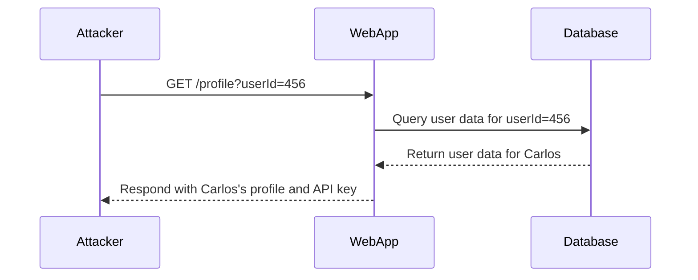

## Introduction to Access Control Vulnerabilities

Access control vulnerabilities are among the most critical issues in web application security. They allow attackers to bypass intended restrictions and gain unauthorized access to sensitive data or perform actions that should be restricted to specific roles or privileges. One common type of access control vulnerability is horizontal privilege escalation, which occurs when an attacker can access resources belonging to other users at the same privilege level.

In this chapter, we will delve deep into the concept of horizontal privilege escalation, focusing on a specific scenario where the user ID is controlled by a request parameter. We will explore the underlying mechanisms, real-world examples, and provide detailed steps to both exploit and defend against such vulnerabilities.

### Horizontal Privilege Escalation

Horizontal privilege escalation refers to a situation where an attacker can access resources or perform actions that are intended to be restricted to other users at the same privilege level. This contrasts with vertical privilege escalation, where an attacker gains elevated privileges.

#### Example Scenario

Consider a web application that allows users to view their personal profiles. Each profile is identified by a unique user ID, which is passed as a parameter in the URL. For instance:

```
https://example.com/profile?userId=123
```

If the application does not properly validate the user ID, an attacker could manipulate the `userId` parameter to view other users' profiles. This is a classic case of horizontal privilege escalation.

### Lab Setup

The lab we will be working with is titled "User ID Controlled by Request Parameter." This lab is part of the Web Security Academy series available on PortSwigger. To access the lab, follow these steps:

1. Visit the URL: `https://portswigger.net/web-security`.
2. Click on the "Sign Up" button to create an account.
3. Once logged in, navigate to the "Academy."
4. Select the "Learning Path."
5. Choose the "Access Control" module.
6. Navigate to the seventh lab titled "User ID Controlled by Request Parameter."

### Lab Objective

The objective of this lab is to exploit a horizontal privilege escalation vulnerability to obtain the API key for the user named "Carlos." The lab provides credentials for a regular user, and your task is to manipulate the request parameters to access Carlos's profile and retrieve his API key.

### Understanding the Vulnerability

To understand how this vulnerability works, let's break down the components involved:

1. **User ID Parameter**: The user ID is passed as a parameter in the URL. For example:
    ```plaintext
    https://example.com/profile?userId=123
    ```
2. **Lack of Validation**: The application does not properly validate whether the user making the request is authorized to view the specified user ID. This allows an attacker to manipulate the `userId` parameter to access other users' profiles.

### Exploiting the Vulnerability

To exploit this vulnerability, we need to manipulate the `userId` parameter to access Carlos's profile. Here’s a step-by-step guide:

1. **Identify the User ID Parameter**:
    - First, identify the parameter used to specify the user ID. In our example, it is `userId`.

2. **Manipulate the Parameter**:
    - Change the value of `userId` to the ID of the target user (Carlos). For instance:
        ```plaintext
        https://example.com/profile?userId=456
        ```

3. **Observe the Response**:
    - Send the modified request and observe the response. If the application does not properly validate the user ID, you should be able to access Carlos's profile.

### Full HTTP Request and Response

Let's look at a complete HTTP request and response to illustrate this process:

#### HTTP Request

```http
GET /profile?userId=456 HTTP/1.1
Host: example.com
User-Agent: Mozilla/5.0 (Windows NT 10.0; Win64; x64) AppleWebKit/537.36 (KHTML, like Gecko) Chrome/91.0.4472.124 Safari/537.36
Accept: text/html,application/xhtml+xml,application/xml;q=0.9,image/avif,image/webp,image/apng,*/*;q=0.8,application/signed-exchange;v=b3;q=0.9
Accept-Language: en-US,en;q=0.9
Cookie: session_id=abc123
Connection: close
```

#### HTTP Response

```http
HTTP/1.1 200 OK
Date: Tue, 21 Sep 2021 12:00:00 GMT
Server: Apache/2.4.41 (Ubuntu)
Content-Type: text/html; charset=UTF-8
Content-Length: 1234
X-Frame-Options: SAMEORIGIN
Set-Cookie: session_id=abc123; Path=/; HttpOnly
Vary: Accept-Encoding
Connection: close

<!DOCTYPE html>
<html>
<head>
    <title>User Profile</title>
</head>
<body>
    <h1>User Profile</h1>
    <div>
        <p>Name: Carlos</p>
        <p>API Key: abcdefghijklmnopqrstuvwxyz1234567890</p>
    </div>
</body>
</html>
```

### Mermaid Diagram: Attack Flow

A mermaid diagram can help visualize the attack flow:



### Real-World Examples

Several real-world examples highlight the severity of horizontal privilege escalation vulnerabilities:

1. **CVE-2021-21972**: A vulnerability in the WordPress plugin "WPForms" allowed attackers to access and modify forms created by other users. This was due to improper validation of the form ID parameter.
2. **CVE-2020-14882**: A vulnerability in the Atlassian Jira software allowed users to access and modify issues assigned to other users by manipulating the issue ID parameter.

### How to Prevent / Defend

Preventing horizontal privilege escalation requires robust access control mechanisms. Here are some best practices:

1. **Validate User Permissions**: Ensure that the application validates whether the user making the request is authorized to access the specified resource.
2. **Use Role-Based Access Control (RBAC)**: Implement RBAC to restrict access based on user roles and permissions.
3. **Audit Logs**: Maintain audit logs to track access attempts and detect suspicious activity.
4. **Input Validation**: Validate all input parameters to ensure they conform to expected formats and ranges.

### Secure Coding Fixes

Here’s an example of how to implement proper validation in a web application:

#### Vulnerable Code

```python
@app.route('/profile')
def profile():
    user_id = request.args.get('userId')
    user_data = get_user_data(user_id)
    return render_template('profile.html', user_data=user_data)
```

#### Secure Code

```python
@app.route('/profile')
def profile():
    user_id = request.args.get('userId')
    current_user_id = session['user_id']
    
    if int(user_id) != current_user_id:
        abort(403)  # Forbidden
    
    user_data = get_user_data(user_id)
    return render_template('profile.html', user_data=user_data)
```

### Configuration Hardening

Ensure that your web server and application configurations are hardened to prevent unauthorized access:

#### Nginx Configuration

```nginx
server {
    listen 80;
    server_name example.com;

    location /profile {
        if ($arg_userId !~ "^[0-9]+$") {
            return 403;
        }
        
        proxy_pass http://backend;
    }
}
```

### Detection

Detecting horizontal privilege escalation vulnerabilities requires monitoring and logging:

1. **Web Application Firewalls (WAFs)**: Use WAFs to detect and block suspicious requests.
2. **Security Information and Event Management (SIEM)**: Implement SIEM systems to correlate and analyze security events.
3. **Regular Audits**: Conduct regular security audits to identify and mitigate vulnerabilities.

### Hands-On Practice

For hands-on practice, consider the following labs:

- **PortSwigger Web Security Academy**: Offers a variety of labs to practice exploiting and defending against access control vulnerabilities.
- **OWASP Juice Shop**: Provides a vulnerable web application to practice various security techniques.
- **DVWA (Damn Vulnerable Web Application)**: Another popular platform for practicing web application security.

By thoroughly understanding and practicing these concepts, you can significantly enhance your ability to identify and mitigate access control vulnerabilities in web applications.

---

This chapter provides a comprehensive overview of horizontal privilege escalation vulnerabilities, focusing on the scenario where the user ID is controlled by a request parameter. By understanding the underlying mechanisms, real-world examples, and implementing robust security measures, you can effectively prevent and defend against such vulnerabilities.

---
<!-- nav -->
[[Web Security (PortSwigger)/12-Access Control Vulnerabilities/08-Lab 7 User ID controlled by request parameter/00-Overview|Overview]] | [[02-Access Control Vulnerabilities User ID Controlled by Request Parameter|Access Control Vulnerabilities User ID Controlled by Request Parameter]]
