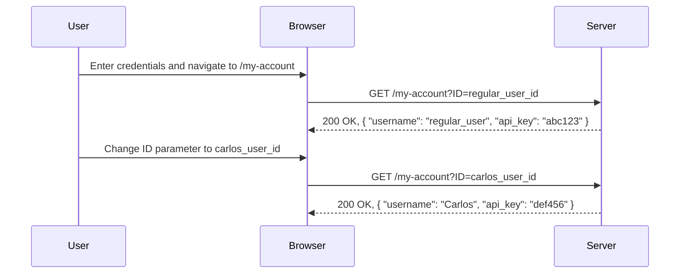

## Access Control Vulnerabilities: User ID Controlled by Request Parameter

### Background Theory

Access control vulnerabilities occur when an application fails to properly restrict access to resources based on user identity and permissions. One common type of access control vulnerability is when the user ID is controlled by a request parameter, allowing an attacker to manipulate the parameter to gain unauthorized access to other users' data.

In the context of web applications, access control is crucial for maintaining the confidentiality and integrity of user data. When an application does not verify that the user making a request is authorized to access the specified resource, it can lead to horizontal privilege escalation, where an attacker gains access to another user's data within the same role or permission level.

### Understanding the Scenario

Let's break down the scenario described in the lecture:

1. **User Login**: The application allows users to log in using their credentials.
2. **API Key Retrieval**: After logging in, the user can retrieve their API key from the `/my-account` page.
3. **Request Parameter**: The request to the `/my-account` page includes an `ID` parameter, which is used to fetch the user's data.
4. **Potential Vulnerability**: If the application does not validate that the `ID` parameter corresponds to the logged-in user, an attacker can manipulate the `ID` parameter to access another user's data.

### Analyzing the Request

To understand the vulnerability, let's examine the HTTP request and response involved in retrieving the API key.

#### HTTP Request

```http
GET /my-account?ID=regular_user_id HTTP/1.1
Host: example.com
Cookie: session=valid_session_cookie
```

#### HTTP Response

```http
HTTP/1.1 200 OK
Content-Type: application/json

{
    "username": "regular_user",
    "api_key": "abc123"
}
```

### Identifying the Vulnerability

The vulnerability arises because the application does not verify that the `ID` parameter matches the user associated with the session cookie. This allows an attacker to change the `ID` parameter to any valid user ID and retrieve that user's data.

#### Exploitation Steps

1. **Identify the Parameter**: Determine which parameter controls the user data retrieval.
2. **Manipulate the Parameter**: Change the `ID` parameter to a different user's ID.
3. **Verify Access**: Check if the application returns the data for the manipulated user.

### Real-World Example

A recent example of such a vulnerability was found in a popular e-commerce platform, leading to a breach where attackers could access other users' orders and personal information. This vulnerability was exploited by manipulating the `user_id` parameter in the URL, bypassing the intended access control mechanism.

### Detailed Exploit Walkthrough

Let's walk through the detailed steps of exploiting this vulnerability using the example provided in the lecture.

#### Step 1: Log In with Regular Account

First, log in with the regular account provided and navigate to the `/my-account` page.

#### Step 2: Analyze the Request

Observe the HTTP request sent to the `/my-account` page. Note the `ID` parameter and the session cookie.

#### Step 3: Manipulate the `ID` Parameter

Change the `ID` parameter to the desired user's ID (e.g., `Carlos`).

#### Step 4: Send the Modified Request

Send the modified request to the server and observe the response.

#### HTTP Request with Manipulated `ID`

```http
GET /my-account?ID=carlos_user_id HTTP/1.1
Host: example.com
Cookie: session=valid_session_cookie
```

#### Expected HTTP Response

```http
HTTP/1.1 200 OK
Content-Type: application/json

{
    "username": "Carlos",
    "api_key": "def456"
}
```

### Mermaid Diagram: Attack Chain



### Common Pitfalls

1. **Insufficient Input Validation**: Failing to validate the `ID` parameter against the session cookie.
2. **Hardcoded Default Values**: Using default values for the `ID` parameter that can be easily guessed or enumerated.
3. **Inconsistent Access Control**: Implementing access control checks inconsistently across different parts of the application.

### How to Prevent / Defend

#### Detection

1. **Logging and Monitoring**: Implement logging and monitoring to detect unusual patterns in requests, such as frequent changes in the `ID` parameter.
2. **Security Scanning Tools**: Use tools like Burp Suite, OWASP ZAP, or commercial scanners to identify access control vulnerabilities.

#### Prevention

1. **Validate User Identity**: Ensure that the `ID` parameter matches the user associated with the session cookie.
2. **Use Secure Session Management**: Implement strong session management practices, including secure cookies and session timeouts.
3. **Role-Based Access Control (RBAC)**: Implement RBAC to ensure that users can only access resources appropriate to their roles.

#### Secure Coding Fixes

##### Vulnerable Code

```python
@app.route('/my-account')
def my_account():
    user_id = request.args.get('ID')
    user_data = get_user_data(user_id)
    return jsonify(user_data)
```

##### Secure Code

```python
@app.route('/my-account')
def my_account():
    session_user_id = session['user_id']
    requested_user_id = request.args.get('ID')
    
    if requested_user_id != session_user_id:
        abort(403)  # Forbidden
    
    user_data = get_user_data(requested_user_id)
    return jsonify(user_data)
```

### Configuration Hardening

1. **Web Application Firewall (WAF)**: Configure a WAF to block suspicious requests, such as those with manipulated `ID` parameters.
2. **Rate Limiting**: Implement rate limiting to prevent brute-force attacks on the `ID` parameter.

### Hands-On Labs

For practical experience with this vulnerability, consider the following labs:

- **PortSwigger Web Security Academy**: Offers a module on access control vulnerabilities, including horizontal privilege escalation.
- **OWASP Juice Shop**: Provides a vulnerable web application where you can practice identifying and exploiting access control issues.
- **DVWA (Damn Vulnerable Web Application)**: Contains various access control vulnerabilities that can be exploited and fixed.

By thoroughly understanding and practicing these concepts, you can effectively identify and mitigate access control vulnerabilities in web applications.

---
<!-- nav -->
[[Web Security (PortSwigger)/12-Access Control Vulnerabilities/08-Lab 7 User ID controlled by request parameter/01-Introduction to Access Control Vulnerabilities|Introduction to Access Control Vulnerabilities]] | [[Web Security (PortSwigger)/12-Access Control Vulnerabilities/08-Lab 7 User ID controlled by request parameter/00-Overview|Overview]] | [[Web Security (PortSwigger)/12-Access Control Vulnerabilities/08-Lab 7 User ID controlled by request parameter/03-Access Control Vulnerabilities|Access Control Vulnerabilities]]
