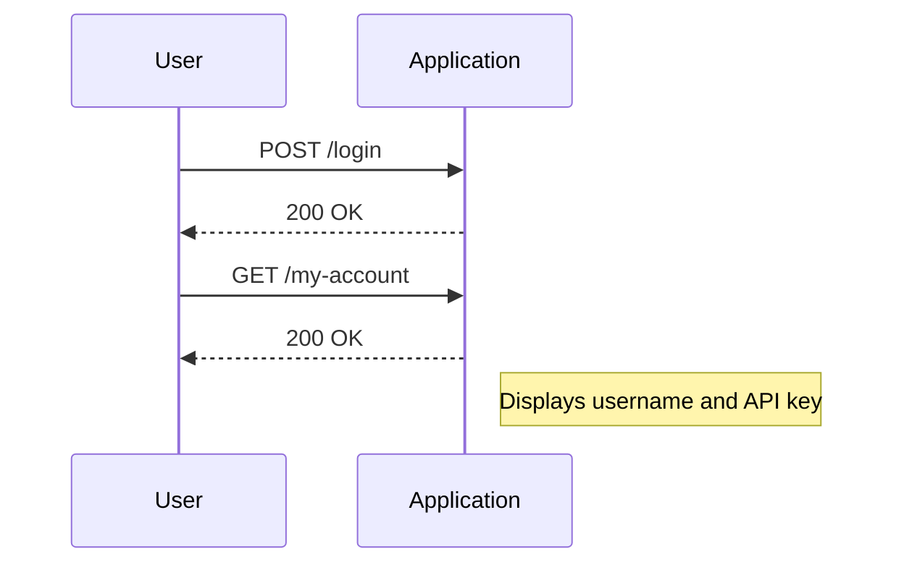
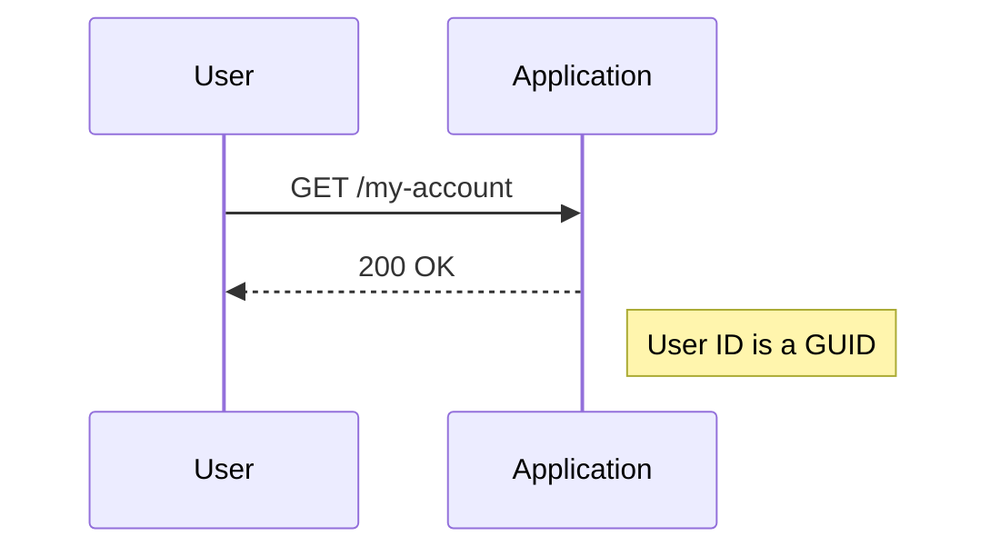
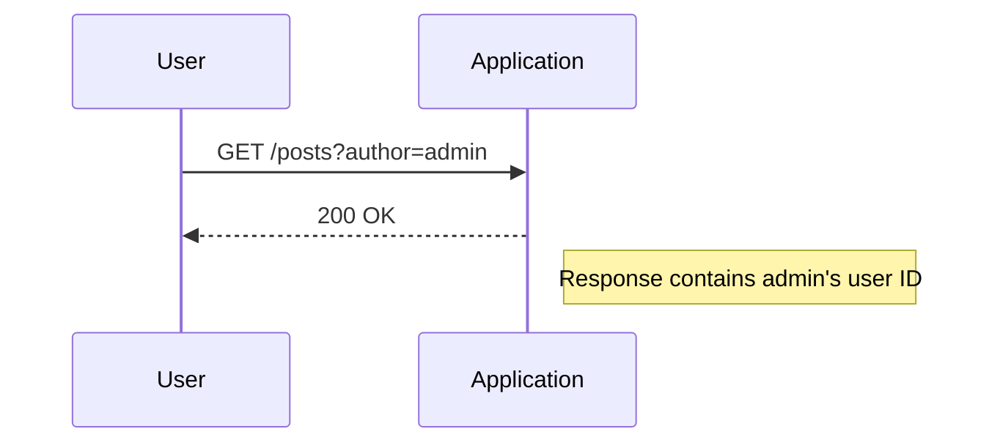

## Access Control Vulnerabilities: User ID Controlled by Request Parameter with Unpredictable User IDs

### Background Theory

Access control vulnerabilities occur when an application fails to properly restrict access to resources based on the identity and permissions of the user. One common type of access control vulnerability is when a user ID is controlled by a request parameter, which can allow an attacker to manipulate the parameter to gain unauthorized access to other users' accounts.

In this scenario, the user ID is not predictable or guessable, making it difficult for an attacker to brute-force the ID. However, if the user ID is leaked through some part of the application, an attacker can use this information to access other users' accounts.

### Understanding the Scenario

Let's break down the scenario described in the lecture:

1. **Logging Page**: The application has a logging page where users can log in using provided credentials.
2. **My Account Functionality**: After logging in, users can access their account details, including a username and an API key.
3. **Unpredictable User IDs**: The user ID is not predictable or guessable, meaning it cannot be brute-forced.
4. **Leaked User ID**: The user ID is leaked through the application, specifically when selecting a post written by another user.

### Detailed Explanation

#### Logging Page and My Account Functionality

When a user logs in, they are presented with a page that displays their account details. This typically includes:

- **Username**: The unique identifier for the user.
- **API Key**: A secret token used for API authentication.



#### Unpredictable User IDs

The user ID is generated in such a way that it is not predictable or guessable. This is often achieved using a globally unique identifier (GUID), which is a 128-bit number used to identify information in computer systems.



#### Leaked User ID

Despite the unpredictability of the user ID, it is leaked through the application when selecting a post written by another user. This can be seen in the request made by the application when selecting a post.



### Real-World Examples

#### Recent CVEs and Breaches

One recent example of an access control vulnerability involving user IDs is CVE-2021-3129, which affected the WordPress REST API. In this case, an attacker could manipulate the `author` parameter to access posts written by other users, leading to unauthorized access to sensitive information.

Another example is the breach of the LinkedIn API in 2019, where an attacker exploited an access control vulnerability to access user data by manipulating the `userId` parameter.

### Complete Code Example

Let's consider a hypothetical web application that allows users to view posts written by other users. The application uses a predictable user ID, which makes it vulnerable to access control attacks.

#### Vulnerable Code

```python
@app.route('/posts/<int:user_id>')
def view_posts(user_id):
    posts = get_posts_by_user(user_id)
    return render_template('posts.html', posts=posts)
```

#### Full HTTP Request and Response

```http
GET /posts/123 HTTP/1.1
Host: example.com
Cookie: session=abc123

HTTP/1.1 200 OK
Content-Type: text/html; charset=utf-8
Set-Cookie: session=abc123; Path=/; HttpOnly

<!DOCTYPE html>
<html>
<head>
    <title>User Posts</title>
</head>
<body>
    <h1>Posts by User 123</h1>
    <ul>
        <li>Post 1</li>
        <li>Post 2</li>
    </ul>
</body>
</html>
```

### How to Prevent / Defend

#### Detection

To detect access control vulnerabilities, you can perform the following steps:

1. **Static Analysis**: Use static analysis tools to scan the codebase for potential access control issues.
2. **Dynamic Analysis**: Perform dynamic analysis by testing the application with different user roles and permissions.
3. **Penetration Testing**: Conduct penetration testing to identify vulnerabilities that can be exploited by attackers.

#### Prevention

To prevent access control vulnerabilities, follow these best practices:

1. **Use Non-Predictable User IDs**: Generate user IDs using a GUID or a similar non-predictable method.
2. **Validate User Permissions**: Ensure that the application validates user permissions before allowing access to resources.
3. **Implement Role-Based Access Control (RBAC)**: Use RBAC to manage user permissions and ensure that users can only access resources they are authorized to access.

#### Secure Code Fix

Here is an example of how to fix the vulnerable code by implementing proper access control:

```python
from flask import abort

@app.route('/posts/<int:user_id>')
def view_posts(user_id):
    if not is_authorized(user_id):
        abort(403)
    posts = get_posts_by_user(user_id)
    return render_template('posts.html', posts=posts)

def is_authorized(user_id):
    # Check if the current user is authorized to view posts by the specified user
    current_user_id = get_current_user_id()
    return current_user_id == user_id or is_admin(current_user_id)
```

#### Full HTTP Request and Response (Fixed Version)

```http
GET /posts/123 HTTP/1.1
Host: example.com
Cookie: session=abc123

HTTP/1.1 403 Forbidden
Content-Type: text/html; charset=utf-8
Set-Cookie: session=abc123; Path=/; HttpOnly

<!DOCTYPE html>
<html>
<head>
    <title>Forbidden</title>
</head>
<body>
    <h1>403 Forbidden</h1>
    <p>You are not authorized to view this resource.</p>
</body>
</html>
```

### Common Pitfalls

#### Brute-Forcing User IDs

Even though user IDs are unpredictable, an attacker might attempt to brute-force the IDs by making numerous requests to the application. To mitigate this, implement rate limiting and account lockout mechanisms.

#### Insecure Direct Object References (IDOR)

An insecure direct object reference occurs when an application exposes internal implementation details, such as database keys or file paths, to the user. This can lead to unauthorized access if the user can manipulate these references.

### Hands-On Labs

To practice and understand access control vulnerabilities, you can use the following labs:

- **PortSwigger Web Security Academy**: Offers interactive labs on various web security topics, including access control vulnerabilities.
- **OWASP Juice Shop**: A deliberately insecure web application for security training.
- **DVWA (Damn Vulnerable Web Application)**: A PHP/MySQL web application that is riddled with vulnerabilities for educational purposes.

By thoroughly understanding and practicing these concepts, you can effectively prevent and defend against access control vulnerabilities in web applications.

---
<!-- nav -->
[[Web Security (PortSwigger)/12-Access Control Vulnerabilities/09-Lab 8 User ID controlled by request parameter with unpredictable user IDs/01-Introduction to Access Control Vulnerabilities|Introduction to Access Control Vulnerabilities]] | [[Web Security (PortSwigger)/12-Access Control Vulnerabilities/09-Lab 8 User ID controlled by request parameter with unpredictable user IDs/00-Overview|Overview]] | [[Web Security (PortSwigger)/12-Access Control Vulnerabilities/09-Lab 8 User ID controlled by request parameter with unpredictable user IDs/03-Access Control Vulnerabilities|Access Control Vulnerabilities]]
