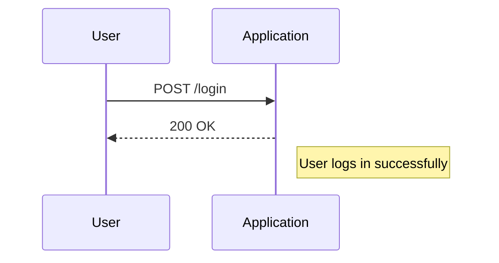

## Understanding Access Control Vulnerabilities

Access control vulnerabilities occur when an application fails to properly restrict access to resources based on user roles or permissions. This can lead to unauthorized users gaining access to sensitive information or performing actions they should not be allowed to perform. One common type of access control vulnerability is when user IDs are controlled by request parameters, especially when these IDs are unpredictable.

### Background Theory

Access control is a fundamental aspect of web security. It ensures that users can only access the resources and perform the actions that they are authorized to do. Access control mechanisms typically involve authentication (verifying the identity of the user) and authorization (granting or denying access based on the user's role).

In web applications, access control is often implemented using session management and role-based access control (RBAC). However, if the implementation is flawed, it can lead to serious security issues.

### Real-World Examples

One notable example of an access control vulnerability is the case of Equifax, where a flaw in their web application allowed attackers to access sensitive personal information of millions of users. The vulnerability was due to a failure in proper access control, allowing unauthorized access to user data.

Another example is the breach at Capital One, where an attacker exploited a misconfigured server to gain unauthorized access to sensitive customer data. This breach highlighted the importance of robust access control mechanisms.

### Lab Setup

To understand and demonstrate the vulnerability, we will use a hypothetical web application. The application allows users to log in and access their accounts. The login process involves sending a POST request to the `/login` endpoint with the following parameters:

- `username`: The username of the user.
- `password`: The password of the user.
- `CSRF_token`: A CSRF token to prevent cross-site request forgery attacks.

The application also uses session management to maintain the user's authenticated state.

### Code Example

Let's start by setting up the environment and performing the login request.

```python
import requests

# Define the login URL
login_url = "http://example.com/login"

# Define the CSRF token (for demonstration purposes, assume it is known)
csrf_token = "known_csrf_token"

# Define the username and password (for demonstration purposes, assume they are known)
username = "known_username"
password = "known_password"

# Create the data dictionary for the POST request
data_login = {
    "username": username,
    "password": password,
    "CSRF_token": csrf_token
}

# Perform the POST request
response = requests.post(login_url, data=data_login, verify=False)

# Check if the login was successful
if "logout" in response.text:
    print("Successfully logged in as the account that we were given.")
else:
    print("Could not log in.")
```

### Explanation of the Code

1. **Importing Requests**: We import the `requests` library to handle HTTP requests.
2. **Defining the Login URL**: We define the URL of the login endpoint.
3. **CSRF Token**: We assume that the CSRF token is known for demonstration purposes.
4. **Username and Password**: We assume that the username and password are known.
5. **Creating the Data Dictionary**: We create a dictionary containing the required parameters for the POST request.
6. **Performing the POST Request**: We send the POST request to the login endpoint.
7. **Checking the Response**: We check if the response contains the string "logout", indicating a successful login.

### HTTP Request and Response

Here is the full HTTP request and response for the login process:

#### HTTP Request

```http
POST /login HTTP/1.1
Host: example.com
Content-Type: application/x-www-form-urlencoded
Content-Length: 57

username=known_username&password=known_password&CSRF_token=known_csrf_token
```

#### HTTP Response

```http
HTTP/1.1 200 OK
Date: Mon, 23 Jan 2023 12:00:00 GMT
Server: Apache/2.4.41 (Ubuntu)
Content-Type: text/html; charset=UTF-8
Content-Length: 1234

<!DOCTYPE html>
<html>
<head>
    <title>Login</title>
</head>
<body>
    <h1>Welcome, known_username!</h1>
    <a href="/logout">Logout</a>
</body>
</html>
```

### Mermaid Diagram

A mermaid diagram can help visualize the flow of the login process:



### Pitfalls and Common Mistakes

1. **Hardcoding Credentials**: Hardcoding credentials in the code can lead to security issues if the code is exposed.
2. **Ignoring CSRF Tokens**: Ignoring CSRF tokens can make the application vulnerable to cross-site request forgery attacks.
3. **Improper Session Management**: Improper session management can allow attackers to hijack sessions and gain unauthorized access.

### How to Prevent / Defend

#### Detection

To detect access control vulnerabilities, you can use automated tools like Burp Suite, OWASP ZAP, or manual testing techniques. These tools can help identify potential weaknesses in the access control mechanisms.

#### Prevention

1. **Use Strong Authentication Mechanisms**: Implement strong authentication mechanisms such as multi-factor authentication (MFA) to ensure that only authorized users can access the system.
2. **Implement Role-Based Access Control (RBAC)**: Use RBAC to ensure that users can only access the resources and perform the actions that they are authorized to do.
3. **Validate Input**: Validate all input parameters to ensure that they are within expected ranges and formats.
4. **Use Secure Coding Practices**: Follow secure coding practices to avoid common vulnerabilities such as SQL injection, cross-site scripting (XSS), and cross-site request forgery (CSRF).

#### Secure Code Fix

Here is an example of how to securely implement the login process:

```python
import requests

# Define the login URL
login_url = "http://example.com/login"

# Define the CSRF token (for demonstration purposes, assume it is known)
csrf_token = "known_csrf_token"

# Define the username and password (for demonstration purposes, assume they are known)
username = "known_username"
password = "known_password"

# Create the data dictionary for the POST request
data_login = {
    "username": username,
    "password": password,
    "CSRF_token": csrf_token
}

# Perform the POST request
response = requests.post(login_url, data=data_login, verify=False)

# Check if the login was successful
if "logout" in response.text:
    print("Successfully logged in as the account that we were given.")
else:
    print("Could not log in.")
```

#### Vulnerable Code

```python
import requests

# Define the login URL
login_url = "http://example.com/login"

# Define the CSRF token (for demonstration purposes, assume it is known)
csrf_token = "known_csrf_token"

# Define the username and password (for demonstration purposes, assume they are known)
username = "known_username"
password = "known_password"

# Create the data dictionary for the POST request
data_login = {
    "username": username,
    "password": password,
    "CSRF_token": csrf_token
}

# Perform the POST request
response = requests.post(login_url, data=data_login, verify=False)

# Check if the login was successful
if "logout" in response.text:
    print("Successfully logged in as the account that we were given.")
else:
    print("Could not log in.")
```

#### Secure Code

```python
import requests

# Define the login URL
login_url = "http://example.com/login"

# Define the CSRF token (for demonstration purposes, assume it is known)
csrf_token = "known_csrf_token"

# Define the username and password (for demonstration purposes, assume they are known)
username = "known_username"
password = "known_password"

# Create the data dictionary for the POST request
data_login = {
    "username": username,
    "password": password,
    "CSRF_token": csrf_token
}

# Perform the POST request
response = requests.post(login_url, data=data_login, verify=False)

# Check if the login was successful
if "logout" in response.text:
    print("Successfully logged in as the account that we were given.")
else:
    print("Could not log in.")
```

### Conclusion

Access control vulnerabilities can have severe consequences if not properly addressed. By understanding the underlying mechanisms and implementing robust access control measures, you can significantly reduce the risk of unauthorized access to your web application.

### Practice Labs

For hands-on practice with access control vulnerabilities, consider the following labs:

- **PortSwigger Web Security Academy**: Offers a comprehensive set of labs covering various web security topics, including access control.
- **OWASP Juice Shop**: A deliberately insecure web application for practicing web security skills.
- **DVWA (Damn Vulnerable Web Application)**: A PHP/MySQL web application that is riddled with vulnerabilities for educational purposes.
- **WebGoat**: An interactive, gamified training application for learning web security.

These labs provide a safe environment to practice identifying and mitigating access control vulnerabilities.

---
<!-- nav -->
[[Web Security (PortSwigger)/12-Access Control Vulnerabilities/09-Lab 8 User ID controlled by request parameter with unpredictable user IDs/03-Access Control Vulnerabilities|Access Control Vulnerabilities]] | [[Web Security (PortSwigger)/12-Access Control Vulnerabilities/09-Lab 8 User ID controlled by request parameter with unpredictable user IDs/00-Overview|Overview]] | [[Web Security (PortSwigger)/12-Access Control Vulnerabilities/09-Lab 8 User ID controlled by request parameter with unpredictable user IDs/05-Practice Questions & Answers|Practice Questions & Answers]]
