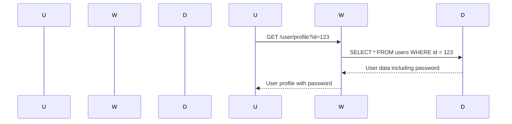

## Introduction to Access Control Vulnerabilities

Access control vulnerabilities are among the most critical issues in web application security. These vulnerabilities occur when an application fails to properly restrict access to resources based on user roles or permissions. One common form of access control vulnerability is when sensitive information, such as passwords, can be accessed by manipulating request parameters. This type of vulnerability can lead to unauthorized access, data breaches, and other serious security incidents.

In this chapter, we will delve into a specific access control vulnerability: the scenario where the user ID is controlled by a request parameter, leading to password disclosure. We will explore the underlying mechanisms, recent real-world examples, and detailed steps to both exploit and defend against such vulnerabilities.

### Background Theory

Access control is a fundamental aspect of web application security. It ensures that users can only access resources and perform actions that they are authorized to do. Access control mechanisms typically involve:

1. **Authentication**: Verifying the identity of a user.
2. **Authorization**: Determining what actions a user is allowed to perform based on their role or permissions.

When these mechanisms fail, attackers can exploit the vulnerabilities to gain unauthorized access to sensitive information or perform actions they should not be able to.

### Real-World Example: CVE-2021-21972

One recent real-world example of an access control vulnerability is CVE-2021-21972, which affected the Atlassian Jira software. In this case, an attacker could manipulate request parameters to access sensitive information, including passwords, of other users. This vulnerability was due to improper validation of user IDs in certain API endpoints.



### Lab Setup

To understand and exploit this vulnerability, we will use the Web Security Academy provided by PortSwigger. The lab environment is designed to simulate real-world scenarios and provide hands-on experience.

#### Setting Up the Lab

1. **Sign Up**: Visit `https://portswigger.net/web-security` and sign up for an account.
2. **Navigate to the Lab**:
    - Click on "Academy".
    - Select the "Learning Path".
    - Choose "Access Control".
    - Select "Lab Number 10: User ID Controlled by Request Parameter with Password Disclosure".

Once you are logged in, you can access the lab environment. The lab simulates a web application with a user profile page that displays the user's existing password in a masked input field.

### Exploiting the Vulnerability

The goal of the lab is to exploit the broken access control vulnerability to retrieve the administrator's password and use it to delete the user "Carlos". Here’s how you can achieve this:

#### Step-by-Step Exploitation

1. **Identify the Vulnerable Endpoint**:
    - The user profile page is accessible via a request parameter, e.g., `/user/profile?id=<user_id>`.

2. **Manipulate the Request Parameter**:
    - By changing the `id` parameter, you can access different user profiles.
    - For example, to access the administrator's profile, you might set `id` to a known administrator ID.

3. **Retrieve the Administrator's Password**:
    - Once you access the administrator's profile, you can see the password in the masked input field.
    - Extract the password from the response.

4. **Log in as the Administrator**:
    - Use the retrieved password to log in as the administrator.
    - Navigate to the user management section and delete the user "Carlos".

#### Full HTTP Request and Response

Here is an example of the HTTP request and response to access the user profile:

```http
GET /user/profile?id=1 HTTP/1.1
Host: vulnerable-webapp.com
Cookie: session=abc123

HTTP/1.1 200 OK
Content-Type: text/html; charset=UTF-8
Set-Cookie: session=abc123

<!DOCTYPE html>
<html>
<head>
    <title>User Profile</title>
</head>
<body>
    <h1>User Profile</h1>
    <form>
        <label for="password">Password:</label>
        <input type="password" id="password" name="password" value="admin_password">
    </form>
</body>
</html>
```

### Common Pitfalls

When exploiting access control vulnerabilities, several common pitfalls can arise:

1. **Insufficient Error Handling**: The application may return error messages that reveal sensitive information.
2. **Rate Limiting**: The server may implement rate limiting, making repeated requests difficult.
3. **Session Management**: Improper session management can lead to session hijacking or fixation attacks.

### How to Prevent / Defend

#### Detection

To detect access control vulnerabilities, you can use automated tools like Burp Suite, OWASP ZAP, or static analysis tools like SonarQube. These tools can help identify insecure direct object references (IDOR) and other access control issues.

#### Prevention

1. **Proper Authorization Checks**:
    - Ensure that every resource access is checked against the user's role and permissions.
    - Use role-based access control (RBAC) to manage user permissions.

2. **Parameter Validation**:
    - Validate all input parameters to ensure they are within expected ranges.
    - Use parameterized queries or ORM frameworks to prevent SQL injection.

3. **Secure Session Management**:
    - Use secure cookies with the `HttpOnly` and `Secure` flags.
    - Implement session timeouts and regenerate session IDs after login.

#### Secure Coding Fixes

Here is an example of how to securely handle user profile access:

```python
# Vulnerable Code
@app.route('/user/profile')
def user_profile():
    user_id = request.args.get('id')
    user = User.query.get(user_id)
    return render_template('profile.html', user=user)

# Secure Code
@app.route('/user/profile')
@login_required
def user_profile():
    user_id = request.args.get('id')
    if int(user_id) != current_user.id:
        abort(403)
    user = User.query.get(user_id)
    return render_template('profile.html', user=user)
```

### Conclusion

Access control vulnerabilities are a significant threat to web applications. By understanding the underlying mechanisms and exploiting them in a controlled environment, you can better appreciate the importance of proper access control measures. Always ensure that your applications are thoroughly tested and hardened against such vulnerabilities.

### Practice Labs

For hands-on practice, consider the following labs:

- **PortSwigger Web Security Academy**: Offers a variety of labs, including the one described in this chapter.
- **OWASP Juice Shop**: A deliberately insecure web application for practicing web security skills.
- **DVWA (Damn Vulnerable Web Application)**: Another popular web application for learning and testing web security techniques.

By engaging with these labs, you can gain practical experience in identifying and mitigating access control vulnerabilities.

---
<!-- nav -->
[[Web Security (PortSwigger)/12-Access Control Vulnerabilities/11-Lab 10 User ID controlled by request parameter with password disclosure/00-Overview|Overview]] | [[02-Access Control Vulnerabilities User ID Controlled by Request Parameter with Password Disclosure|Access Control Vulnerabilities User ID Controlled by Request Parameter with Password Disclosure]]
