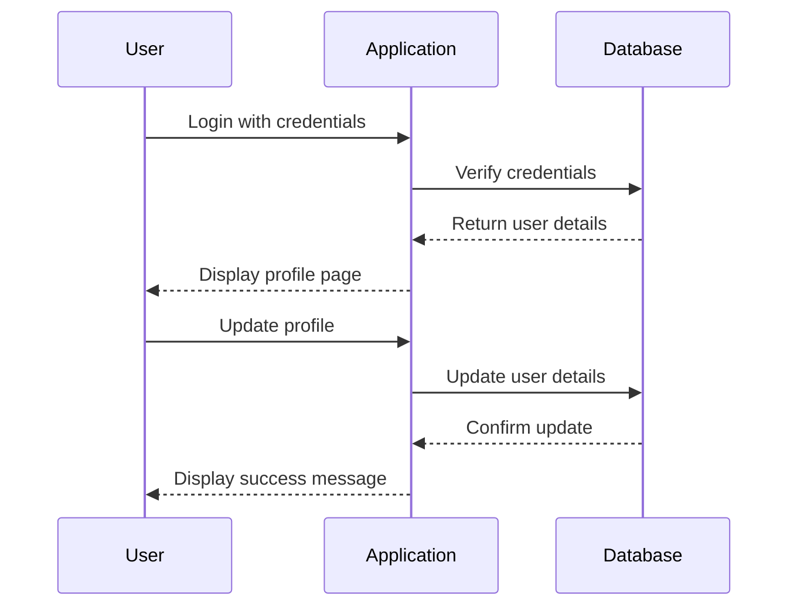

## Access Control Vulnerabilities

### Introduction to Access Control Vulnerabilities

Access control vulnerabilities are among the most critical issues in web application security. These vulnerabilities occur when an application fails to properly restrict access to resources based on user permissions. This can lead to unauthorized access to sensitive data, administrative functions, and other critical operations. In this section, we will explore a specific type of access control vulnerability where the user ID is controlled by a request parameter, leading to potential password disclosure.

### Background Theory

#### What is Access Control?

Access control is a security technique used to regulate who or what can view or use resources in a computing environment. It ensures that users have appropriate levels of access to resources based on their roles and permissions. Access control mechanisms typically involve authentication (verifying the identity of a user) and authorization (granting or denying access based on the user's role).

#### Why is Access Control Important?

Access control is crucial because it helps prevent unauthorized access to sensitive information and system resources. Without proper access control, attackers can exploit vulnerabilities to gain elevated privileges, steal data, or perform malicious actions within the application.

### User ID Controlled by Request Parameter

One common form of access control vulnerability occurs when the user ID is controlled by a request parameter. This means that an attacker can manipulate the request parameters to access other users' accounts or administrative functions.

#### Example Scenario

Consider a web application where the user ID is passed as a parameter in the URL. For instance:

```
https://example.com/user/profile?userId=123
```

If the application does not properly validate the `userId` parameter, an attacker can change the value of `userId` to access other users' profiles. This can lead to unauthorized access to sensitive information, including passwords.

### Password Disclosure Vulnerability

In the given scenario, the application displays the user's password in the password field, even though it is masked in the user interface. This is a significant vulnerability because it allows an attacker to potentially extract the password using client-side vulnerabilities such as Cross-Site Scripting (XSS).

#### Detailed Explanation

When a user logs in with the credentials provided (username and password), the application displays the user's profile page. This page includes fields for updating the email address and password. The password field is pre-filled with the user's current password, even though it is masked in the user interface.

To demonstrate this vulnerability, let's consider the following steps:

1. **Login with Provided Credentials**:
   - Username: `admin`
   - Password: `Peter`

```plaintext
POST /login HTTP/1.1
Host: example.com
Content-Type: application/x-www-form-urlencoded

username=admin&password=Peter
```

2. **Navigate to Profile Page**:
   - The application redirects to the user's profile page, displaying the username, email, and password fields.

```plaintext
GET /user/profile HTTP/1.1
Host: example.com
Cookie: session_id=abc123
```

3. **Inspect Password Field**:
   - Right-click on the password field and select "Inspect" to view the HTML source code.

```html
<input type="password" id="password" name="password" value="Peter">
```

### Real-World Examples

#### Recent Breaches and CVEs

Several high-profile breaches have been attributed to access control vulnerabilities. For example:

- **CVE-2021-44228 (Log4Shell)**: This vulnerability allowed attackers to execute arbitrary code on servers running Apache Log4j. While not directly related to access control, it demonstrates the importance of securing all aspects of an application.
- **Equifax Data Breach (2017)**: This breach exposed sensitive personal information of millions of customers due to a vulnerability in the Apache Struts framework. Access control failures played a significant role in the breach.

### How to Prevent / Defend

#### Detection

To detect access control vulnerabilities, organizations should implement the following measures:

1. **Automated Scanning Tools**: Use tools like Burp Suite, OWASP ZAP, or commercial scanners to identify potential vulnerabilities.
2. **Code Reviews**: Conduct regular code reviews to ensure proper access control mechanisms are in place.
3. **Penetration Testing**: Perform penetration testing to simulate attacks and identify weaknesses.

#### Prevention

To prevent access control vulnerabilities, follow these best practices:

1. **Input Validation**: Validate all input parameters to ensure they meet expected criteria.
2. **Role-Based Access Control (RBAC)**: Implement RBAC to restrict access based on user roles.
3. **Least Privilege Principle**: Ensure users have the minimum level of access necessary to perform their tasks.

#### Secure Coding Fixes

Let's compare the vulnerable code with the secure version:

**Vulnerable Code**:

```php
<?php
$userId = $_GET['userId'];
$user = getUserById($userId);
echo "<input type='password' id='password' name='password' value='{$user['password']}'>";
?>
```

**Secure Code**:

```php
<?php
session_start();
if (!isset($_SESSION['user_id'])) {
    die("Unauthorized access");
}

$userId = $_SESSION['user_id'];
$user = getUserById($userId);
echo "<input type='password' id='password' name='password' value=''>";
?>
```

### Complete Example

#### Full HTTP Request and Response

**HTTP Request**:

```http
GET /user/profile?userId=123 HTTP/1.1
Host: example.com
Cookie: session_id=abc123
```

**HTTP Response**:

```http
HTTP/1.1 200 OK
Date: Mon, 20 Mar 2023 12:00:00 GMT
Server: Apache/2.4.41 (Ubuntu)
Content-Type: text/html; charset=UTF-8
Content-Length: 1234

<!DOCTYPE html>
<html>
<head>
    <title>User Profile</title>
</head>
<body>
    <h1>User Profile</h1>
    <form method="post" action="/user/update">
        <label for="email">Email:</label>
        <input type="email" id="email" name="email" value="user@example.com"><br><br>
        <label for="password">Password:</label>
        <input type="password" id="password" name="password" value="Peter"><br><br>
        <input type="submit" value="Update">
    </form>
</body>
</html>
```

### Mermaid Diagrams

#### Access Control Flow



### Hands-On Labs

For practical experience with access control vulnerabilities, consider the following labs:

- **PortSwigger Web Security Academy**: Offers a series of labs covering various web security topics, including access control vulnerabilities.
- **OWASP Juice Shop**: A deliberately insecure web application for practicing web security skills.
- **DVWA (Damn Vulnerable Web Application)**: A PHP/MySQL web application that is riddled with vulnerabilities for educational purposes.

### Conclusion

Access control vulnerabilities are serious threats to web application security. By understanding the underlying principles and implementing robust security measures, organizations can significantly reduce the risk of unauthorized access and data breaches. Always prioritize secure coding practices and regular security assessments to maintain the integrity of your applications.

---
<!-- nav -->
[[02-Access Control Vulnerabilities User ID Controlled by Request Parameter with Password Disclosure|Access Control Vulnerabilities User ID Controlled by Request Parameter with Password Disclosure]] | [[Web Security (PortSwigger)/12-Access Control Vulnerabilities/11-Lab 10 User ID controlled by request parameter with password disclosure/00-Overview|Overview]] | [[Web Security (PortSwigger)/12-Access Control Vulnerabilities/11-Lab 10 User ID controlled by request parameter with password disclosure/04-Practice Questions & Answers|Practice Questions & Answers]]
