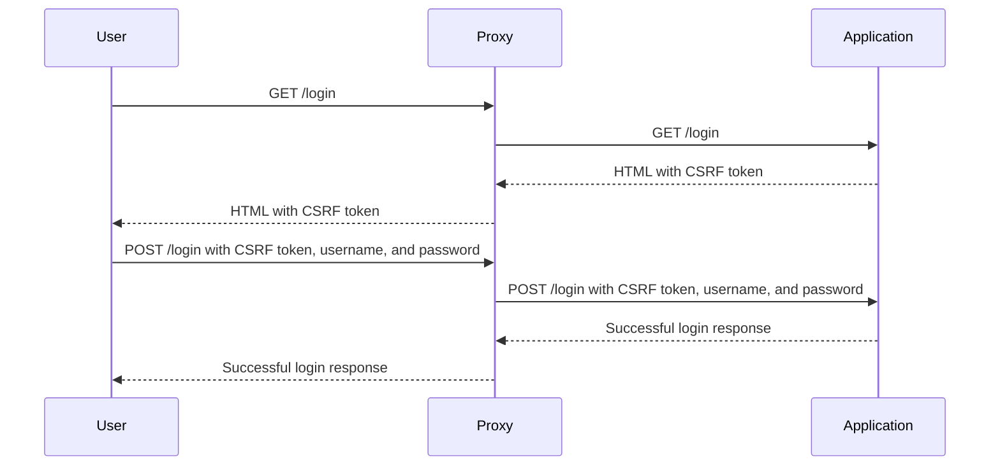

## Understanding Access Control Vulnerabilities

Access control vulnerabilities are among the most critical issues in web security. They occur when an application fails to properly restrict access to resources based on user roles and permissions. One specific type of access control vulnerability is the insecure direct object reference (IDOR). This occurs when an application exposes internal implementation objects such as files, directories, database records, etc., in a manner that allows unauthorized users to manipulate them.

### Background Theory

Before diving into the specifics of IDOR, it's essential to understand the broader context of access control mechanisms in web applications. Access control is a fundamental security principle that ensures that users can only access resources and perform actions that they are authorized to do. This is typically achieved through:

- **Authentication**: Verifying the identity of a user.
- **Authorization**: Determining what actions a user is allowed to perform based on their role and permissions.

In a typical web application, these mechanisms are implemented using various techniques such as session management, role-based access control (RBAC), and attribute-based access control (ABAC).

### Insecure Direct Object References (IDOR)

An insecure direct object reference (IDOR) occurs when an application exposes internal implementation objects in a way that allows unauthorized users to manipulate them. This often happens when the application uses predictable or sequential identifiers for resources, such as database record IDs or file paths.

#### Example Scenario

Consider a web application that allows users to view their personal information. The application might use a URL like `/profile?id=123` to display the profile of the user with ID `123`. If the application does not properly validate the user's authorization to view this profile, an attacker could simply change the `id` parameter to view other users' profiles.

### Lab 11: Insecure Direct Object References

To illustrate how IDOR vulnerabilities can be exploited, let's walk through a practical example using a hypothetical web application. We'll focus on logging in and extracting sensitive data.

#### Step-by-Step Walkthrough

1. **Understanding the Login Functionality**:
    - The application uses a POST request to the `/login` endpoint to authenticate users.
    - The request includes three parameters: `CSRF token`, `username`, and `password`.

2. **Extracting the CSRF Token**:
    - Before sending the login request, we need to extract the CSRF token from the login page.
    - The login page is accessed via a GET request to `/login`.

```python
import requests

# Define the base URL of the application
base_url = "http://example.com"

# Send a GET request to the login page to extract the CSRF token
response = requests.get(base_url + "/login")
csrf_token = response.text.split('name="csrf_token" value="')[1].split('"')[0]

print(f"Extracted CSRF token: {csrf_token}")
```

3. **Logging in**:
    - Once we have the CSRF token, we can send a POST request to the `/login` endpoint with the required parameters.

```python
# Define the login credentials
username = "Carlos"
password = "password123"

# Send a POST request to the login endpoint
login_data = {
    "csrf_token": csrf_token,
    "username": username,
    "password": password
}
response = requests.post(base_url + "/login", data=login_data)

print(f"Login response: {response.text}")
```

### Real-World Examples

#### Recent CVEs and Breaches

- **CVE-2021-3129**: A vulnerability in the WordPress REST API allowed attackers to bypass authentication and access sensitive data.
- **Equifax Data Breach (2017)**: An IDOR vulnerability in the Equifax website exposed sensitive personal information of millions of users.

### How to Prevent / Defend Against IDOR

#### Detection

- **Automated Scanning Tools**: Use tools like Burp Suite, OWASP ZAP, or commercial scanners to identify potential IDOR vulnerabilities.
- **Manual Testing**: Perform manual testing to verify that the application properly enforces access controls.

#### Prevention

- **Proper Authorization Checks**: Ensure that the application checks the user's authorization before allowing access to any resource.
- **Use Non-Predictable Identifiers**: Avoid using sequential or easily guessable identifiers for resources. Instead, use random, non-predictable identifiers.
- **Session Management**: Implement strong session management practices to ensure that sessions are properly validated and protected.

#### Secure Coding Fixes

##### Vulnerable Code

```python
@app.route("/profile/<int:user_id>")
def view_profile(user_id):
    user = User.query.get(user_id)
    return render_template("profile.html", user=user)
```

##### Secure Code

```python
@app.route("/profile/<int:user_id>")
@login_required
def view_profile(user_id):
    current_user_id = current_user.id
    if current_user_id != user_id:
        abort(403)  # Forbidden
    user = User.query.get(user_id)
    return render_template("profile.html", user=user)
```

### Complete Example

#### Full HTTP Request and Response

**GET Request to Extract CSRF Token**

```http
GET /login HTTP/1.1
Host: example.com
User-Agent: Mozilla/5.0 (Windows NT 10.0; Win64; x64) AppleWebKit/537.36 (KHTML, like Gecko) Chrome/91.0.4472.124 Safari/537.36
Accept: text/html,application/xhtml+xml,application/xml;q=0.9,image/webp,*/*;q=0.8
Accept-Language: en-US,en;q=0.5
Connection: keep-alive
Upgrade-Insecure-Requests: 1

HTTP/1.1 200 OK
Date: Tue, 01 Mar 2022 12:00:00 GMT
Server: Apache/2.4.41 (Ubuntu)
Content-Type: text/html; charset=UTF-8
Content-Length: 1234
X-XSS-Protection: 1; mode=block
X-Frame-Options: SAMEORIGIN
Set-Cookie: csrftoken=abcdefg; expires=Wed, 01 Mar 2023 12:00:00 GMT; Max-Age=31536000; Path=/; SameSite=Lax
Cache-Control: max-age=0, no-cache, no-store, must-revalidate
Pragma: no-cache
Expires: Wed, 01 Jan 1980 00:00:00 GMT

<!DOCTYPE html>
<html>
<head>
    <title>Login</title>
</head>
<body>
    <form method="POST" action="/login">
        <input type="hidden" name="csrf_token" value="abcdefg">
        <label for="username">Username:</label>
        <input type="text" id="username" name="username">
        <label for="password">Password:</label>
        <input type="password" id="password" name="password">
        <button type="submit">Login</button>
    </form>
</body>
</html>
```

**POST Request to Log In**

```http
POST /login HTTP/1.1
Host: example.com
User-Agent: Mozilla/5.0 (Windows NT 10.0; Win64; x64) AppleWebKit/537.36 (KHTML, like Gecko) Chrome/91.0.4472.124 Safari/537.36
Accept: text/html,application/xhtml+xml,application/xml;q=0.9,image/webp,*/*;q=0.8
Accept-Language: en-US,en;q=0.5
Content-Type: application/x-www-form-urlencoded
Content-Length: 50
Connection: keep-alive
Referer: http://example.com/login
Cookie: csrftoken=abcdefg

csrf_token=abcdefg&username=Carlos&password=password123

HTTP/1.1 200 OK
Date: Tue, 01 Mar 2022 12:00:00 GMT
Server: Apache/2.4.41 (Ubuntu)
Content-Type: text/html; charset=UTF-8
Content-Length: 1234
X-XSS-Protection: 1; mode=block
X-Frame-Options: SAMEORIGIN
Set-Cookie: sessionid=1234567890abcdef; expires=Wed, 01 Mar 2023 12:00:00 GMT; Max-Age=31536000; Path=/; HttpOnly; SameSite=Lax
Cache-Control: max-age=0, no-cache, no-store, must-revalidate
Pragma: no-cache
Expires: Wed, 01 Jan 1980 00:00:00 GMT

<!DOCTYPE html>
<html>
<head>
    <title>Welcome, Carlos!</title>
</head>
<body>
    <h1>Welcome, Carlos!</h1>
    <p>You are now logged in.</p>
</body>
</html>
```

### Mermaid Diagrams

#### Sequence Diagram for Login Process



### Hands-On Labs

For hands-on practice with IDOR vulnerabilities, consider the following labs:

- **PortSwigger Web Security Academy**: Offers a comprehensive set of labs covering various web security topics, including IDOR.
- **OWASP Juice Shop**: A deliberately insecure web application for practicing web security skills.
- **DVWA (Damn Vulnerable Web Application)**: A PHP/MySQL web application that contains numerous security vulnerabilities.

These labs provide a safe environment to practice identifying and exploiting IDOR vulnerabilities, as well as learning how to defend against them.

By thoroughly understanding the concepts, mechanics, and real-world implications of IDOR vulnerabilities, you can better protect your applications from such attacks. Always ensure that proper access controls are in place and that sensitive data is protected from unauthorized access.

---
<!-- nav -->
[[02-Access Control Vulnerabilities Insecure Direct Object References|Access Control Vulnerabilities Insecure Direct Object References]] | [[Web Security (PortSwigger)/12-Access Control Vulnerabilities/12-Lab 11 Insecure direct object references/00-Overview|Overview]] | [[Web Security (PortSwigger)/12-Access Control Vulnerabilities/12-Lab 11 Insecure direct object references/04-Practice Questions & Answers|Practice Questions & Answers]]
