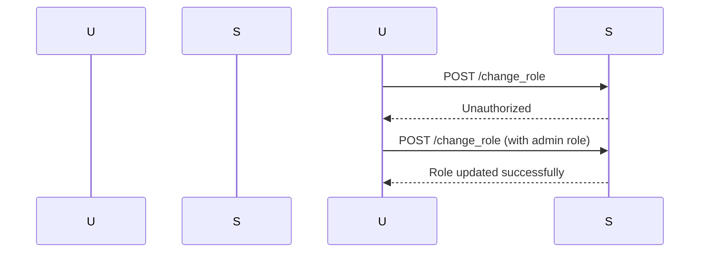
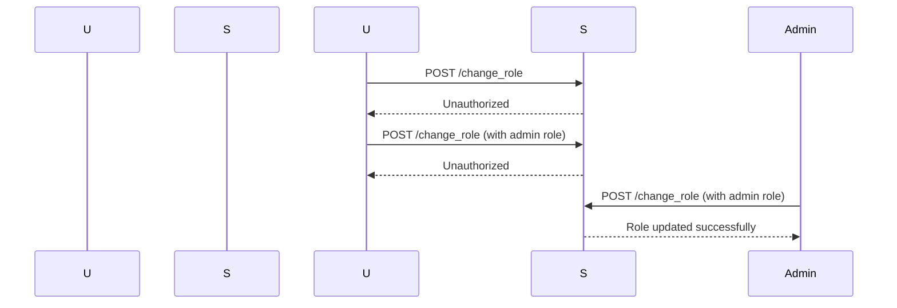

## Introduction to Access Control Vulnerabilities

Access control vulnerabilities are among the most critical issues in web application security. They occur when an application fails to properly restrict access to resources based on user roles or permissions. This can lead to unauthorized access, data breaches, and other serious security incidents. In this chapter, we will delve deep into the specific scenario of a multi-step process with no access control on one step, as presented in Lab 12 of the Web Security Academy.

### Background Theory

Access control is a fundamental aspect of web application security. It ensures that users can only access resources and perform actions that they are authorized to do. Access control mechanisms typically involve:

1. **Authentication**: Verifying the identity of a user.
2. **Authorization**: Determining what actions a user is allowed to perform based on their identity and role.

In a typical web application, these mechanisms are implemented using various techniques such as session management, role-based access control (RBAC), and attribute-based access control (ABAC).

#### Role-Based Access Control (RBAC)

RBAC is a widely used method for implementing access control. It defines roles and assigns them to users. Each role has a set of permissions associated with it. For example, an `admin` role might have permission to modify user roles, whereas a `regular user` role might not.

#### Attribute-Based Access Control (ABAC)

ABAC is a more flexible approach that allows access decisions to be made based on attributes of the user, resource, and environment. For example, a user might be allowed to access a resource only if they are in a certain department and the current time is within business hours.

### Multi-Step Processes and Access Control

A multi-step process is a workflow that involves several sequential steps to achieve a particular outcome. In the context of web applications, these processes often involve user interactions and server-side operations. Access control vulnerabilities can arise when one or more steps in the process lack proper authorization checks.

#### Example Scenario: Changing User Roles

Consider a web application with an admin panel that allows administrators to change user roles. The process might involve the following steps:

1. **Select User**: Choose the user whose role needs to be changed.
2. **Choose New Role**: Select the new role for the user.
3. **Submit Changes**: Confirm the changes and update the database.

If any of these steps lack proper access control, an attacker could potentially exploit this to gain unauthorized privileges.

### Lab 12: Multi-Step Process with No Access Control on One Step

In Lab 12 of the Web Security Academy, we encounter a scenario where a multi-step process for changing user roles lacks proper access control on one of the steps. Let's break down the lab and understand the vulnerability in detail.

#### Lab Setup

To access the lab, follow these steps:

1. Visit the URL: `https://portswigger.net/web-security`.
2. Click on the sign-up button to create an account if you don't already have one.
3. Log in to your account.
4. Navigate to the Academy section.
5. Select the learning path for access control.
6. Find and select Lab 12 titled "Multi-Step Process with No Access Control on One Step".

#### Lab Objective

The objective of this lab is to exploit a multi-step process in the admin panel to promote a regular user to an administrator. The process involves:

1. Logging in as a regular user.
2. Exploiting the flawed access controls to change the user's role.

### Detailed Walkthrough

Let's walk through the steps to exploit the vulnerability and understand the underlying mechanics.

#### Step 1: Logging In as a Regular User

First, log in to the application using the credentials provided for a regular user. For example:

```plaintext
Username: regular_user
Password: regular_password
```

#### Step 2: Identifying the Flawed Access Control

Once logged in, navigate to the admin panel. The admin panel should allow you to view and modify user roles. However, due to the flawed access control, you might be able to perform actions that you shouldn't be able to.

#### Step 3: Exploiting the Vulnerability

To exploit the vulnerability, you need to identify which step in the multi-step process lacks proper access control. For example, consider the following steps:

1. **Select User**: Choose the user whose role needs to be changed.
2. **Choose New Role**: Select the new role for the user.
3. **Submit Changes**: Confirm the changes and update the database.

If the `Submit Changes` step lacks proper access control, an attacker could potentially submit changes to promote themselves to an administrator.

#### Step 4: Crafting the Exploit

To craft the exploit, you need to intercept and modify the HTTP requests sent to the server. This can be done using tools like Burp Suite, which allows you to intercept and manipulate HTTP traffic.

For example, suppose the `Submit Changes` step involves sending a POST request to `/change_role` with the following parameters:

```http
POST /change_role HTTP/1.1
Host: example.com
Content-Type: application/x-www-form-urlencoded

username=regular_user&new_role=admin
```

By intercepting this request and modifying the `new_role` parameter to `admin`, you can promote yourself to an administrator.

### Real-World Examples

Access control vulnerabilities have been exploited in numerous real-world scenarios. Here are a few recent examples:

#### CVE-2021-21972: Microsoft Exchange Server

In March 2021, a series of vulnerabilities were discovered in Microsoft Exchange Server, including an access control issue that allowed attackers to gain unauthorized access to email accounts. This vulnerability was exploited in a widespread attack that affected thousands of organizations worldwide.

#### CVE-2022-22965: Apache Log4j

In December 2021, a critical vulnerability was discovered in Apache Log4j, a popular Java logging library. The vulnerability allowed attackers to execute arbitrary code on affected systems, leading to widespread exploitation. While this vulnerability was primarily related to remote code execution, it also highlighted the importance of proper access control in preventing unauthorized access.

### How to Prevent / Defend

To prevent access control vulnerabilities, it is crucial to implement robust access control mechanisms and regularly audit your application for potential weaknesses. Here are some best practices:

#### Secure Coding Practices

1. **Role-Based Access Control (RBAC)**: Implement RBAC to ensure that users can only perform actions that are appropriate for their roles.
2. **Attribute-Based Access Control (ABAC)**: Use ABAC to make access decisions based on attributes of the user, resource, and environment.
3. **Least Privilege Principle**: Ensure that users have the minimum level of access necessary to perform their tasks.

#### Configuration Hardening

1. **Session Management**: Implement secure session management practices to prevent session hijacking and other attacks.
2. **Input Validation**: Validate all input to ensure that it meets expected criteria and does not contain malicious content.
3. **Error Handling**: Implement proper error handling to prevent sensitive information from being exposed in error messages.

#### Detection and Monitoring

1. **Logging and Monitoring**: Implement comprehensive logging and monitoring to detect and respond to suspicious activity.
2. **Security Scanning**: Regularly scan your application for vulnerabilities using tools like Burp Suite, OWASP ZAP, and others.
3. **Penetration Testing**: Conduct regular penetration testing to identify and address security weaknesses.

### Complete Example

Let's walk through a complete example of how to exploit and fix the access control vulnerability in Lab 12.

#### Vulnerable Code

Suppose the backend code for the `Submit Changes` step looks like this:

```python
@app.route('/change_role', methods=['POST'])
def change_role():
    username = request.form['username']
    new_role = request.form['new_role']
    
    # Update the user's role in the database
    db.execute("UPDATE users SET role = ? WHERE username = ?", (new_role, username))
    
    return "Role updated successfully"
```

This code lacks proper access control checks, allowing any user to change the role of any other user.

#### Fixed Code

To fix the vulnerability, we need to add proper access control checks. For example:

```python
@app.route('/change_role', methods=['POST'])
def change_role():
    username = request.form['username']
    new_role = request.form['new_role']
    
    # Check if the current user is an admin
    if current_user.role != 'admin':
        return "Unauthorized", 403
    
    # Update the user's role in the database
    db.execute("UPDATE users SET role = ? WHERE username = ?", (new_role, username))
    
    return "Role updated successfully"
```

In this fixed code, we check if the current user is an admin before allowing them to change the role of another user.

### Mermaid Diagrams

Let's visualize the attack chain and the fixed access control mechanism using mermaid diagrams.

#### Attack Chain



#### Fixed Access Control Mechanism



### Hands-On Labs

To practice and reinforce your understanding of access control vulnerabilities, consider the following hands-on labs:

- **PortSwigger Web Security Academy**: Offers a variety of labs focused on web application security, including access control vulnerabilities.
- **OWASP Juice Shop**: A deliberately insecure web application designed for security training.
- **DVWA (Damn Vulnerable Web Application)**: Another popular web application for security training.

These labs provide practical experience in identifying and exploiting access control vulnerabilities, as well as implementing secure coding practices to prevent them.

### Conclusion

Access control vulnerabilities are a significant threat to web application security. By understanding the underlying mechanics and implementing robust access control mechanisms, you can protect your application from unauthorized access and other security incidents. Regular auditing and penetration testing are essential to ensure that your application remains secure against evolving threats.

---
<!-- nav -->
[[Web Security (PortSwigger)/12-Access Control Vulnerabilities/13-Lab 12 Multi step process with no access control on one step/00-Overview|Overview]] | [[02-Access Control Vulnerabilities in Multi-Step Processes|Access Control Vulnerabilities in Multi-Step Processes]]
