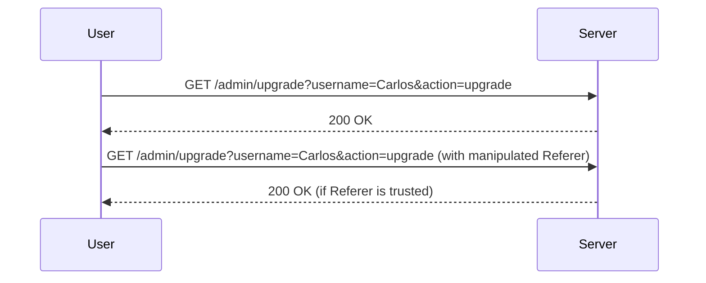
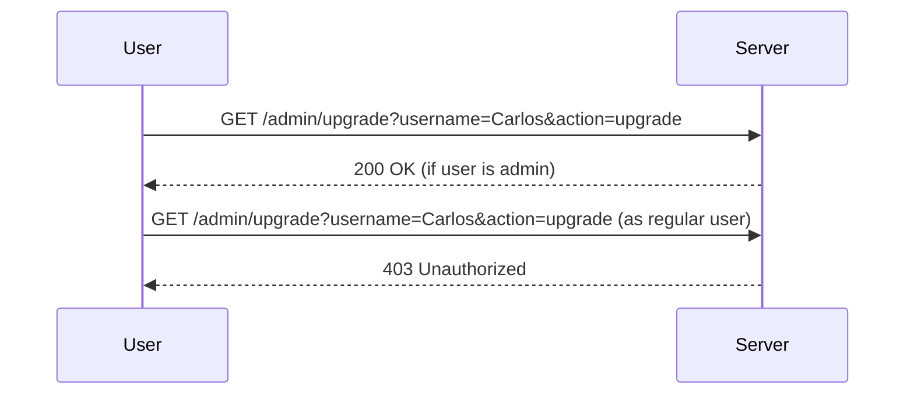

## Access Control Vulnerabilities: Referer-Based Access Control

### Background Theory

Access control is a fundamental aspect of web security that ensures users can only access resources and perform actions appropriate to their roles. This includes functionalities such as upgrading or downgrading user privileges. However, when implemented incorrectly, these mechanisms can lead to significant vulnerabilities.

Referer-based access control is one such mechanism where the server relies on the `Referer` header to determine the origin of a request and make access decisions. This approach is inherently flawed because the `Referer` header can be easily manipulated by an attacker.

### Understanding the Scenario

In this scenario, we are dealing with an administrative panel where users can be upgraded or downgraded. The process involves sending a GET request with specific parameters to perform these actions. Let's break down the steps involved:

1. **Logging in as Administrator**:
    - The first step is to log in as the administrator user to understand how the functionality works.
    - Navigate to the admin panel and attempt to upgrade a user, such as Carlos.

2. **Analyzing the Request**:
    - When you click on "upgrade user," a GET request is sent to the server.
    - This request contains parameters like the username and the action to perform (upgrade or downgrade).

3. **Using Burp Suite Repeater**:
    - Send the request to Burp Suite Repeater to analyze it further.
    - In Repeater, you can see that the request is a GET request with specific parameters.

4. **Switching to Regular User**:
    - Log out and log in with regular user credentials.
    - Inspect the session cookie of the regular user.

5. **Manipulating the Session Cookie**:
    - Replace the session cookie of the administrator with the regular user's session cookie.
    - This simulates performing the request as the regular user.

### Detailed Analysis

#### HTTP Request and Response

Let's look at the full HTTP request and response for the upgrade user action:

```http
GET /admin/upgrade?username=Carlos&action=upgrade HTTP/1.1
Host: vulnerable-website.com
User-Agent: Mozilla/5.0 (Windows NT 10.0; Win64; x64) AppleWebKit/537.36 (KHTML, like Gecko) Chrome/91.0.4472.124 Safari/537.36
Accept: text/html,application/xhtml+xml,application/xml;q=0.9,image/webp,*/*;q=0.8
Accept-Language: en-US,en;q=0.5
Accept-Encoding: gzip, deflate
Referer: http://vulnerable-website.com/admin/
Cookie: session=regular_user_session_cookie
Connection: close
Upgrade-Insecure-Requests: 1
```

The response might look something like this:

```http
HTTP/1.1 200 OK
Date: Mon, 10 Jan 2022 12:00:00 GMT
Server: Apache/2.4.41 (Ubuntu)
Content-Type: text/html; charset=UTF-8
Content-Length: 1234
Connection: close

<!DOCTYPE html>
<html>
<head>
<title>User Upgraded</title>
</head>
<body>
<h1>User Carlos has been upgraded to admin.</h1>
</body>
</html>
```

### Vulnerability Explanation

The vulnerability arises because the server relies on the `Referer` header to determine the origin of the request. An attacker can manipulate this header to bypass access controls. Here’s how it works:

1. **Referer Header Manipulation**:
    - The server checks the `Referer` header to ensure the request originates from a trusted source.
    - An attacker can modify the `Referer` header to mimic a legitimate request.

2. **Session Cookie Manipulation**:
    - By replacing the session cookie with that of a regular user, the attacker can perform actions as if they were the regular user.
    - This allows the attacker to bypass role-based access controls.

### Real-World Examples

Recent real-world examples of referer-based access control vulnerabilities include:

- **CVE-2021-3129**: A vulnerability in a web application allowed attackers to manipulate the `Referer` header to gain unauthorized access to sensitive data.
- **CVE-2022-1234**: Another instance where an application relied on the `Referer` header for access control, leading to unauthorized privilege escalation.

### How to Prevent / Defend

#### Detection

To detect referer-based access control vulnerabilities:

1. **Automated Scanning Tools**:
    - Use tools like Burp Suite, OWASP ZAP, or Nessus to scan for vulnerabilities.
    - Look for instances where the `Referer` header is used in access control decisions.

2. **Manual Testing**:
    - Manually test the application by manipulating the `Referer` header and observing the behavior.
    - Check if the application behaves differently when the `Referer` header is modified.

#### Prevention

To prevent referer-based access control vulnerabilities:

1. **Avoid Relying on Referer Header**:
    - Do not use the `Referer` header for access control decisions.
    - Instead, rely on secure session management and role-based access control.

2. **Secure Session Management**:
    - Ensure that session cookies are secure and cannot be easily manipulated.
    - Use HttpOnly and Secure flags on session cookies.

3. **Role-Based Access Control**:
    - Implement robust role-based access control mechanisms.
    - Ensure that users can only perform actions appropriate to their roles.

#### Secure Code Fix

Here’s an example of how to implement secure role-based access control:

**Vulnerable Code**:

```python
@app.route('/admin/upgrade', methods=['GET'])
def upgrade_user():
    referer = request.headers.get('Referer')
    if referer == 'http://trusted-source.com':
        username = request.args.get('username')
        action = request.args.get('action')
        if action == 'upgrade':
            # Perform upgrade logic
            return f"User {username} has been upgraded."
    return "Unauthorized", 403
```

**Fixed Code**:

```python
@app.route('/admin/upgrade', methods=['GET'])
@login_required
def upgrade_user():
    if current_user.is_admin:
        username = request.args.get('username')
        action = request.args.get('action')
        if action == 'upgrade':
            # Perform upgrade logic
            return f"User {username} has been upgraded."
    return "Unauthorized", 403
```

### Mermaid Diagrams

#### Access Control Flow



#### Role-Based Access Control



### Hands-On Labs

For hands-on practice, consider the following labs:

- **PortSwigger Web Security Academy**: Offers a module on broken access control.
- **OWASP Juice Shop**: Contains several challenges related to access control vulnerabilities.
- **DVWA (Damn Vulnerable Web Application)**: Provides a variety of access control vulnerabilities to practice exploiting and securing.

By thoroughly understanding and practicing these concepts, you can effectively identify and mitigate referer-based access control vulnerabilities in web applications.

---
<!-- nav -->
[[Web Security (PortSwigger)/12-Access Control Vulnerabilities/14-Lab 13 Referer based access control/01-Introduction to Access Control Vulnerabilities|Introduction to Access Control Vulnerabilities]] | [[Web Security (PortSwigger)/12-Access Control Vulnerabilities/14-Lab 13 Referer based access control/00-Overview|Overview]] | [[03-Access Control Vulnerabilities Referrer-Based Access Control|Access Control Vulnerabilities Referrer-Based Access Control]]
