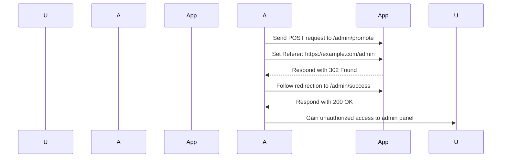

## Access Control Vulnerabilities: Referrer-Based Access Control

### Background Theory

Access control is a fundamental aspect of web security that ensures that users can only access resources and perform actions that they are authorized to do. Access control mechanisms typically involve authentication (verifying the identity of the user) and authorization (granting permissions based on the user's role).

One common method of implementing access control is through the use of HTTP headers, such as the `Referer` header. The `Referer` header is sent by the browser to indicate the URL of the page from which the current request originated. This header can be used to enforce certain access control policies, but it is inherently insecure due to its client-controllable nature.

### Understanding the `Referer` Header

The `Referer` header is an HTTP header that is sent by the browser along with each request. Its primary purpose is to provide information about the referring page, which can be useful for analytics, logging, and other purposes. However, it can also be used inappropriately for access control decisions.

#### Syntax and Example Values

The `Referer` header follows the following syntax:

```
Referer: <URL>
```

For example:

```plaintext
Referer: https://example.com/admin
```

This header indicates that the request originated from the `/admin` page of `example.com`.

#### Security Implications

The `Referer` header is client-controllable, meaning that a malicious user can easily manipulate it. This makes it unsuitable for enforcing access control policies. An attacker can set the `Referer` header to any value they choose, potentially bypassing access control checks.

### Real-World Examples

Several real-world vulnerabilities have been discovered due to the misuse of the `Referer` header for access control. One notable example is CVE-2021-30116, which affected a popular web application framework. In this case, the application relied on the `Referer` header to determine whether a user was accessing an administrative interface. By manipulating the `Referer` header, attackers were able to gain unauthorized access to the administrative interface.

Another example is CVE-2020-14882, which affected a widely-used content management system. The system used the `Referer` header to restrict access to certain administrative functions. Attackers exploited this vulnerability by setting the `Referer` header to a specific value, thereby gaining unauthorized access.

### Detailed Exploitation Example

Let's consider a scenario where an application uses the `Referer` header to enforce access control. We will demonstrate how an attacker can exploit this vulnerability to gain unauthorized access.

#### Initial Setup

Suppose we have an application with two roles: `regular user` and `administrator`. The application allows administrators to access an administrative panel located at `/admin`. The application uses the `Referer` header to ensure that only requests originating from the `/admin` page can access the administrative panel.

#### Exploitation Steps

1. **Identify the Access Control Mechanism**:
   The first step is to identify how the application enforces access control. In this case, the application checks the `Referer` header to ensure that the request originates from the `/admin` page.

2. **Manipulate the `Referer` Header**:
   Since the `Referer` header is client-controllable, an attacker can manipulate it to bypass the access control check. The attacker can set the `Referer` header to `https://example.com/admin` even if the actual request does not originate from the `/admin` page.

3. **Perform the Request**:
   The attacker sends a request to the administrative panel with the manipulated `Referer` header. If the application relies solely on the `Referer` header for access control, the attacker will be granted access.

#### Full HTTP Request and Response

Here is a complete example of the HTTP request and response:

```http
POST /admin/promote HTTP/1.1
Host: example.com
Referer: https://example.com/admin
Content-Type: application/x-www-form-urlencoded
Content-Length: 11

username=carlos
```

Response:

```http
HTTP/1.1 302 Found
Date: Tue, 14 Mar 2023 12:00:00 GMT
Server: Apache/2.4.41 (Ubuntu)
Location: https://example.com/admin/success
Content-Length: 0
```

Following the redirection:

```http
GET /admin/success HTTP/1.1
Host: example.com
Referer: https://example.com/admin
```

Response:

```http
HTTP/1.1 200 OK
Date: Tue, 14 Mar 2023 12:00:00 GMT
Server: Apache/2.4.41 (Ubuntu)
Content-Type: text/html; charset=UTF-8
Content-Length: 123

<!DOCTYPE html>
<html>
<head>
    <title>Success</title>
</head>
<body>
    <h1>Congratulations! You have successfully promoted the user.</h1>
</body>
</html>
```

### Mermaid Diagrams

To visualize the attack chain, we can use a mermaid sequence diagram:



### Common Pitfalls and Detection

#### Common Pitfalls

1. **Relying on Client-Controlled Headers**: Using client-controllable headers like `Referer` for access control is inherently insecure.
2. **Insufficient Authentication**: Not properly authenticating users before granting access to sensitive resources.
3. **Inconsistent Access Control Policies**: Having inconsistent access control policies across different parts of the application.

#### Detection

Detection of `Referer`-based access control vulnerabilities can be done through automated tools and manual testing.

1. **Automated Tools**: Tools like Burp Suite, ZAP, and OWASP Dependency-Check can be used to scan for such vulnerabilities.
2. **Manual Testing**: Manually testing the application by manipulating the `Referer` header and observing the behavior.

### How to Prevent / Defend

#### Secure Coding Practices

1. **Use Server-Side Authentication**: Always authenticate users on the server side before granting access to sensitive resources.
2. **Avoid Client-Controlled Headers**: Do not rely on client-controlled headers like `Referer` for access control decisions.
3. **Implement Role-Based Access Control (RBAC)**: Use RBAC to ensure that users can only access resources and perform actions that they are authorized to do.

#### Secure Configuration

1. **Disable Referer Header**: Consider disabling the `Referer` header in your application to prevent its misuse.
2. **Use Secure Headers**: Implement secure headers like `X-Frame-Options`, `Content-Security-Policy`, and `Strict-Transport-Security` to enhance security.

#### Example of Secure Code

Here is an example of how to securely implement access control without relying on the `Referer` header:

```python
from flask import Flask, request, redirect, session

app = Flask(__name__)
app.secret_key = 'your_secret_key'

@app.route('/login', methods=['POST'])
def login():
    username = request.form['username']
    password = request.form['password']
    
    # Perform authentication logic here
    if authenticate_user(username, password):
        session['username'] = username
        return redirect('/admin')
    else:
        return "Authentication failed", 401

@app.route('/admin', methods=['GET'])
def admin_panel():
    if 'username' in session and is_admin(session['username']):
        return "Welcome to the admin panel"
    else:
        return "Unauthorized", 403

def authenticate_user(username, password):
    # Placeholder for authentication logic
    return True

def is_admin(username):
    # Placeholder for checking if the user is an admin
    return True

if __name__ == '__main__':
    app.run(debug=True)
```

#### Vulnerable vs. Secure Code

Here is a comparison of vulnerable and secure code:

**Vulnerable Code:**

```python
from flask import Flask, request, redirect

app = Flask(__name__)

@app.route('/admin/promote', methods=['POST'])
def promote_user():
    referer = request.headers.get('Referer')
    if referer and '/admin' in referer:
        username = request.form['username']
        # Promote the user to admin
        return "User promoted successfully"
    else:
        return "Unauthorized", 403

if __name__ == '__main__':
    app.run(debug=True)
```

**Secure Code:**

```python
from flask import Flask, request, redirect, session

app = Flask(__name__)
app.secret_key = 'your_secret_key'

@app.route('/admin/promote', methods=['POST'])
def promote_user():
    if 'username' in session and is_admin(session['username']):
        username = request.form['username']
        # Promote the user to admin
        return "User promoted successfully"
    else:
        return "Unauthorized", 403

def is_admin(username):
    # Placeholder for checking if the user is an admin
    return True

if __name__ == '__main__':
    app.run(debug=True)
```

### Practice Labs

To practice and understand this vulnerability better, you can use the following labs:

- **PortSwigger Web Security Academy**: This lab provides a detailed walkthrough of various web security vulnerabilities, including access control vulnerabilities.
- **OWASP Juice Shop**: This is a deliberately insecure web application that you can use to practice identifying and exploiting various security vulnerabilities.
- **DVWA (Damn Vulnerable Web Application)**: This is another intentionally vulnerable web application that you can use to practice identifying and exploiting security vulnerabilities.

By practicing these labs, you can gain a deeper understanding of how to identify and exploit `Referer`-based access control vulnerabilities, as well as how to defend against them.

### Conclusion

In conclusion, relying on the `Referer` header for access control is inherently insecure due to its client-controllable nature. To prevent such vulnerabilities, it is essential to use server-side authentication and implement robust access control mechanisms. By understanding the underlying principles and practicing with real-world examples, you can effectively identify and mitigate these vulnerabilities in your applications.

---
<!-- nav -->
[[02-Access Control Vulnerabilities Referer-Based Access Control|Access Control Vulnerabilities Referer-Based Access Control]] | [[Web Security (PortSwigger)/12-Access Control Vulnerabilities/14-Lab 13 Referer based access control/00-Overview|Overview]] | [[04-Access Control Vulnerabilities|Access Control Vulnerabilities]]
