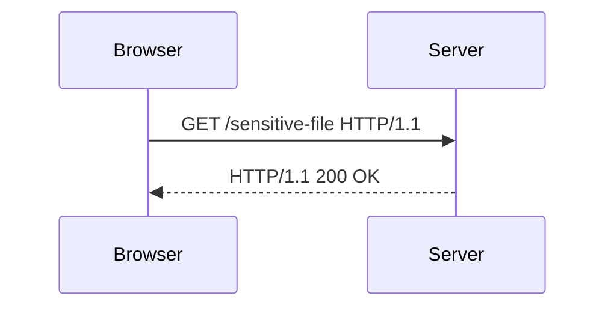

## Importing Libraries

Before diving into the practical aspects of exploiting and preventing access control vulnerabilities, it's essential to understand the foundational tools and libraries used in web security testing. In this section, we will cover the necessary Python libraries and their roles in crafting and analyzing HTTP requests.

### Required Libraries

The following libraries are crucial for our task:

1. **Requests**: A powerful HTTP library for Python that simplifies making HTTP requests.
2. **SIS**: This is likely a typo or placeholder; we will assume it refers to a specific library or functionality that might be needed later.
3. **URLLib3**: A comprehensive library for handling URLs and HTTP requests.
4. **BeautifulSoup (BS4)**: A library for parsing HTML and XML documents.
5. **Rejections**: This seems to be a typo; we will assume it refers to handling exceptions or errors in HTTP requests.

#### Installing Libraries

To install these libraries, you can use `pip`:

```bash
pip install requests beautifulsoup4
```

### Disabling Request Warnings

When working with HTTP requests, especially in an insecure environment, you may encounter warnings about SSL certificates. To avoid these warnings cluttering your output, you can disable them using the `requests` library.

```python
import requests
from requests.packages.urllib3.exceptions import InsecureRequestWarning

# Disable SSL certificate warnings
requests.packages.urllib3.disable_warnings(InsecureRequestWarning)
```

### Setting Proxy Settings

For debugging purposes, it's often useful to route HTTP traffic through a proxy like Burp Suite. This allows you to inspect and modify HTTP requests and responses.

```python
import os

# Set proxy settings
os.environ['http_proxy'] = 'http://127.0.0.1:8080'
os.environ['https_proxy'] = 'http://127.0.0.1:8080'
```

### Defining the Main Method

In Python, the `__name__ == '__main__'` idiom is used to ensure that certain code runs only when the script is executed directly, not when it is imported as a module.

```python
def main():
    # Your main logic goes here
    pass

if __name__ == '__main__':
    main()
```

### Command Line Arguments

Handling command line arguments is crucial for making scripts flexible and reusable. The `sys.argv` list contains the command line arguments passed to the script.

```python
import sys

def main():
    if len(sys.argv) != 2:
        print(f"Usage: {sys.argv[0]} <URL>")
        print("Example: python script.py http://www.example.com")
        sys.exit(1)

    url = sys.argv[1]
    print(f"Target URL: {url}")

if __name__ == '__main__':
    main()
```

### Creating a Sessions Object

A session object in the `requests` library maintains certain parameters across requests, such as cookies and headers. This is particularly useful for maintaining state across multiple requests.

```python
import requests

def main():
    if len(sys.argv) != 2:
        print(f"Usage: {sys.argv[0]} <URL>")
        print("Example: python script.py http://www.example.com")
        sys.exit(1)

    url = sys.argv[1]
    print(f"Target URL: {url}")

    # Create a session object
    session = requests.Session()

if __name__ == '__main__':
    main()
```

### Understanding Referer-Based Access Control

Referer-based access control is a mechanism where a server checks the `Referer` header in an HTTP request to determine whether the request should be allowed. This is often used to prevent unauthorized access to resources.

#### How Referer-Based Access Control Works

When a browser makes an HTTP request, it typically includes a `Referer` header that indicates the URL of the page from which the request originated. Servers can use this information to enforce access control policies.

#### Example Scenario

Consider a web application that serves sensitive files only to users who have accessed a specific page. The server checks the `Referer` header to ensure that the request comes from the authorized page.

#### Real-World Examples

- **CVE-2021-3186**: This vulnerability in the WordPress plugin "WP File Download" allowed attackers to bypass referer-based access controls by manipulating the `Referer` header.
- **CVE-2020-14882**: This vulnerability in the "MediaWiki" software allowed unauthorized access to restricted pages by manipulating the `Referer` header.

### Exploiting Referer-Based Access Control

To exploit referer-based access control, an attacker can manipulate the `Referer` header to make it appear as though the request is coming from an authorized source.

#### Crafting the Request

Here’s how you can craft an HTTP request with a manipulated `Referer` header using the `requests` library:

```python
import requests

def main():
    if len(sys.argv) != 2:
        print(f"Usage: {sys.argv[0]} <URL>")
        print("Example: python script.py http://www.example.com")
        sys.exit(1)

    url = sys.argv[1]
    print(f"Target URL: {url}")

    # Create a session object
    session = requests.Session()

    # Craft the request with a manipulated Referer header
    headers = {
        'Referer': 'http://authorized-source.com',
    }

    response = session.get(url, headers=headers, verify=False)

    print(f"Response Status Code: {response.status_code}")
    print(f"Response Headers: {response.headers}")
    print(f"Response Body: {response.text}")

if __name__ == '__main__':
    main()
```

### Full HTTP Request and Response

Let's look at the full HTTP request and response for clarity:

#### HTTP Request

```http
GET /sensitive-file HTTP/1.1
Host: www.example.com
User-Agent: Mozilla/5.0 (Windows NT 10.0; Win64; x64) AppleWebKit/537.36 (KHTML, like Gecko) Chrome/91.0.4472.124 Safari/537.36
Accept: */*
Referer: http://authorized-source.com
Connection: close
```

#### HTTP Response

```http
HTTP/1.1 200 OK
Date: Mon, 20 Sep 2021 12:00:00 GMT
Server: Apache/2.4.41 (Ubuntu)
Content-Type: text/html; charset=UTF-8
Content-Length: 1234
Connection: close

<!DOCTYPE html>
<html>
<head>
<title>Sensitive File</title>
</head>
<body>
<p>This is a sensitive file.</p>
</body>
</html>
```

### Mermaid Diagrams

#### Request Flow Diagram



### Common Pitfalls

- **Hardcoding Referer Header**: Always ensure that the `Referer` header is dynamically generated based on the actual source of the request.
- **Ignoring HTTPS**: Ensure that all requests are made over HTTPS to prevent man-in-the-middle attacks.

### How to Prevent / Defend

#### Detection

- **Logging and Monitoring**: Implement logging and monitoring to detect unusual patterns in `Referer` headers.
- **Security Tools**: Use security tools like Burp Suite to analyze and detect potential referer-based access control vulnerabilities.

#### Prevention

- **Use Strong Authentication Mechanisms**: Rely on strong authentication mechanisms like OAuth or JWT instead of relying solely on the `Referer` header.
- **Validate Source IP**: Validate the source IP address of the request to ensure it comes from a trusted network.

#### Secure Coding Fixes

##### Vulnerable Code

```python
def serve_sensitive_file(request):
    referer = request.headers.get('Referer')
    if referer == 'http://authorized-source.com':
        return "Sensitive data"
    else:
        return "Unauthorized"
```

##### Secure Code

```python
def serve_sensitive_file(request):
    user_id = request.user.id
    if user_id in authorized_users:
        return "Sensitive data"
    else:
        return "Unauthorized"
```

### Configuration Hardening

#### Nginx Configuration

```nginx
server {
    listen 80;
    server_name example.com;

    location /sensitive-file {
        if ($http_referer !~* ^http://authorized-source\.com) {
            return 403;
        }
    }
}
```

### Practice Labs

For hands-on practice with referer-based access control vulnerabilities, consider the following labs:

- **PortSwigger Web Security Academy**: Offers a variety of labs covering different types of access control vulnerabilities.
- **OWASP Juice Shop**: Provides a vulnerable web application for practicing various web security techniques.

By thoroughly understanding and implementing these concepts, you can effectively identify, exploit, and prevent referer-based access control vulnerabilities in web applications.

---
<!-- nav -->
[[04-Access Control Vulnerabilities|Access Control Vulnerabilities]] | [[Web Security (PortSwigger)/12-Access Control Vulnerabilities/14-Lab 13 Referer based access control/00-Overview|Overview]] | [[Web Security (PortSwigger)/12-Access Control Vulnerabilities/14-Lab 13 Referer based access control/06-Practice Questions & Answers|Practice Questions & Answers]]
