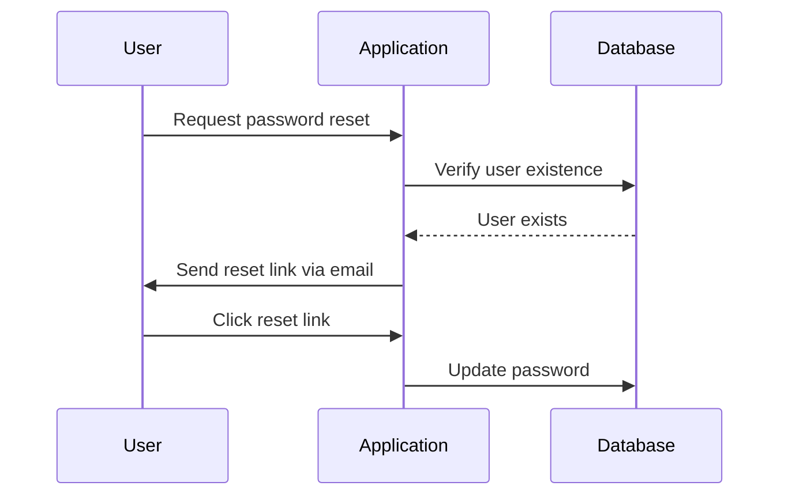
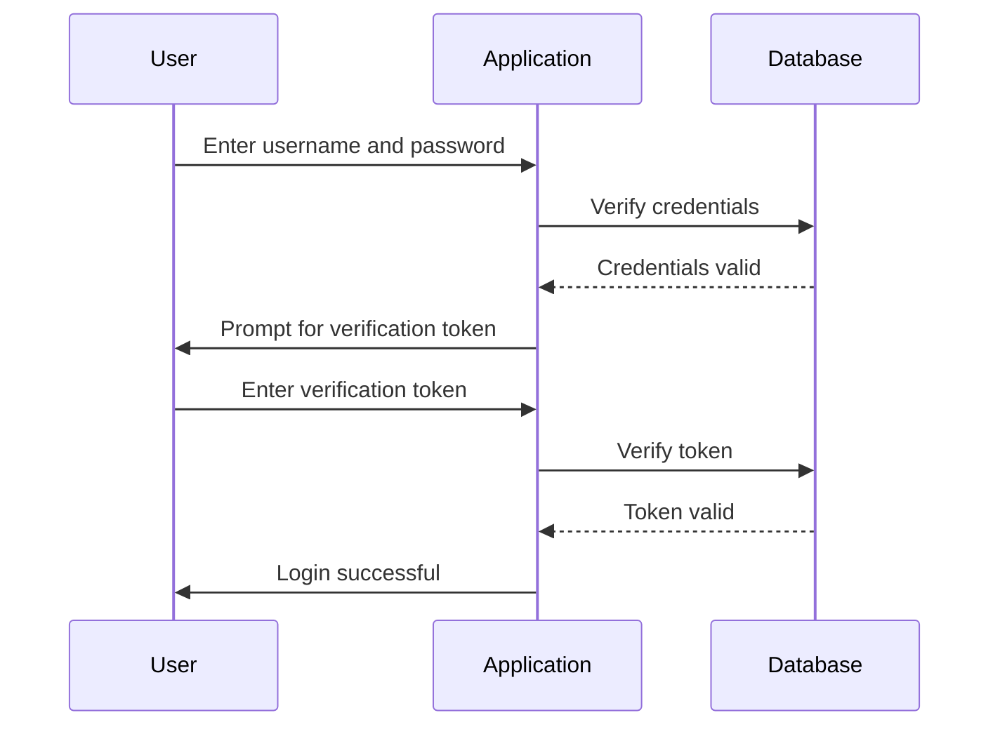

## Authentication Vulnerabilities Complete Guide

### Introduction to Authentication Vulnerabilities

Authentication is a critical component of web applications, ensuring that users are who they claim to be. However, authentication mechanisms can often be vulnerable to various attacks, undermining the security of the entire application. This section will delve into the details of authentication vulnerabilities, focusing on the importance of testing all authentication mechanisms within an application, not just the login page.

### Testing All Authentication Mechanisms

When testing for authentication vulnerabilities, it is crucial to examine all authentication mechanisms within an application. This includes:

- **Login Page**: The primary entry point for users to access their accounts.
- **Forgot Password Functionality**: A feature that allows users to reset their passwords.
- **Multi-Factor Authentication (MFA)**: An additional layer of security that requires users to provide two or more forms of identification.

#### Example: Forgot Password Functionality

The forgot password functionality is often overlooked but can be a significant vulnerability. If this mechanism is not properly secured, attackers can easily compromise user accounts.

**Why It Matters:**
- **Ease of Exploitation**: Attackers can exploit weak forgot password mechanisms to gain unauthorized access to user accounts.
- **Undermines Security**: Compromising the forgot password functionality undermines the overall security of the application.

**Real-World Example:**
- **CVE-2021-21972**: A vulnerability in the WordPress plugin "User Registration" allowed attackers to bypass the password reset mechanism, leading to unauthorized access.

**Detection and Prevention:**
- **Detection**: Monitor for unusual activity such as multiple password reset requests from different IP addresses.
- **Prevention**: Implement rate limiting on password reset requests and require additional verification methods (e.g., email confirmation).



### Multi-Factor Authentication (MFA) Vulnerabilities

Multi-Factor Authentication (MFA) adds an extra layer of security by requiring users to provide two or more forms of identification. However, MFA implementations can also have vulnerabilities if not properly designed.

#### Example: Business Logic Flaw in MFA Implementation

Consider an application that employs MFA. The process involves:

1. **Username and Password**: The user provides their username and password.
2. **Verification Token**: If the username and password are correct, the user is prompted to enter a verification token.

**Issue with the Implementation:**
- **Verification Code Not Tied to UserID**: The verification code is not tied to the user ID, and the application uses a cookie (`account`) to keep track of the session.

**Why It Matters:**
- **Session Hijacking**: An attacker can hijack the session by manipulating the `account` cookie.
- **Compromise of Multiple Accounts**: If the verification code is not tied to the user ID, an attacker can potentially compromise multiple accounts.

**Real-World Example:**
- **CVE-2020-14774**: A vulnerability in the Okta MFA implementation allowed attackers to bypass MFA by manipulating session cookies.

**Detection and Prevention:**
- **Detection**: Monitor for unusual activity such as multiple failed MFA attempts from different IP addresses.
- **Prevention**: Ensure that the verification code is tied to the user ID and implement proper session management.



### Secure MFA Implementation

To ensure the security of MFA, it is essential to follow best practices:

1. **Tie Verification Code to UserID**: Ensure that the verification code is tied to the user ID to prevent session hijacking.
2. **Proper Session Management**: Use secure session management techniques to prevent session hijacking.
3. **Rate Limiting**: Implement rate limiting on MFA attempts to prevent brute-force attacks.

**Secure Code Example:**

```python
# Vulnerable MFA Implementation
def verify_mfa(token):
    if token == get_token_from_database():
        return True
    return False

# Secure MFA Implementation
def verify_mfa(user_id, token):
    if token == get_token_from_database(user_id):
        return True
    return False
```

### Hands-On Labs

To practice identifying and mitigating authentication vulnerabilities, consider the following hands-on labs:

- **PortSwigger Web Security Academy**: Offers a comprehensive set of labs covering various authentication vulnerabilities.
- **OWASP Juice Shop**: A deliberately insecure web application for practicing web security skills.
- **DVWA (Damn Vulnerable Web Application)**: A PHP/MySQL web application that is riddled with vulnerabilities for educational purposes.

By thoroughly testing all authentication mechanisms and implementing secure coding practices, you can significantly enhance the security of your web application.

### Conclusion

Authentication vulnerabilities can severely undermine the security of web applications. By testing all authentication mechanisms, understanding the underlying business logic, and implementing secure coding practices, you can mitigate these risks and ensure the integrity of your application. Always stay vigilant and continuously monitor for potential vulnerabilities to maintain robust security.

---
<!-- nav -->
[[01-Authentication Vulnerabilities A Comprehensive Guide|Authentication Vulnerabilities A Comprehensive Guide]] | [[Web Security (PortSwigger)/13-Authentication Vulnerabilities/01-Authentication Vulnerabilities Complete Guide/00-Overview|Overview]] | [[03-Introduction to Authentication Vulnerabilities|Introduction to Authentication Vulnerabilities]]
