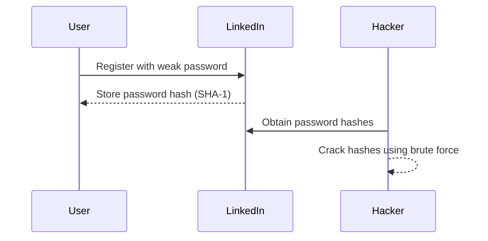
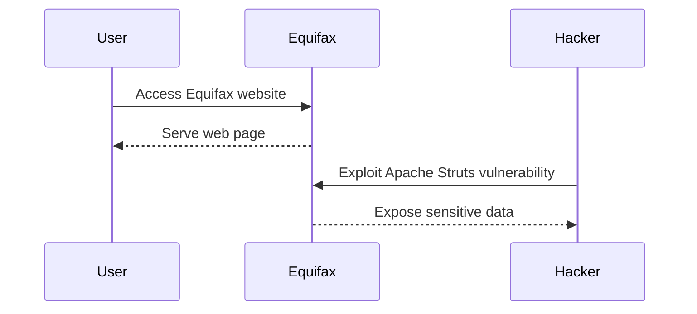

## Introduction to Authentication Vulnerabilities

Welcome to the comprehensive guide on Authentication Vulnerabilities in web security. This chapter aims to provide a deep dive into the mechanisms, vulnerabilities, and preventive measures related to authentication processes in web applications. By the end of this chapter, you will have a thorough understanding of how authentication works, the various types of vulnerabilities associated with it, and how to effectively test and secure these systems.

### What is Authentication?

Authentication is the process of verifying the identity of a user or entity. In the context of web applications, it ensures that the person attempting to access a resource is indeed who they claim to be. This is typically achieved through one or more of the following factors:

1. **Something you know**: A password or PIN.
2. **Something you have**: A physical token or a mobile device.
3. **Something you are**: Biometric data such as fingerprints or facial recognition.

The primary goal of authentication is to establish trust between the user and the system. Without proper authentication, unauthorized users could gain access to sensitive information or perform actions they should not be allowed to.

### Importance of Authentication

Authentication is crucial because it forms the foundation of security in web applications. Without robust authentication mechanisms, attackers can impersonate legitimate users and gain unauthorized access to resources. This can lead to data breaches, financial losses, and reputational damage.

### Types of Authentication Mechanisms

There are several types of authentication mechanisms commonly used in web applications:

1. **Username and Password**: The most common form of authentication, where users provide a username and a password to gain access.
2. **Two-Factor Authentication (2FA)**: Adds an additional layer of security by requiring a second factor, such as a code sent to a mobile device.
3. **Multi-Factor Authentication (MFA)**: Extends 2FA by using multiple factors, such as biometrics and hardware tokens.
4. **OAuth and OpenID Connect**: Protocols used for authentication and authorization, often involving third-party identity providers.

### Common Authentication Flaws

Despite the importance of authentication, many web applications suffer from authentication flaws. These flaws can be categorized into several types:

1. **Weak Passwords**: Users often choose weak passwords that are easy to guess or crack.
2. **Brute Force Attacks**: Attackers attempt to guess passwords through repeated login attempts.
3. **Session Management Issues**: Improper handling of session IDs can allow attackers to hijack sessions.
4. **Insecure Direct Object References (IDOR)**: Allows attackers to manipulate parameters to access unauthorized resources.
5. **Broken Authentication**: Flaws in the implementation of authentication mechanisms, such as improper validation of credentials.

### Real-World Examples of Authentication Vulnerabilities

#### Example 1: LinkedIn Data Breach (CVE-2012-0801)

In 2012, LinkedIn suffered a massive data breach where hackers obtained over 6.5 million hashed passwords. The breach was due to the use of weak hashing algorithms (SHA-1) and the lack of salt, making it easier for attackers to crack the hashes.



#### Example 2: Equifax Data Breach (CVE-2017-5638)

Equifax suffered a significant data breach in 2017, affecting over 143 million customers. The breach was caused by a vulnerability in Apache Struts, which allowed attackers to execute arbitrary code and steal sensitive data.



### How to Find and Exploit Authentication Vulnerabilities

To effectively test and exploit authentication vulnerabilities, you need to understand the common methods and tools used in penetration testing.

#### Tools for Testing Authentication

1. **Burp Suite**: A popular tool for web application security testing, including authentication testing.
2. **OWASP ZAP**: Another widely used tool for identifying security vulnerabilities in web applications.
3. **Hydra**: A fast and powerful tool for brute-forcing passwords.

#### Steps to Test Authentication

1. **Identify Authentication Mechanisms**: Determine the type of authentication used by the application.
2. **Test Weak Passwords**: Use tools like Hydra to test for weak passwords.
3. **Test Brute Force Attacks**: Attempt to guess passwords through repeated login attempts.
4. **Test Session Management**: Check for issues with session IDs and ensure they are properly handled.
5. **Test IDOR**: Manipulate parameters to check if unauthorized access is possible.

### Example: Testing Weak Passwords with Hydra

Here’s an example of how to use Hydra to test for weak passwords:

```bash
hydra -l admin -P /path/to/password/list.txt http://target.com login
```

This command attempts to log in as `admin` using a list of potential passwords from `/path/to/password/list.txt`.

### How to Prevent and Defend Against Authentication Vulnerabilities

Preventing and defending against authentication vulnerabilities requires a multi-layered approach, including secure coding practices, proper configuration, and regular security assessments.

#### Secure Coding Practices

1. **Use Strong Hashing Algorithms**: Always use strong hashing algorithms like bcrypt or Argon2 for storing passwords.
2. **Implement Salt**: Add a unique salt to each password hash to prevent rainbow table attacks.
3. **Enforce Strong Password Policies**: Require users to create strong passwords and enforce regular password changes.
4. **Enable Two-Factor Authentication (2FA)**: Implement 2FA to add an additional layer of security.

#### Configuration Hardening

1. **Secure Session Management**: Ensure session IDs are properly generated and managed.
2. **Disable Auto-Complete**: Disable auto-complete on login forms to prevent unauthorized access.
3. **Limit Login Attempts**: Implement rate limiting to prevent brute force attacks.

#### Regular Security Assessments

1. **Penetration Testing**: Regularly conduct penetration tests to identify and fix vulnerabilities.
2. **Code Reviews**: Perform regular code reviews to ensure secure coding practices are followed.
3. **Security Audits**: Conduct security audits to assess the overall security posture of the application.

### Example: Secure Password Storage with bcrypt

Here’s an example of how to securely store passwords using bcrypt in Python:

```python
import bcrypt

# Generate a salt
salt = bcrypt.gensalt()

# Hash the password
password = b"mysecretpassword"
hashed_password = bcrypt.hashpw(password, salt)

# Verify the password
if bcrypt.checkpw(password, hashed_password):
    print("Password matches")
else:
    print("Password does not match")
```

### Conclusion

Understanding and securing authentication mechanisms is critical for maintaining the security of web applications. By recognizing common vulnerabilities, using appropriate testing tools, and implementing robust security measures, you can significantly reduce the risk of unauthorized access and data breaches.

### Hands-On Labs

For practical experience in testing and securing authentication mechanisms, consider the following labs:

- **PortSwigger Web Security Academy**: Offers interactive labs on authentication vulnerabilities.
- **OWASP Juice Shop**: Provides a vulnerable web application for practicing security testing.
- **DVWA (Damn Vulnerable Web Application)**: A deliberately insecure web application for learning web security.

By engaging with these labs, you can apply the theoretical knowledge gained in this chapter to real-world scenarios, enhancing your skills in web security.

---
<!-- nav -->
[[02-Authentication Vulnerabilities Complete Guide|Authentication Vulnerabilities Complete Guide]] | [[Web Security (PortSwigger)/13-Authentication Vulnerabilities/01-Authentication Vulnerabilities Complete Guide/00-Overview|Overview]] | [[04-Authentication Vulnerabilities|Authentication Vulnerabilities]]
