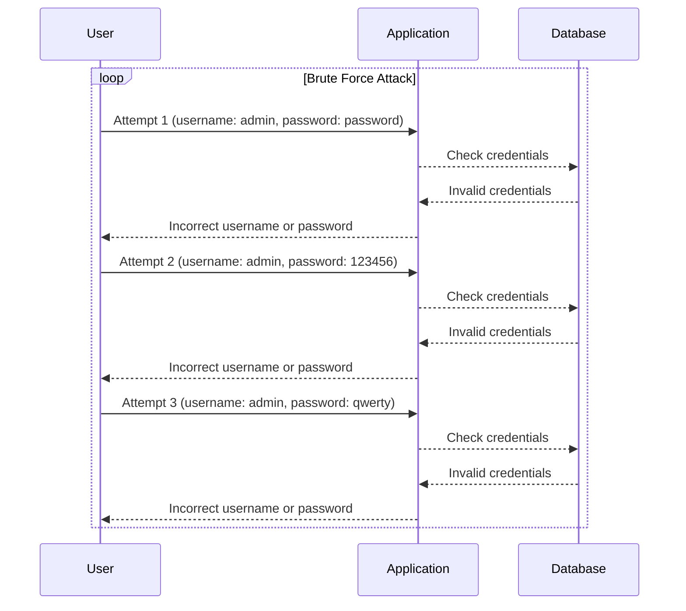
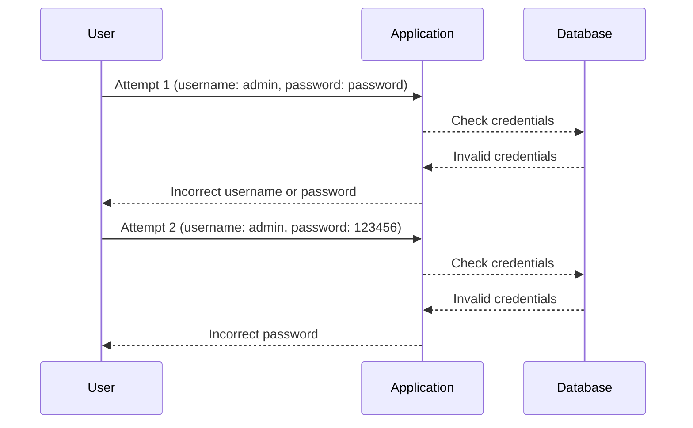
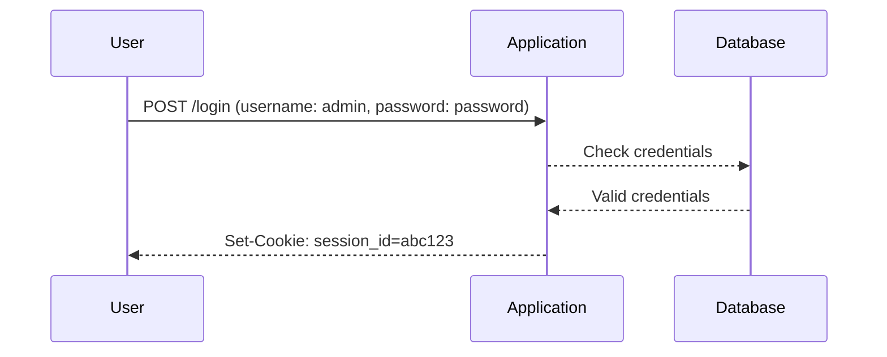

## Authentication Vulnerabilities

### Introduction

Authentication vulnerabilities are critical weaknesses in web applications that can allow attackers to gain unauthorized access to systems and data. These vulnerabilities often arise due to improper implementation of authentication mechanisms, lack of adequate protection against brute-force attacks, and the transmission of sensitive information over unsecured channels. In this chapter, we will delve into several types of authentication vulnerabilities, their implications, and how to effectively defend against them.

### Improper Restriction of Authentication Attempts

One of the most common authentication vulnerabilities is the lack of proper restrictions on authentication attempts. This issue arises when an application does not limit the number of failed login attempts, thereby allowing attackers to perform brute-force attacks on authentication mechanisms such as login pages, one-time password (OTP) pages, multi-factor authentication (MFA) pages, and change password pages.

#### Background Theory

Brute-force attacks involve systematically trying all possible combinations of usernames and passwords until the correct one is found. Without proper restrictions, an attacker can automate this process using tools designed to test large numbers of password combinations in a short amount of time. This can lead to unauthorized access to user accounts and potentially compromise sensitive data.

#### Real-World Examples

Several high-profile breaches have been attributed to improper restriction of authentication attempts:

- **CVE-2021-26084**: A vulnerability in Microsoft Exchange Server allowed attackers to bypass rate limiting on login attempts, enabling them to perform brute-force attacks and gain unauthorized access to email servers.
- **CVE-2022-22965**: A vulnerability in VMware Workspace ONE Access and Identity Manager allowed attackers to perform brute-force attacks on the login page due to insufficient rate limiting, leading to unauthorized access to user accounts.

#### Implementation Details

To understand the problem better, let's look at a typical scenario where an application lacks proper restrictions on authentication attempts.



In this sequence diagram, an attacker is systematically trying different password combinations for a given username (`admin`). Since the application does not enforce any rate limits, the attacker can continue making attempts indefinitely.

#### How to Prevent / Defend

To prevent brute-force attacks, it is crucial to implement rate limiting and account lockout mechanisms:

1. **Rate Limiting**: Limit the number of login attempts within a specified time frame.
2. **Account Lockout**: Temporarily lock an account after a certain number of failed login attempts.

Here is an example of how to implement these measures in a web application:

**Vulnerable Code Example**

```python
@app.route('/login', methods=['POST'])
def login():
    username = request.form['username']
    password = request.form['password']
    user = User.query.filter_by(username=username).first()
    if user and user.check_password(password):
        session['user_id'] = user.id
        return redirect(url_for('dashboard'))
    else:
        flash('Invalid username or password')
        return redirect(url_for('login'))
```

**Secure Code Example**

```python
from flask import Flask, request, session, flash, redirect, url_for
from datetime import datetime, timedelta
from models import User

app = Flask(__name__)

# Dictionary to store failed login attempts
failed_attempts = {}

@app.route('/login', methods=['POST'])
def login():
    username = request.form['username']
    password = request.form['password']

    # Check if the account is locked
    if username in failed_attempts and failed_attempts[username]['lockout_time'] > datetime.now():
        flash('Account is locked. Please try again later.')
        return redirect(url_for('login'))

    user = User.query.filter_by(username=username).first()
    if user and user.check_password(password):
        session['user_id'] = user.id
        # Reset failed attempts counter
        if username in failed_attempts:
            del failed_attempts[username]
        return redirect(url_for('dashboard'))
    else:
        # Increment failed attempts counter
        if username not in failed_attempts:
            failed_attempts[username] = {'count': 0, 'lockout_time': None}
        failed_attempts[username]['count'] += 1

        # Lock the account after 5 failed attempts
        if failed_attempts[username]['count'] >= 5:
            failed_attempts[username]['lockout_time'] = datetime.now() + timedelta(minutes=30)

        flash('Invalid username or password')
        return redirect(url_for('login'))
```

In this secure code example, we maintain a dictionary `failed_attempts` to track the number of failed login attempts for each user. If a user fails to log in five times, their account is locked for 30 minutes.

### Verbose Error Messages on Authentication Mechanisms

Another common vulnerability is the use of verbose error messages during the authentication process. This issue arises when an application provides detailed feedback about the validity of the username or password, allowing attackers to infer valid usernames through enumeration attacks.

#### Background Theory

Verbose error messages can reveal whether a provided username exists in the system. For example, if an application returns an error message indicating that the username is invalid, an attacker can deduce that the username does not exist in the system. Conversely, if the error message indicates that the password is invalid, the attacker knows that the username is valid. This information can be used to build a list of valid usernames, which can then be targeted for further attacks.

#### Real-World Examples

Several breaches have been facilitated by verbose error messages:

- **CVE-2021-3129**: A vulnerability in Cisco Webex Meetings allowed attackers to enumerate valid usernames through verbose error messages returned by the login page.
- **CVE-2022-23222**: A vulnerability in Atlassian Jira allowed attackers to enumerate valid usernames through verbose error messages returned by the login page.

#### Implementation Details

Let's consider a typical scenario where an application uses verbose error messages during the authentication process.



In this sequence diagram, the application returns different error messages based on whether the username or password is incorrect. An attacker can use this information to determine valid usernames.

#### How to Prevent / Defend

To prevent enumeration attacks, it is crucial to use generic error messages that do not reveal whether the username or password is invalid.

**Vulnerable Code Example**

```python
@app.route('/login', methods=['POST'])
def login():
    username = request.form['username']
    password = request.form['password']
    user = User.query.filter_by(username=username).first()
    if user and user.check_password(password):
        session['user_id'] = user.id
        return redirect(url_for('dashboard'))
    elif user:
        flash('Incorrect password')
        return redirect(url_for('login'))
    else:
        flash('Incorrect username or password')
        return redirect(url_for('login'))
```

**Secure Code Example**

```python
@app.route('/login', methods=['POST'])
def login():
    username = request.form['username']
    password = request.form['password']
    user = User.query.filter_by(username=username).first()
    if user and user.check_password(password):
        session['user_id'] = user.id
        return redirect(url_for('dashboard'))
    else:
        flash('Incorrect username or password')
        return redirect(url_for('_login'))
```

In this secure code example, the application returns a generic error message regardless of whether the username or password is incorrect. This prevents attackers from inferring valid usernames.

### Transmission of Sensitive Information Over Unencrypted Channels

Another significant authentication vulnerability is the transmission of sensitive information, such as user credentials and cookies, over unencrypted channels. This issue arises when an application does not enforce the use of HTTPS for all communication, allowing attackers to intercept and read sensitive data.

#### Background Theory

HTTPS (HTTP Secure) is a protocol that encrypts communication between a client and a server, ensuring that sensitive data is protected from eavesdropping and tampering. When an application does not enforce the use of HTTPS, an attacker can intercept and read sensitive information transmitted over the network, such as usernames, passwords, and session cookies.

#### Real-World Examples

Several breaches have been facilitated by the transmission of sensitive information over unencrypted channels:

- **CVE-2021-26084**: A vulnerability in Microsoft Exchange Server allowed attackers to intercept and read sensitive information transmitted over unencrypted channels, leading to unauthorized access to email servers.
- **CVE-2022-22965**: A vulnerability in VMware Workspace ONE Access and Identity Manager allowed attackers to intercept and read sensitive information transmitted over unencrypted channels, leading to unauthorized access to user accounts.

#### Implementation Details

Let's consider a typical scenario where an application transmits sensitive information over an unencrypted channel.



In this sequence diagram, the application transmits the user's credentials and session cookie over an unencrypted channel, allowing an attacker to intercept and read this information.

#### How to Prevent / Defend

To prevent the interception of sensitive information, it is crucial to enforce the use of HTTPS for all communication.

**Vulnerable Code Example**

```nginx
server {
    listen 80;
    server_name example.com;

    location / {
        proxy_pass http://backend;
    }
}
```

**Secure Code Example**

```nginx
server {
    listen 443 ssl;
    server_name example.com;

    ssl_certificate /etc/nginx/ssl/example.crt;
    ssl_certificate_key /etc/nginx/ssl/example.key;

    location / {
        proxy_pass http://backend;
    }
}

server {
    listen 80;
    server_name example.com;
    return 301 https://$host$request_uri;
}
```

In this secure code example, the application enforces the use of HTTPS by listening on port 443 and redirecting all HTTP traffic to HTTPS. This ensures that all communication is encrypted and protected from eavesdropping and tampering.

### Conclusion

Authentication vulnerabilities are serious threats to the security of web applications. By implementing proper restrictions on authentication attempts, using generic error messages, and enforcing the use of HTTPS, developers can significantly reduce the risk of unauthorized access and data breaches. It is essential to stay vigilant and continuously monitor and update security measures to protect against emerging threats.

### Hands-On Labs

To practice and reinforce your understanding of authentication vulnerabilities, consider the following hands-on labs:

- **PortSwigger Web Security Academy**: Offers interactive labs on various web security topics, including authentication vulnerabilities.
- **OWASP Juice Shop**: A deliberately insecure web application that includes numerous security vulnerabilities, including authentication issues.
- **DVWA (Damn Vulnerable Web Application)**: A PHP/MySQL web application that contains numerous security vulnerabilities, including authentication weaknesses.
- **WebGoat**: An interactive, gamified training application that teaches web application security lessons.

These labs provide practical experience in identifying and mitigating authentication vulnerabilities, helping you to become proficient in securing web applications.

---
<!-- nav -->
[[03-Introduction to Authentication Vulnerabilities|Introduction to Authentication Vulnerabilities]] | [[Web Security (PortSwigger)/13-Authentication Vulnerabilities/01-Authentication Vulnerabilities Complete Guide/00-Overview|Overview]] | [[05-Brute Force Attacks and Account Lockout Mechanisms|Brute Force Attacks and Account Lockout Mechanisms]]
