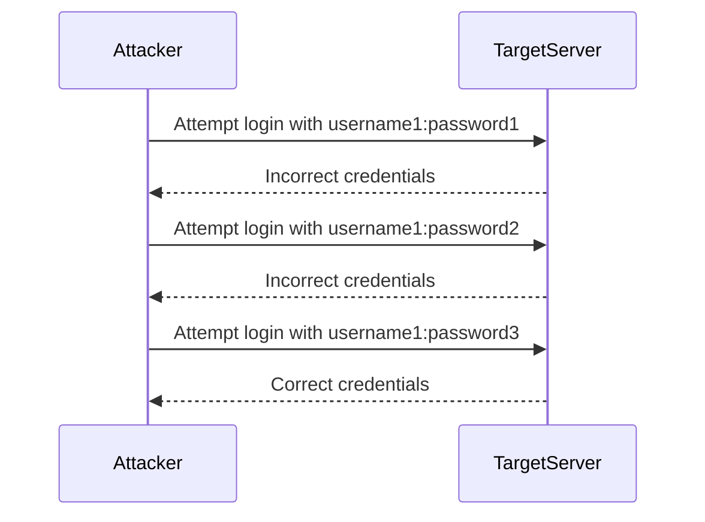
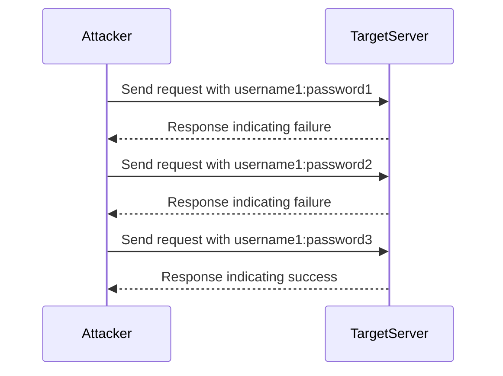
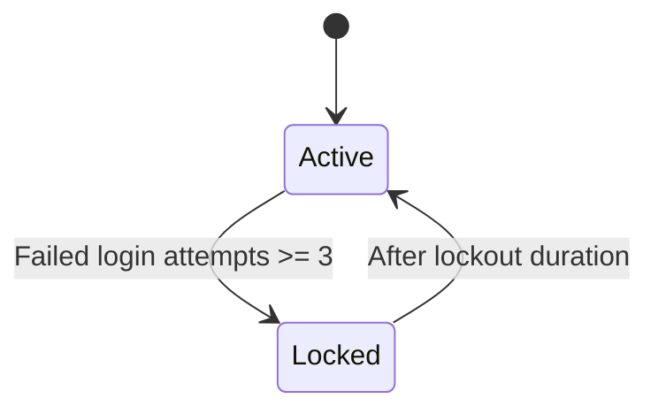
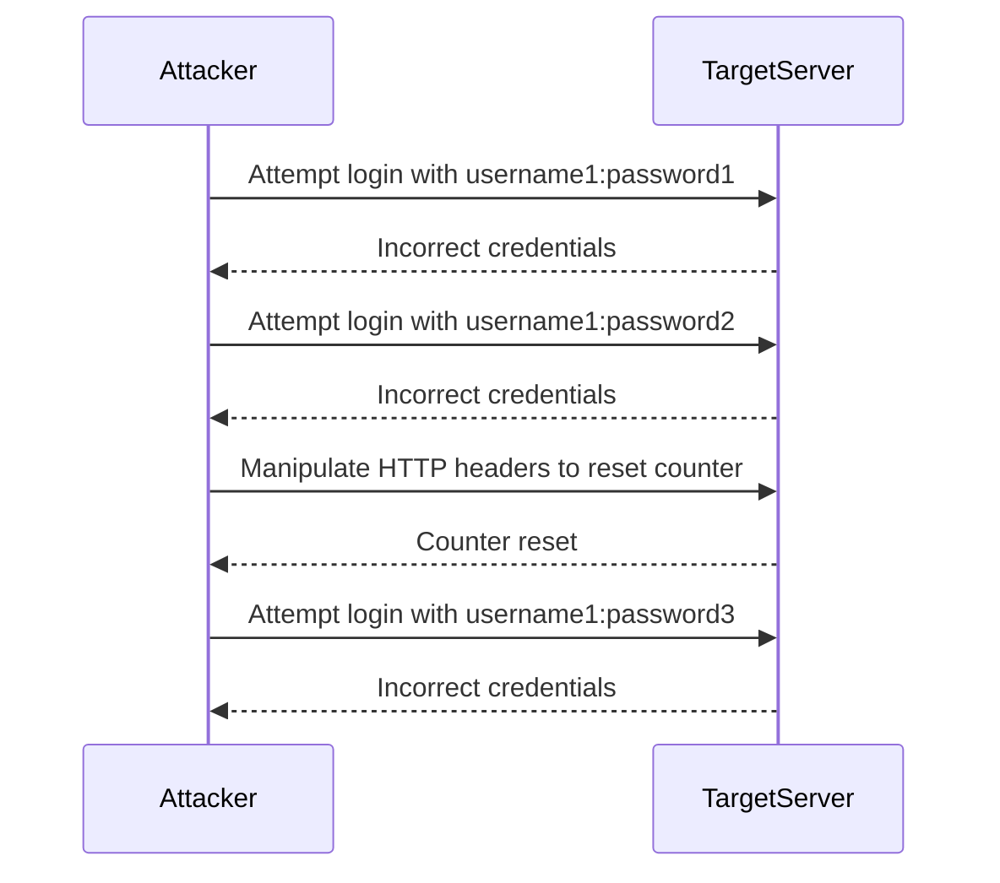
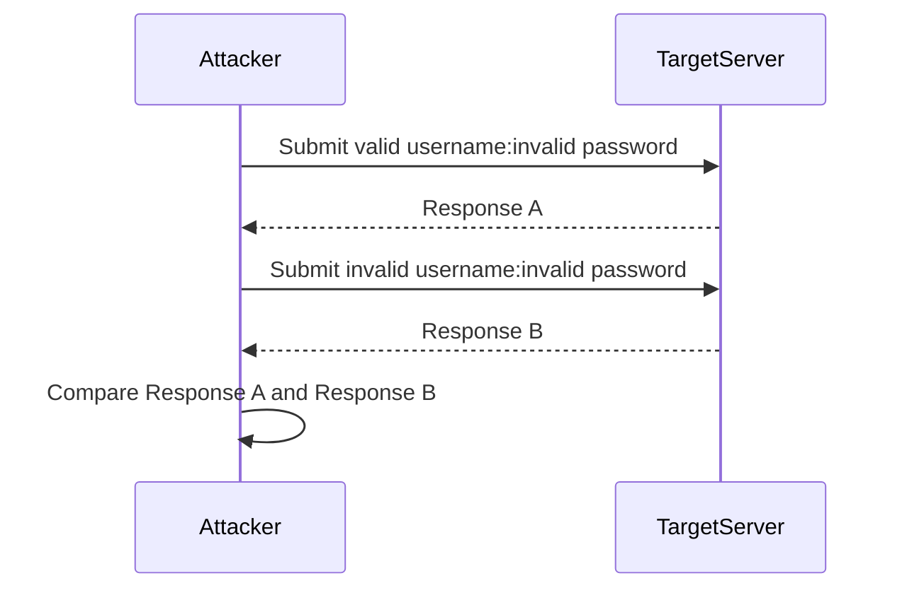
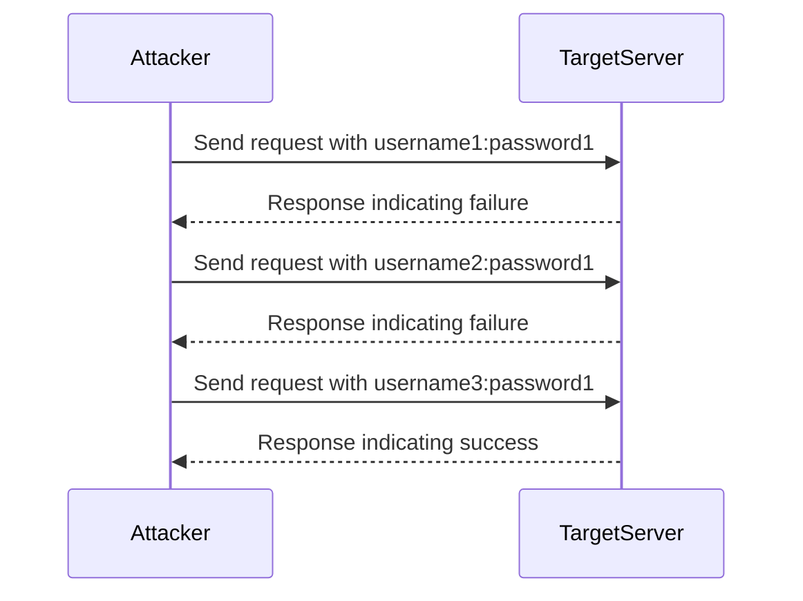

## Brute Force Attacks and Account Lockout Mechanisms

### Introduction to Brute Force Attacks

Brute force attacks are a method used by attackers to gain unauthorized access to systems by systematically trying different combinations of credentials until the correct one is found. These attacks are particularly effective against weak or commonly used passwords. Tools such as Hydra and Burp Intruder are commonly used to automate the process of brute forcing authentication mechanisms.

#### What is Hydra?

Hydra is a fast and flexible network logon cracker that supports various protocols and services. It can be used to perform brute force attacks on a wide range of authentication mechanisms, including SSH, FTP, HTTP, and more. Hydra allows users to specify a list of usernames and passwords to try, making it a powerful tool for both penetration testers and malicious actors.



#### What is Burp Intruder?

Burp Intruder is a feature within the Burp Suite, a comprehensive toolkit for web application security testing. It automates the process of sending multiple requests to a server with different payloads, allowing for efficient brute force attacks. Burp Intruder can be configured to send requests with different usernames and passwords, and it can analyze the responses to identify successful logins.



### Account Lockout Mechanisms

Account lockout mechanisms are designed to prevent brute force attacks by temporarily locking an account after a certain number of failed login attempts. However, these mechanisms themselves can be vulnerable if not implemented correctly.

#### How Account Lockout Works

When a user enters incorrect credentials, the system increments a counter associated with the account. Once the counter reaches a predefined threshold, the account is locked, preventing further login attempts for a specified period or indefinitely.

#### Example of Account Lockout Implementation

Consider a scenario where an account is locked after three failed login attempts:



#### Vulnerability in Account Lockout Mechanisms

One common vulnerability in account lockout mechanisms is the use of cookies to track the number of failed login attempts. If an attacker can manipulate or bypass the cookie, they may be able to reset the failed attempt counter and continue their brute force attack.

#### Real-World Example: CVE-2021-21972

CVE-2021-21972 is a vulnerability in the account lockout mechanism of a popular web application framework. The vulnerability allowed attackers to bypass the lockout mechanism by manipulating HTTP headers, effectively resetting the failed attempt counter.



### Monitoring Requests and Responses During Brute Force Attacks

To determine if an account lockout mechanism can be exploited, it is crucial to monitor all requests and responses during the attack. This includes analyzing the HTTP headers, status codes, and response bodies to identify patterns that may indicate a vulnerability.

#### Full HTTP Request and Response Example

Here is an example of a full HTTP request and response during a brute force attack:

```http
POST /login HTTP/1.1
Host: example.com
Content-Type: application/x-www-form-urlencoded
Content-Length: 29

username=admin&password=pass123
```

```http
HTTP/1.1 200 OK
Date: Mon, 20 Nov 2023 12:00:00 GMT
Content-Type: text/html; charset=UTF-8
Content-Length: 1234

<!DOCTYPE html>
<html>
<head>
    <title>Login</title>
</head>
<body>
    <h1>Login Failed</h1>
    <p>Incorrect username or password.</p>
</body>
</html>
```

#### Analyzing HTTP Headers

The HTTP headers provide valuable information about the response. Key headers to analyze include:

- **Status Code**: Indicates whether the login was successful or not.
- **Set-Cookie**: Used to track session state and can be manipulated to bypass lockout mechanisms.
- **Content-Length**: Can indicate the size of the response body, which may differ between successful and failed login attempts.

### Testing for Verbal Error Messages

Verbal error messages are a common vulnerability in web applications where the error messages provided to the user reveal sensitive information about the authentication process. This can be exploited to determine if a username is valid or not.

#### Steps to Test for Verbal Error Messages

1. **Submit a valid username and an invalid password**.
2. **Submit an invalid username and an invalid password**.
3. **Compare the responses** for any differences in status code, redirects, information displayed, HTML page source, or processing time.

#### Example Using Verp Comparer

Verp Comparer is a tool that can be used to compare the responses from different login attempts. Here is an example of how to use it:



#### Full HTTP Request and Response Example

Here are the full HTTP requests and responses for the two scenarios:

```http
POST /login HTTP/1.1
Host: example.com
Content-Type: application/x-www-form-urlencoded
Content-Length: 35

username=admin&password=wrongpassword
```

```http
HTTP/1.1 200 OK
Date: Mon, 20 Nov 2023 12:00:00 GMT
Content-Type: text/html; charset=UTF-8
Content-Length: 1234

<!DOCTYPE html>
<html>
<head>
    <title>Login</title>
</head>
<body>
    <h1>Login Failed</h1>
    <p>Incorrect password for admin.</p>
</body>
</html>
```

```http
POST /login HTTP/1.1
Host: example.com
Content-Type: application/x-www-form-urlencoded
Content-Length: 35

username=nonexistent&password=wrongpassword
```

```http
HTTP/1.1 200 OK
Date: Mon, 20 Nov 2023 12:00:00 GMT
Content-Type: text/html; charset=UTF-8
Content-Length: 1234

<!DOCTYPE html>
<html>
<head>
    <title>Login</title>
</head>
<body>
    <h1>Login Failed</h1>
    <p>User nonexistent does not exist.</p>
</body>
</html>
```

### Differences in Responses

By comparing the responses, we can identify differences that indicate a vulnerability:

- **Status Code**: Both responses have a 200 status code, but the content differs.
- **HTML Content**: The first response indicates an incorrect password, while the second response indicates that the user does not exist.
- **Processing Time**: The time taken to process the requests may also differ, providing additional clues.

### Automated Attack to Enumerate Valid Usernames

Once a vulnerability in verbal error messages is identified, an automated attack can be launched to enumerate valid usernames in the application.

#### Example Using Burp Intruder

Burp Intruder can be configured to send requests with different usernames and analyze the responses to identify valid usernames.



### How to Prevent / Defend Against Authentication Vulnerabilities

#### Secure Coding Practices

1. **Use Strong Password Policies**: Enforce strong password requirements, such as minimum length, complexity, and regular expiration.
2. **Implement Multi-Factor Authentication (MFA)**: Require users to provide multiple forms of verification, such as a password and a one-time code sent to their phone.
3. **Rate Limit Login Attempts**: Limit the number of login attempts per unit of time to prevent brute force attacks.
4. **Use CAPTCHAs**: Implement CAPTCHAs to prevent automated attacks.

#### Secure Configuration

1. **Configure Account Lockout Mechanisms**: Ensure that account lockout mechanisms are properly configured and cannot be bypassed.
2. **Monitor and Log Authentication Attempts**: Regularly monitor and log authentication attempts to detect and respond to suspicious activity.
3. **Use Secure HTTP Headers**: Configure HTTP headers to enhance security, such as setting `X-Frame-Options`, `Content-Security-Policy`, and `Strict-Transport-Security`.

#### Example of Secure Configuration

Here is an example of a secure configuration for an Nginx server:

```nginx
server {
    listen 443 ssl;
    server_name example.com;

    ssl_certificate /etc/nginx/ssl/example.crt;
    ssl_certificate_key /etc/nginx/ssl/example.key;

    location /login {
        auth_basic "Restricted Area";
        auth_basic_user_file /etc/nginx/htpasswd.users;

        add_header X-Frame-Options DENY;
        add_header Content-Security-Policy "default-src 'self'";
        add_header Strict-Transport-Security "max-age=31536000; includeSubDomains";

        limit_req zone=login burst=5 nodelay;
    }
}
```

#### Detection and Prevention Tools

1. **Web Application Firewalls (WAFs)**: Use WAFs to detect and block malicious traffic.
2. **Intrusion Detection Systems (IDS)**: Implement IDS to monitor network traffic and detect suspicious patterns.
3. **Security Information and Event Management (SIEM)**: Use SIEM solutions to aggregate and analyze security events from various sources.

### Practice Labs

For hands-on practice with authentication vulnerabilities, consider the following labs:

- **PortSwigger Web Security Academy**: Offers interactive labs on various web security topics, including authentication vulnerabilities.
- **OWASP Juice Shop**: A deliberately insecure web application for practicing web security skills.
- **DVWA (Damn Vulnerable Web Application)**: A PHP/MySQL web application that contains numerous security vulnerabilities.
- **WebGoat**: An interactive training application designed to teach web application security lessons.

These labs provide a safe environment to practice identifying and mitigating authentication vulnerabilities.

### Conclusion

Authentication vulnerabilities are a significant threat to web applications. By understanding the mechanisms behind brute force attacks, account lockout mechanisms, and verbal error messages, and by implementing robust security measures, organizations can significantly reduce the risk of unauthorized access. Regular monitoring, secure coding practices, and the use of detection and prevention tools are essential components of a comprehensive security strategy.

---
<!-- nav -->
[[04-Authentication Vulnerabilities|Authentication Vulnerabilities]] | [[Web Security (PortSwigger)/13-Authentication Vulnerabilities/01-Authentication Vulnerabilities Complete Guide/00-Overview|Overview]] | [[06-Brute Force Protection|Brute Force Protection]]
