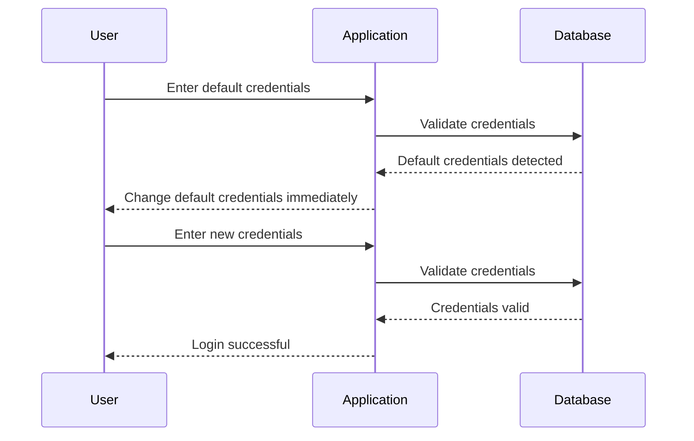

## Default Credentials

### What Are Default Credentials?

Default credentials are pre-set login credentials provided by software vendors. They are often used during initial setup and are intended to be changed by the end-user. However, many users fail to change these defaults, leaving their systems vulnerable to unauthorized access.

### Why Are Default Credentials Dangerous?

Default credentials pose a significant security risk because they are widely known and documented. Attackers can easily find and use these credentials to gain unauthorized access to systems.

### How Do Default Credentials Work?

Let’s consider a web application that uses default credentials like `admin/admin`. An attacker can easily try these credentials to gain access:

```http
POST /login HTTP/1.1
Host: example.com
Content-Type: application/x-www-form-urlencoded

username=admin&password=admin
```

If the credentials are not changed, the attacker will successfully log in.

### Real-World Examples

#### CVE-2021-21972: Zyxel NAS Devices

In 2021, Zyxel Network Storage (NAS) devices were found to have default passwords that could be easily guessed. This allowed attackers to gain administrative access to the devices, leading to potential data theft and unauthorized access.

### How to Prevent / Defend Against Default Credentials

#### Secure Coding Practices

Ensure that default credentials are changed upon installation. Provide clear instructions to users to change default passwords immediately after deployment.

Here’s an example of a secure password policy implementation in Python:

```python
import re

def validate_password(password):
    if len(password) < 1 12:
        return False
    if not re.search("[a-z]", password):
        return False
    if not re.search("[A-Z]", password):
        return False
    if not re.search("[0-9]", password):
        return False
    if not re.search("[!@#$%^&*()_+]", password):
        return False
    return True

# Example usage
print(validate_password("Password123!"))  # True
print(validate_password("pass"))          # False
```

#### Hardening Configuration

Ensure that default credentials are changed upon installation. Provide clear instructions to users to change default passwords immediately after deployment.

```json
{
  "default_credentials": {
    "username": "admin",
    "password": "change_me"
  }
}
```

### Mermaid Diagram: Default Credentials Enforcement



### Practice Labs

For hands-on practice with authentication vulnerabilities, consider the following labs:

- **PortSwigger Web Security Academy**: Offers comprehensive modules on authentication vulnerabilities, including weak password requirements and default credentials.
- **OWASP Juice Shop**: A deliberately insecure web application for practicing web security skills, including authentication vulnerabilities.
- **DVWA (Damn Vulnerable Web Application)**: A PHP/MySQL web application that is riddled with vulnerabilities, including weak password requirements and default credentials.

By thoroughly understanding and implementing secure coding practices and configuration hardening, you can significantly reduce the risk of authentication vulnerabilities in your web applications.

---
<!-- nav -->
[[07-Changing Default Credentials|Changing Default Credentials]] | [[Web Security (PortSwigger)/13-Authentication Vulnerabilities/01-Authentication Vulnerabilities Complete Guide/00-Overview|Overview]] | [[Web Security (PortSwigger)/13-Authentication Vulnerabilities/01-Authentication Vulnerabilities Complete Guide/09-Generic Error Messages|Generic Error Messages]]
