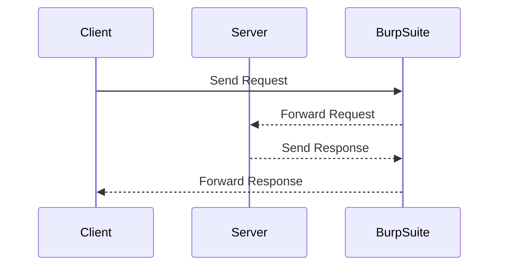

## Insecure Forgot Password Functionality

### Background Theory

Another common authentication vulnerability is insecure forgot password functionality. This typically occurs when the reset password process is not properly secured, allowing attackers to reset passwords and gain unauthorized access to accounts.

### How It Works

The forgot password functionality usually involves the following steps:

1. **User Requests Reset**: The user requests a password reset by entering their email address or username.
2. **Email Sent**: The system sends an email with a reset link or a temporary password.
3. **Reset Password**: The user clicks the reset link or enters the temporary password to reset their password.

If any of these steps are not properly secured, an attacker can exploit the vulnerability to reset passwords and gain unauthorized access.

### Real-World Examples

#### Recent Breaches

One notable example of a breach due to insecure forgot password functionality is the LinkedIn data breach in 2012. In this case, attackers exploited a vulnerability in the forgot password functionality, which allowed them to reset passwords and gain unauthorized access to user accounts.

#### CVE Example

Another example is CVE-2019-11510, which affected the WordPress Jetpack plugin. This vulnerability allowed attackers to reset passwords by manipulating the reset token. While this specific vulnerability was related to the reset token, it highlights the importance of ensuring that the entire forgot password process is securely implemented.

### Testing for Insecure Forgot Password Functionality

To test for insecure forgot password functionality, you can follow these steps:

1. **Identify Forgot Password Functionality**: Identify if the application has a forgot password functionality.
2. **Perform Walkthrough**: Perform a complete walkthrough with an account that you control while intercepting all the requests and responses in your proxy.

Here is an example of how you might set up Burp Suite to intercept requests and responses:



### Full HTTP Request and Response

Here is an example of an HTTP request and response for a forgot password request:

```http
POST /forgot-password HTTP/1.1
Host: example.com
Content-Type: application/x-www-form-urlencoded
Content-Length: 29

email=admin@example.com
```

```http
HTTP/1.1 200 OK
Date: Mon, 23 Jan 2023 12:00:00 GMT
Content-Type: text/html; charset=UTF-8
Content-Length: 36

Password reset email sent to admin@example.com
```

### How to Prevent / Defend

#### Detection

To detect insecure forgot password functionality, you can use tools like Burp Suite to intercept and analyze requests and responses. You can also check the application's configuration to ensure that the entire forgot password process is securely implemented.

#### Prevention

To prevent insecure forgot password functionality, you should:

1. **Use Secure Tokens**: Ensure that the reset tokens are securely generated and validated.
2. **Limit Token Expiry**: Limit the expiry time of reset tokens to prevent attackers from resetting passwords after a certain period.
3. **Verify User Identity**: Verify the user's identity before sending the reset email, such as by requiring a secondary form of verification.

Here is an example of how to implement a secure forgot password process:

**Vulnerable Code:**

```python
@app.route('/forgot-password', methods=['POST'])
def forgot_password():
    email = request.form['email']
    # Generate reset token
    token = generate_token()
    # Send reset email
    send_reset_email(email, token)
    return 'Password reset email sent'
```

**Fixed Code:**

```python
@app.route('/forgot-password', methods=['POST'])
def forgot_password():
    email = request.form['email']
    # Generate reset token
    token = generate_secure_token()
    # Send reset email
    send_reset_email(email, token)
    return 'Password reset email sent'
```

In this example, the `generate_secure_token` function ensures that the reset token is securely generated and validated.

### Practice Labs

For hands-on practice, you can use the following labs:

- **PortSwigger Web Security Academy**: This lab provides a comprehensive guide to web security, including insecure forgot password functionality.
- **OWASP Juice Shop**: This lab includes various authentication vulnerabilities, including insecure forgot password functionality.
- **DVWA (Damn Vulnerable Web Application)**: This lab includes a variety of web application vulnerabilities, including insecure forgot password functionality.

By thoroughly understanding and implementing these security measures, you can significantly reduce the risk of authentication vulnerabilities in web applications.

---
<!-- nav -->
[[12-Hashing and Salting Stored Credentials|Hashing and Salting Stored Credentials]] | [[Web Security (PortSwigger)/13-Authentication Vulnerabilities/01-Authentication Vulnerabilities Complete Guide/00-Overview|Overview]] | [[14-Insecure Storage of Credentials|Insecure Storage of Credentials]]
