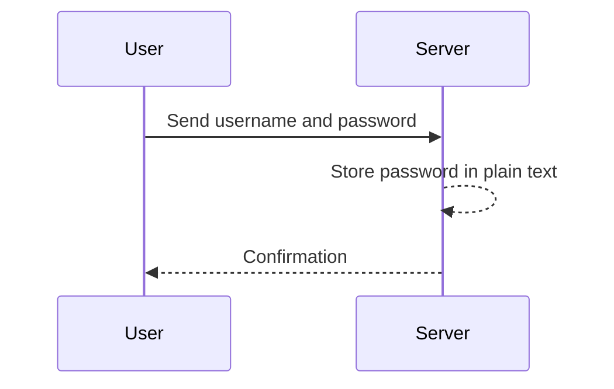
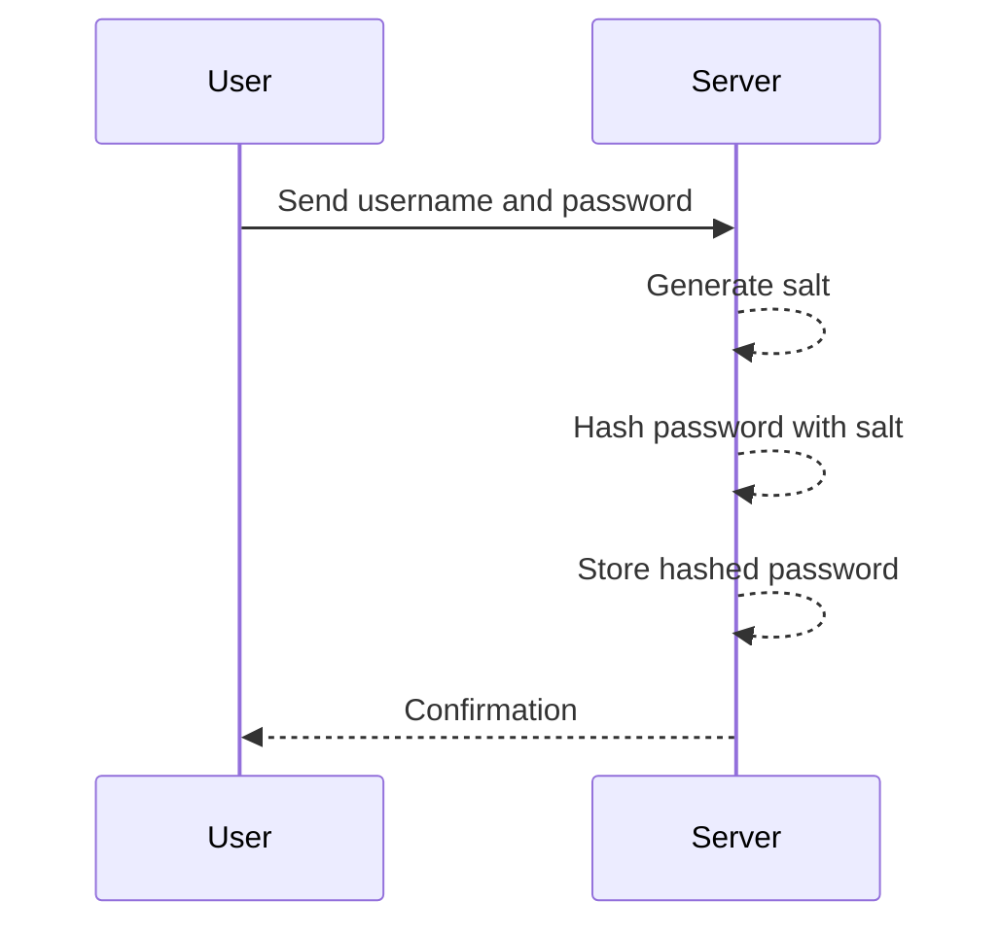

## Insecure Storage of Credentials

### Introduction

Insecure storage of credentials is a critical vulnerability that can lead to unauthorized access to user accounts and sensitive data. This vulnerability occurs when passwords or other sensitive information are stored in a manner that allows them to be easily retrieved or accessed by unauthorized parties. This section will delve into the details of how insecure storage of credentials can occur, the risks associated with it, and how to prevent such vulnerabilities.

### What is Insecure Storage of Credentials?

Insecure storage of credentials refers to the practice of storing user passwords or other sensitive information in a manner that does not adequately protect them from unauthorized access. This can include storing passwords in plain text, using weak encryption methods, or failing to properly hash passwords.

#### Why Does Insecure Storage Matter?

Storing credentials securely is crucial because if an attacker gains access to the storage location, they can easily obtain the credentials and use them to gain unauthorized access to user accounts. This can lead to a variety of negative consequences, including:

- **Unauthorized Access:** Attackers can log in as legitimate users and perform actions that they should not be authorized to do.
- **Data Theft:** Sensitive data can be stolen and used for malicious purposes.
- **Reputation Damage:** Organizations can suffer significant reputational damage if their users' credentials are compromised.

### How Does Insecure Storage Occur?

There are several ways in which insecure storage of credentials can occur:

1. **Plain Text Storage:** Storing passwords in plain text is the most insecure method. If an attacker gains access to the storage location, they can read the passwords directly.
2. **Weak Encryption:** Using weak encryption methods, such as simple substitution ciphers, can also make it easy for attackers to decrypt the passwords.
3. **Improper Hashing:** Hashing is a one-way function that converts a password into a fixed-length string of characters. However, if the hashing algorithm is weak or if the salt is not properly implemented, it can still be possible for attackers to reverse-engineer the passwords.

### Real-World Examples

#### CVE-2019-11510: WordPress Plugin Vulnerability

In 2019, a vulnerability was discovered in the WordPress plugin "WP Customer Area." The plugin stored user passwords in plain text, making it easy for attackers to obtain the passwords if they gained access to the database. This vulnerability was assigned the CVE identifier CVE-2019-11510.

#### Equifax Data Breach (2017)

The Equifax data breach in 2017 exposed the personal information of over 143 million individuals. One of the key factors that contributed to the severity of the breach was the fact that Equifax stored some of the affected users' passwords in plain text. This made it easy for the attackers to obtain the passwords and use them to gain unauthorized access to user accounts.

### Detection and Prevention

#### Detection

To detect insecure storage of credentials, you can perform the following checks:

1. **Review Application Code:** Review the application code to ensure that passwords are not being stored in plain text or using weak encryption methods.
2. **Check Database:** Check the database to ensure that passwords are properly hashed and salted.
3. **Review Logs:** Review logs to ensure that passwords are not being logged in plain text or obfuscated form.

#### Prevention

To prevent insecure storage of credentials, follow these best practices:

1. **Use Strong Hashing Algorithms:** Use strong hashing algorithms such as bcrypt, scrypt, or Argon2 to hash passwords. These algorithms are designed to be computationally expensive, making it difficult for attackers to reverse-engineer the passwords.
2. **Use Salts:** Use unique salts for each password to prevent attackers from using precomputed rainbow tables to reverse-engineer the passwords.
3. **Avoid Plain Text Storage:** Never store passwords in plain text. Always hash and salt the passwords before storing them.
4. **Implement Secure Password Policies:** Implement secure password policies that require users to create strong passwords and change them regularly.

### Secure Coding Practices

#### Example: Insecure Password Storage

```python
# Insecure password storage
def store_password(username, password):
    with open('passwords.txt', 'a') as f:
        f.write(f"{username}:{password}\n")
```

#### Example: Secure Password Storage

```python
import bcrypt

# Secure password storage
def store_password(username, password):
    salt = bcrypt.gensalt()
    hashed_password = bcrypt.hashpw(password.encode(), salt)
    with open('passwords.txt', 'a') as f:
        f.write(f"{username}:{hashed_password.decode()}\n")
```

### Mermaid Diagrams

#### Sequence Diagram: Insecure Password Storage



#### Sequence Diagram: Secure Password Storage



### Common Pitfalls

1. **Using Weak Hashing Algorithms:** Using weak hashing algorithms such as MD5 or SHA-1 can make it easy for attackers to reverse-engineer the passwords.
2. **Failing to Use Salts:** Failing to use unique salts for each password can make it easy for attackers to use precomputed rainbow tables to reverse-engineer the passwords.
3. **Logging Passwords:** Logging passwords in plain text or obfuscated form can make it easy for attackers to obtain the passwords if they gain access to the logs.

### Hands-On Labs

For hands-on practice with authentication vulnerabilities, consider the following labs:

- **PortSwigger Web Security Academy:** Offers a series of labs that cover various authentication vulnerabilities, including insecure storage of credentials.
- **OWASP Juice Shop:** A deliberately insecure web application that includes several authentication vulnerabilities, including insecure storage of credentials.
- **DVWA (Damn Vulnerable Web Application):** A PHP/MySQL web application that is intentionally vulnerable to common web application attacks, including insecure storage of credentials.

By thoroughly understanding the concepts and best practices covered in this section, you can help ensure that your applications are secure and that user credentials are protected from unauthorized access.

---
<!-- nav -->
[[13-Insecure Forgot Password Functionality|Insecure Forgot Password Functionality]] | [[Web Security (PortSwigger)/13-Authentication Vulnerabilities/01-Authentication Vulnerabilities Complete Guide/00-Overview|Overview]] | [[15-Multi-Factor Authentication (MFA)|Multi-Factor Authentication (MFA)]]
