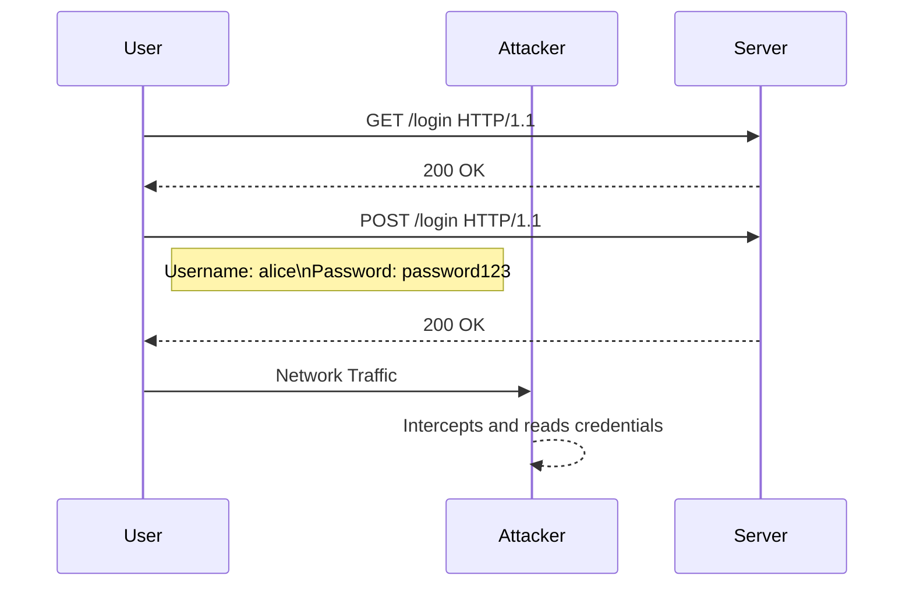

## Unencrypted HTTP Traffic and Authentication Vulnerabilities

### Background Theory

HTTP (Hypertext Transfer Protocol) is a protocol used for transmitting data over the internet. It is widely used for accessing web pages and other resources on the World Wide Web. However, HTTP is inherently unencrypted, meaning that any data transmitted over HTTP can be intercepted and read by anyone who has access to the network.

When you send a request to a server using HTTP, the data is sent in plain text. This includes sensitive information such as usernames and passwords. Anyone who can intercept the network traffic can easily read these credentials, leading to potential security breaches.

### Example: Intercepting Credentials Over HTTP

To illustrate this vulnerability, let's consider an example where we attempt to log into an intentionally vulnerable application, the OASP Juice Shop application, over an unencrypted HTTP connection.

#### Network Setup

Imagine you are on the same network as an attacker. The attacker can use tools like Wireshark or tcpdump to capture network traffic. When you send your login credentials over HTTP, the attacker can intercept and read them.



#### Raw HTTP Request and Response

Here is an example of the HTTP request and response:

```http
POST /login HTTP/1.1
Host: vulnerableapp.com
Content-Type: application/x-www-form-urlencoded
Content-Length: 26

username=alice&password=password123
```

```http
HTTP/1.1 200 OK
Date: Mon, 23 Jan 2023 12:00:00 GMT
Content-Type: text/html; charset=UTF-8
Content-Length: 1234

<!DOCTYPE html>
<html>
<head>
<title>Login Successful</title>
</head>
<body>
<h1>Welcome, alice!</h1>
</body>
</html>
```

### Impact of Unencrypted HTTP Traffic

The primary issue with unencrypted HTTP traffic is that it allows attackers to intercept and read sensitive information, such as login credentials. This can lead to unauthorized access to user accounts, theft of personal data, and other malicious activities.

### How to Prevent / Defend Against Unencrypted HTTP Traffic

#### Detection

To detect unencrypted HTTP traffic, you can use network monitoring tools like Wireshark or tcpdump. These tools allow you to capture and analyze network traffic to identify unencrypted HTTP requests and responses.

#### Prevention

The best way to prevent unencrypted HTTP traffic is to use HTTPS (HTTP Secure) instead. HTTPS encrypts the data transmitted between the client and the server, making it much more difficult for attackers to intercept and read the information.

##### Secure Coding Fix

Here is an example of how to switch from HTTP to HTTPS in a web application:

**Vulnerable Code:**

```python
from flask import Flask, redirect, url_for

app = Flask(__name__)

@app.route('/')
def index():
    return redirect(url_for('login'))

@app.route('/login')
def login():
    return '<form method="post" action="/login"><input type="text" name="username"><input type="password" name="password"><input type="submit"></form>'

if __name__ == '__main__':
    app.run()
```

**Secure Code:**

```python
from flask import Flask, redirect, url_for

app = Flask(__name__)

@app.route('/')
def index():
    return redirect(url_for('login', _external=True, _scheme='https'))

@app.route('/login')
def login():
    return '<form method="post" action="/login"><input type="text" name="username"><input type="password" name="password"><input type="submit"></form>'

if __name__ == '__main__':
    app.run(ssl_context='adhoc')  # For development purposes only
```

In the secure code, we ensure that all redirects and form actions use HTTPS by setting `_scheme='https'`.

#### Configuration Hardening

To further secure your application, you should configure your web server to enforce HTTPS. For example, in Apache, you can use the following configuration:

```apache
<VirtualHost *:80>
    ServerName www.example.com
    Redirect permanent / https://www.example.com/
</VirtualHost>

<VirtualHost *:443>
    ServerName www.example.com
    SSLEngine on
    SSLCertificateFile /path/to/cert.pem
    SSLCertificateKeyFile /path/to/key.pem
    DocumentRoot /var/www/html
</VirtualHost>
```

This configuration redirects all HTTP traffic to HTTPS and ensures that the server uses SSL/TLS encryption.

### Insecure Forgot Password Functionality

### Background Theory

Another common authentication vulnerability is the insecure implementation of the "forgot password" functionality. This feature is designed to help users recover their accounts if they forget their passwords. However, if implemented poorly, it can introduce significant security risks.

One common mistake is to rely on simple security questions that can be easily guessed or found through open-source intelligence (OSINT).

### Example: Insecure Secret Questions

Consider the following example where the forgot password functionality relies on a secret question: "What street did you live on in Sierra Vista?"

#### Vulnerability Analysis

1. **Finite Number of Answers**: There are only a limited number of streets in Sierra Vista, reducing the pool of possible answers.
2. **OSINT**: With a bit of research, an attacker can find the answer to the secret question on the user's social media accounts or other public sources.

#### Real-World Example

A real-world example of this vulnerability can be seen in the breach of the Equifax database in 2017. The company relied on weak security questions, which allowed attackers to reset passwords and gain unauthorized access to user accounts.

### How to Prevent / Defend Against Insecure Secret Questions

#### Detection

To detect insecure secret questions, you can review the implementation of the forgot password functionality. Look for reliance on simple or guessable questions.

#### Prevention

The best way to prevent insecure secret questions is to avoid using them altogether. Instead, implement more secure methods for account recovery, such as:

1. **Email Verification**: Send a verification link to the user's registered email address.
2. **Phone Verification**: Send a verification code to the user's registered phone number.
3. **Multi-Factor Authentication (MFA)**: Require additional authentication factors, such as a one-time password (OTP) or biometric data.

##### Secure Coding Fix

Here is an example of how to implement a secure forgot password functionality using email verification:

**Vulnerable Code:**

```python
from flask import Flask, render_template, request, redirect, url_for

app = Flask(__name__)

@app.route('/forgot_password', methods=['GET', 'POST'])
def forgot_password():
    if request.method == 'POST':
        username = request.form['username']
        secret_question = request.form['secret_question']
        secret_answer = request.form['secret_answer']
        # Check if the secret answer is correct
        if check_secret_answer(username, secret_answer):
            # Reset password
            reset_password(username)
            return redirect(url_for('login'))
        else:
            return render_template('forgot_password.html', error='Incorrect secret answer')
    return render_template('forgot_password.html')

def check_secret_answer(username, secret_answer):
    # Dummy function to check secret answer
    return True

def reset_password(username):
    # Dummy function to reset password
    pass

if __name__ == '__main__':
    app.run()
```

**Secure Code:**

```python
from flask import Flask, render_template, request, redirect, url_for
import smtplib
from email.mime.text import MIMEText

app = Flask(__name__)

@app.route('/forgot_password', methods=['GET', 'POST'])
def forgot_password():
    if request.method == 'POST':
        username = request.form['username']
        email = request.form['email']
        # Send verification link to email
        send_verification_link(email)
        return redirect(url_for('verify_email'))
    return render_template('forgot_password.html')

def send_verification_link(email):
    # Dummy function to send verification link
    msg = MIMEText('Click this link to reset your password: http://example.com/reset_password')
    msg['Subject'] = 'Password Reset'
    msg['From'] = 'noreply@example.com'
    msg['To'] = email
    s = smtplib.SMTP('localhost')
    s.sendmail(msg['From'], [msg['To']], msg.as_string())
    s.quit()

@app.route('/verify_email')
def verify_email():
    return render_template('verify_email.html')

if __name__ == '__main__':
    app.run()
```

In the secure code, we send a verification link to the user's registered email address instead of relying on a secret question.

#### Configuration Hardening

To further secure the forgot password functionality, you should configure your email server to use TLS encryption. For example, in Postfix, you can use the following configuration:

```plaintext
smtp_tls_security_level = may
smtp_use_tls = yes
smtp_tls_CAfile = /etc/postfix/cacert.pem
```

This configuration ensures that emails are sent securely using TLS encryption.

### Practice Labs

For hands-on practice with authentication vulnerabilities, you can use the following labs:

- **PortSwigger Web Security Academy**: Offers a comprehensive set of labs covering various web security topics, including authentication vulnerabilities.
- **OWASP Juice Shop**: A deliberately insecure web application that you can use to practice exploiting and securing authentication mechanisms.
- **DVWA (Damn Vulnerable Web Application)**: Another intentionally vulnerable web application that you can use to practice identifying and fixing authentication vulnerabilities.

These labs provide a safe environment to learn and practice securing authentication mechanisms against common vulnerabilities.

### Conclusion

Authentication vulnerabilities, such as unencrypted HTTP traffic and insecure secret questions, can significantly compromise the security of web applications. By understanding the underlying principles and implementing secure coding practices, you can effectively prevent and defend against these vulnerabilities. Always ensure that sensitive data is transmitted over encrypted channels and avoid relying on weak security mechanisms for account recovery.

---
<!-- nav -->
[[19-Storing Passwords Securely|Storing Passwords Securely]] | [[Web Security (PortSwigger)/13-Authentication Vulnerabilities/01-Authentication Vulnerabilities Complete Guide/00-Overview|Overview]] | [[21-Username Enumeration and Brute Force Attacks|Username Enumeration and Brute Force Attacks]]
