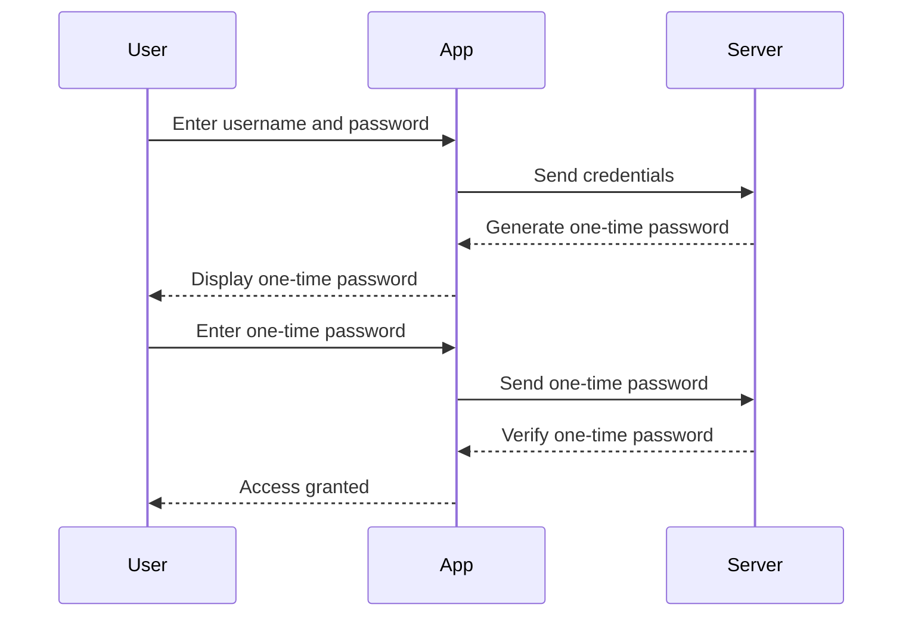

## Username Enumeration and Brute Force Attacks

### What is Username Enumeration?

Username enumeration is a technique used by attackers to discover valid usernames on a system. This can be done through various means, such as observing error messages returned by the authentication system or analyzing the behavior of the system when incorrect usernames are entered. For instance, if an application returns a different error message when a username does not exist compared to when a password is incorrect, an attacker can use this information to enumerate valid usernames.

### Why Does Username Enumeration Matter?

Username enumeration is significant because it can significantly reduce the complexity of a brute-force attack. Once an attacker knows a valid username, they can focus their efforts on guessing the correct password for that specific user. This makes the attack more efficient and increases the likelihood of success.

### How Does Username Enumeration Work?

To demonstrate how username enumeration works, consider the following scenario:

1. **Error Message Analysis**: An attacker might observe the error messages returned by the authentication system. For example, if the system returns "Invalid username" when a non-existent username is entered and "Incorrect password" when a valid username but incorrect password is entered, the attacker can use this information to determine which usernames are valid.

2. **Behavioral Analysis**: Another method involves analyzing the behavior of the system. For instance, if the system takes longer to respond when a valid username is entered compared to when an invalid username is entered, the attacker can infer that the username is valid.

### Real-World Example: CVE-2021-26084

A real-world example of username enumeration is CVE-2021-26084, which affected the WordPress REST API. The vulnerability allowed attackers to enumerate usernames by sending requests to the `/wp-json/wp/v2/users` endpoint. By analyzing the responses, attackers could determine which usernames were valid.

```http
GET /wp-json/wp/v2/users?per_page=100 HTTP/1.1
Host: example.com
```

The response would contain a list of users, allowing the attacker to identify valid usernames.

### How to Prevent Username Enumeration

#### Secure Coding Practices

To prevent username enumeration, developers should ensure that the authentication system returns consistent error messages regardless of whether the username or password is incorrect. This can be achieved by returning a generic error message such as "Invalid username or password."

```python
def authenticate(username, password):
    if not validate_username(username):
        return "Invalid username or password"
    
    if not validate_password(username, password):
        return "Invalid username or password"
    
    return "Authentication successful"
```

#### Network Monitoring and Logging

Implementing network monitoring and logging can help detect attempts at username enumeration. Tools like IDS/IPS systems can be configured to alert on suspicious activity, such as repeated failed login attempts with different usernames.

### Brute Force Attacks

### What is a Brute Force Attack?

A brute force attack is a method of gaining unauthorized access to a system by systematically trying all possible combinations of passwords until the correct one is found. This type of attack is often used in conjunction with username enumeration to target specific accounts.

### Why Does Brute Force Matter?

Brute force attacks are significant because they can be highly effective against weak or commonly used passwords. Even with strong passwords, brute force attacks can still succeed given enough time and computational resources.

### How Does a Brute Force Attack Work?

To demonstrate how a brute force attack works, consider the following scenario:

1. **Password Dictionary**: An attacker might start with a dictionary of common passwords and try each one against a known username. This is often referred to as a dictionary attack.

2. **Hybrid Approach**: If the dictionary approach fails, the attacker might switch to a hybrid approach, combining common words with numbers and symbols to generate potential passwords.

3. **Exhaustive Search**: As a last resort, the attacker might perform an exhaustive search, trying every possible combination of characters until the correct password is found.

### Real-World Example: LinkedIn Breach (2012)

A notable real-world example of a brute force attack is the LinkedIn breach in 2012. Hackers obtained a large number of hashed passwords and used brute force techniques to crack them. The breach exposed over 167 million user accounts, highlighting the importance of using strong, unique passwords.

### How to Prevent Brute Force Attacks

#### Account Lockout Policies

Implementing account lockout policies can significantly reduce the effectiveness of brute force attacks. For example, after a certain number of failed login attempts, the account can be locked for a period of time or permanently disabled.

```json
{
  "account_lockout_policy": {
    "max_attempts": 5,
    "lockout_duration": 300, // 5 minutes
    "reset_after": 3600 // 1 hour
  }
}
```

#### Rate Limiting

Rate limiting can also be used to slow down brute force attacks. By limiting the number of login attempts per unit of time, attackers will have less opportunity to guess the correct password.

```nginx
location /login {
    limit_req zone=login burst=5 nodelay;
}

map $request_uri $login {
    ~*^/login$ 1;
    default 0;
}

limit_req_zone $login zone=login:10m rate=5r/m;
```

### Multi-Stage Login Mechanisms

### What is a Multi-Stage Login Mechanism?

A multi-stage login mechanism is an authentication process that requires users to pass through multiple steps before being granted access. Each stage typically involves a different form of authentication, such as a username and password followed by a one-time password sent via SMS or email.

### Why Does a Multi-Stage Login Mechanism Matter?

Multi-stage login mechanisms are important because they provide an additional layer of security. Even if an attacker manages to obtain a user's password, they would still need to bypass the second factor of authentication, making the attack much more difficult.

### How Does a Multi-Stage Login Mechanism Work?

To demonstrate how a multi-stage login mechanism works, consider the following scenario:

1. **First Stage: Username and Password** - The user enters their username and password.
2. **Second Stage: One-Time Password** - The system sends a one-time password to the user's registered phone number or email address.
3. **Third Stage: Biometric Verification** - The user may be required to provide biometric data, such as a fingerprint or facial recognition.

### Real-World Example: Google Authenticator

Google Authenticator is a widely used two-factor authentication (2FA) tool that implements a multi-stage login mechanism. Users first enter their username and password, and then they must enter a one-time password generated by the app.



### How to Prevent Flaws in Multi-Stage Login Mechanisms

#### Secure Communication Channels

Ensure that all communication channels between the user and the server are encrypted using TLS. This prevents attackers from intercepting sensitive information such as one-time passwords.

```nginx
server {
    listen 443 ssl;
    server_name example.com;

    ssl_certificate /etc/nginx/ssl/example.crt;
    ssl_certificate_key /etc/nginx/ssl/example.key;

    location /login {
        # Your login logic here
    }
}
```

#### Time-Based One-Time Passwords (TOTP)

Use TOTP instead of static one-time passwords. TOTP generates a new code every 30 seconds, making it much harder for attackers to intercept and reuse the code.

```python
import pyotp

# Generate a secret key
secret = pyotp.random_base32()

# Create a TOTP object
totp = pyotp.TOTP(secret)

# Generate a one-time password
one_time_password = totp.now()
```

### Recovery URLs

### What is a Recovery URL?

A recovery URL is a link sent to a user's email address that allows them to reset their password or recover their account. These URLs often contain sensitive information and can be exploited if not properly secured.

### Why Does a Recovery URL Matter?

Recovery URLs are significant because they can be used to gain unauthorized access to a user's account. If an attacker can intercept or predict the recovery URL, they can reset the user's password and take control of the account.

### How Does a Recovery URL Work?

To demonstrate how a recovery URL works, consider the following scenario:

1. **User Requests Recovery**: The user requests a password reset and provides their email address.
2. **Email Sent**: The system sends an email containing a recovery URL to the user's email address.
3. **URL Clicked**: The user clicks the recovery URL and is directed to a page where they can reset their password.

### Real-World Example: Twitter Breach (2022)

In 2022, Twitter experienced a breach where hackers gained access to user accounts by exploiting recovery URLs. The hackers intercepted emails containing recovery URLs and used them to reset passwords and take control of the accounts.

### How to Prevent Recovery URL Vulnerabilities

#### Unique and Non-Predictable Tokens

Ensure that recovery URLs contain unique and non-predictable tokens. This makes it much harder for attackers to guess or intercept the URLs.

```python
import secrets

def generate_recovery_url(user_id):
    token = secrets.token_urlsafe(16)
    url = f"https://example.com/recover/{user_id}/{token}"
    return url
```

#### Expiration and Single-Use

Set an expiration time for recovery URLs and ensure that they can only be used once. This limits the window of opportunity for attackers to exploit the URLs.

```python
from datetime import datetime, timedelta

def generate_recovery_url(user_id):
    token = secrets.token_urlsafe(16)
    expires_at = datetime.utcnow() + timedelta(minutes=15)
    url = f"https://example.com/recover/{user_id}/{token}?expires={expires_at}"
    return url
```

### Full HTTP Request and Response Example

Here is a complete example of a recovery URL request and response:

```http
GET /recover/12345/abcdefg1234567890?expires=2023-10-01T12:00:00Z HTTP/1.1
Host: example.com
Cookie: session=abc123

HTTP/1.1 200 OK
Date: Mon, 01 Oct 2023 12:00:00 GMT
Content-Type: text/html; charset=UTF-8
Content-Length: 1234

<!DOCTYPE html>
<html>
<head>
    <title>Password Recovery</title>
</head>
<body>
    <h1>Password Recovery</h1>
    <form action="/reset-password" method="POST">
        <label for="password">New Password:</label>
        <input type="password" id="password" name="password" required>
        <button type="submit">Reset Password</button>
    </form>
</body>
</html>
```

### How to Prevent Recovery URL Vulnerabilities

#### Secure Email Transmission

Ensure that emails containing recovery URLs are transmitted securely using TLS. This prevents attackers from intercepting the emails and obtaining the recovery URLs.

```nginx
server {
    listen 443 ssl;
    server_name example.com;

    ssl_certificate /etc/nginx/ssl/example.crt;
    ssl_certificate_key /etc/nginx/ssl/example.key;

    location /recover {
        # Your recovery logic here
    }
}
```

#### Network Monitoring and Logging

Implement network monitoring and logging to detect any unusual activity related to recovery URLs. This can help identify potential attacks and allow for timely intervention.

### Practice Labs

For hands-on practice with authentication vulnerabilities, consider the following labs:

- **PortSwigger Web Security Academy**: Offers comprehensive modules on authentication vulnerabilities, including username enumeration and brute force attacks.
- **OWASP Juice Shop**: A deliberately insecure web application that includes challenges related to authentication vulnerabilities.
- **DVWA (Damn Vulnerable Web Application)**: Provides a range of authentication-related vulnerabilities for testing and learning.

By thoroughly understanding and implementing the preventive measures discussed, you can significantly enhance the security of your authentication mechanisms and protect against common vulnerabilities.

---
<!-- nav -->
[[20-Unencrypted HTTP Traffic and Authentication Vulnerabilities|Unencrypted HTTP Traffic and Authentication Vulnerabilities]] | [[Web Security (PortSwigger)/13-Authentication Vulnerabilities/01-Authentication Vulnerabilities Complete Guide/00-Overview|Overview]] | [[22-Using Encrypted Channels|Using Encrypted Channels]]
