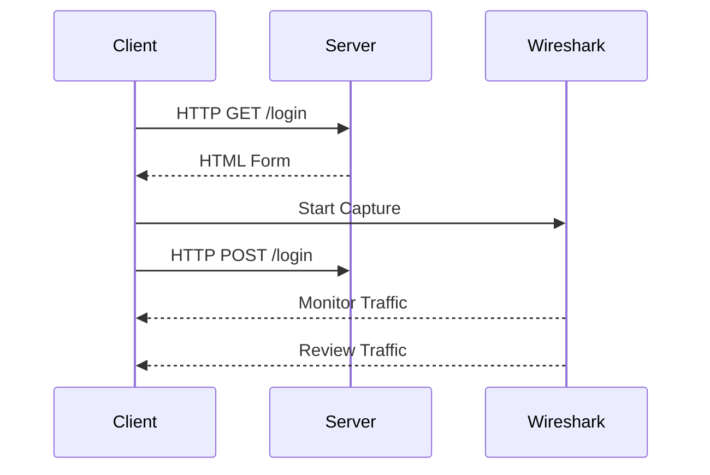

## Vulnerable Transmission of Credentials

### Background Theory

Authentication vulnerabilities are critical in web security because they can expose sensitive user information, such as usernames and passwords, to unauthorized parties. One of the most common types of authentication vulnerabilities is the transmission of credentials in an insecure manner. This typically occurs when credentials are sent over an unencrypted connection, such as HTTP, instead of a secure connection like HTTPS.

### How It Works

When a user logs into a web application, their credentials (username and password) are typically transmitted from the client (browser) to the server. If this transmission is not encrypted, an attacker can intercept the credentials using techniques such as Man-in-the-Middle (MitM) attacks. This can happen in several ways:

1. **URL Query String**: Credentials are included in the URL query string, which can be easily intercepted by anyone who has access to the network traffic.
2. **Cookies**: Credentials are stored in cookies, which can be intercepted if the cookies are not marked as secure.
3. **HTTP Traffic**: Credentials are transmitted over HTTP, which is not encrypted, allowing an attacker to capture the credentials.

### Real-World Examples

#### Recent Breaches

One notable example of a breach due to insecure transmission of credentials is the Equifax data breach in 2017. In this case, attackers exploited a vulnerability in Apache Struts, which allowed them to execute arbitrary code on the server. Once they had access, they were able to steal sensitive information, including credentials, which were not properly encrypted during transmission.

#### CVE Example

Another example is CVE-2018-1259, which affected the WordPress REST API. This vulnerability allowed attackers to bypass authentication by manipulating the API requests. While this specific vulnerability was related to authentication bypass, it highlights the importance of ensuring that all authentication-related traffic is securely transmitted.

### Testing for Vulnerable Transmission

To test for vulnerable transmission of credentials, you can follow these steps:

1. **Perform a Successful Login**: Log in to the application while monitoring all the traffic between the client and the server.
2. **Monitor Traffic**: Use tools like Wireshark or Burp Suite to monitor the network traffic.
3. **Review Traffic**: Look for instances where credentials are submitted in a URL query string, as a cookie, or are transmitted back to the client.

Here is an example of how you might set up Wireshark to monitor traffic:



### Full HTTP Request and Response

Here is an example of an HTTP request and response where credentials are transmitted in plain text:

```http
POST /login HTTP/1.1
Host: example.com
Content-Type: application/x-www-form-urlencoded
Content-Length: 29

username=admin&password=secret
```

```http
HTTP/1.1 200 OK
Date: Mon, 23 Jan 2023 12:00:00 GMT
Content-Type: text/html; charset=UTF-8
Content-Length: 12

Welcome, admin!
```

### How to Prevent / Defend

#### Detection

To detect insecure transmission of credentials, you can use tools like Wireshark or Burp Suite to monitor network traffic. You can also check the application's configuration to ensure that it is using HTTPS instead of HTTP.

#### Prevention

To prevent insecure transmission of credentials, you should:

1. **Use HTTPS**: Ensure that all communication between the client and the server is encrypted using HTTPS.
2. **Secure Cookies**: Mark cookies as secure so that they are only transmitted over HTTPS.
3. **Avoid URL Query Strings**: Avoid transmitting credentials in URL query strings.

Here is an example of how to configure a web server to use HTTPS:

```nginx
server {
    listen 443 ssl;
    server_name example.com;

    ssl_certificate /etc/ssl/certs/example.crt;
    ssl_certificate_key /etc/ssl/private/example.key;

    location /login {
        proxy_pass http://backend;
    }
}
```

### Secure Code Fix

Here is an example of how to fix insecure transmission of credentials in a web application:

**Vulnerable Code:**

```python
@app.route('/login', methods=['POST'])
def login():
    username = request.form['username']
    password = request.form['password']
    # Process login
    return redirect('/')
```

**Fixed Code:**

```python
@app.route('/login', methods=['POST'])
def login():
    username = request.form['username']
    password = request.form['password']
    # Process login
    return redirect('/', code=302)
```

In this example, the `redirect` function ensures that the user is redirected to a secure page after logging in.

### Practice Labs

For hands-on practice, you can use the following labs:

- **PortSwigger Web Security Academy**: This lab provides a comprehensive guide to web security, including authentication vulnerabilities.
- **OWASP Juice Shop**: This lab includes various authentication vulnerabilities that you can test and fix.
- **DVWA (Damn Vulnerable Web Application)**: This lab includes a variety of web application vulnerabilities, including insecure transmission of credentials.

---
<!-- nav -->
[[24-Verification and Validation Logic|Verification and Validation Logic]] | [[Web Security (PortSwigger)/13-Authentication Vulnerabilities/01-Authentication Vulnerabilities Complete Guide/00-Overview|Overview]] | [[26-Weak Password Complexity Requirements|Weak Password Complexity Requirements]]
