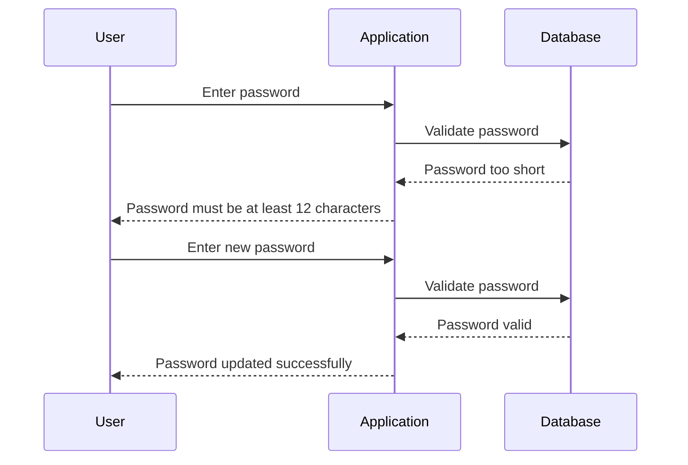

## Weak Password Requirements

### What Are Weak Password Requirements?

Weak password requirements refer to insufficient constraints placed on the creation or modification of user passwords. This can include allowing overly short passwords, permitting dictionary words, names, or easily guessable patterns, and even allowing passwords that match usernames. These lax requirements make it significantly easier for attackers to gain unauthorized access through methods such as brute-forcing or guessing.

### Why Are Weak Password Requirements Dangerous?

When password requirements are weak, the entropy (randomness) of the password is reduced, making it more susceptible to various attacks:

1. **Brute-Force Attacks**: Attackers can systematically try all possible combinations of characters until they find the correct password. Shorter and simpler passwords reduce the number of attempts needed.
2. **Dictionary Attacks**: Attackers use lists of common words, phrases, and names to guess passwords. If a password is based on a dictionary word, it becomes much easier to crack.
3. **Social Engineering**: Attackers may use personal information like names, birthdays, or common patterns to guess passwords.

### How Do Weak Password Requirements Work?

Let's consider a scenario where a web application allows users to set very short passwords. Here’s an example of how this might look in a database:

```sql
CREATE TABLE users (
    id INT PRIMARY KEY,
    username VARCHAR(50),
    password VARCHAR(50)
);

INSERT INTO users (id, username, password) VALUES (1, 'alice', '123');
```

In this case, the password `'123'` is extremely weak and can be easily guessed or brute-forced.

### Real-World Examples

#### CVE-2021-21972: Zyxel NAS Devices

In 2021, Zyxel Network Storage (NAS) devices were found to have default passwords that could be easily guessed. This allowed attackers to gain administrative access to the devices, leading to potential data theft and unauthorized access.

#### Example of Default Credentials

Consider a web application that uses default credentials like `admin/admin`. An attacker can easily try these credentials to gain access:

```http
POST /login HTTP/1.1
Host: example.com
Content-Type: application/x-www-form-urlencoded

username=admin&password=admin
```

### How to Prevent / Defend Against Weak Password Requirements

#### Secure Coding Practices

Implement strong password policies that enforce complexity and length requirements. For example, a password should be at least 12 characters long and include a mix of uppercase and lowercase letters, numbers, and special characters.

Here’s an example of a secure password policy implementation in Python:

```python
import re

def validate_password(password):
    if len(password) < 12:
        return False
    if not re.search("[a-z]", password):
        return False
    if not re.search("[A-Z]", password):
        return False
    if not re.search("[0-9]", password):
        return False
    if not re.search("[!@#$%^&*()_+]", password):
        return False
    return True

# Example usage
print(validate_password("Password123!"))  # True
print(validate_password("pass"))          # False
```

#### Hardening Configuration

Ensure that default credentials are changed upon installation. Provide clear instructions to users to change default passwords immediately after deployment.

```json
{
  "default_credentials": {
    "username": "admin",
    "password": "change_me"
  }
}
```

### Mermaid Diagram: Password Complexity Enforcement



---
<!-- nav -->
[[26-Weak Password Complexity Requirements|Weak Password Complexity Requirements]] | [[Web Security (PortSwigger)/13-Authentication Vulnerabilities/01-Authentication Vulnerabilities Complete Guide/00-Overview|Overview]] | [[28-Practice Questions & Answers|Practice Questions & Answers]]
