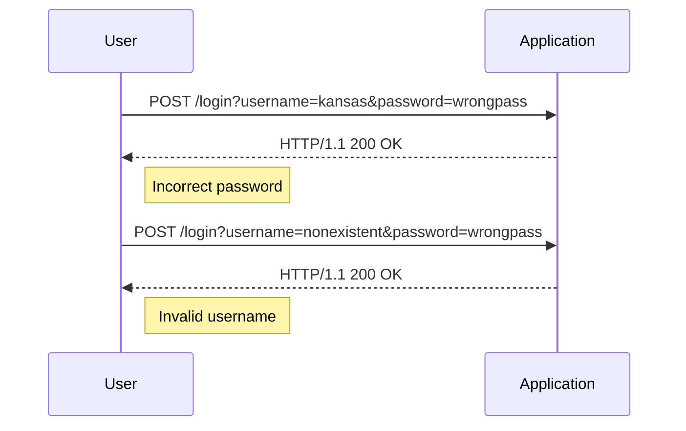

## Username Enumeration via Different Responses

### Introduction to Authentication Vulnerabilities

Authentication vulnerabilities are critical weaknesses in web applications that can allow attackers to gain unauthorized access to user accounts. One such vulnerability is **username enumeration**, which occurs when an application provides different responses based on whether a given username exists or not. This can be exploited by attackers to systematically identify valid usernames, making subsequent attacks more effective.

### Understanding Username Enumeration

Username enumeration is a technique used by attackers to determine whether a specific username is valid within a system. This is often achieved by observing differences in the application's responses to login attempts with valid versus invalid usernames.

#### Example Scenario

Consider a web application with a login form that accepts a username and password. When a user submits the form, the application checks the provided credentials against its database. If the username does not exist, the application might respond with a message like "Invalid username." If the username exists but the password is incorrect, the application might respond with a message like "Incorrect password."



### Identifying Username Enumeration

To identify username enumeration, an attacker would typically perform the following steps:

1. **Submit a Login Request**: Send a login request with a known valid username and an incorrect password.
2. **Observe the Response**: Analyze the response to determine if the username is valid.
3. **Repeat with Different Usernames**: Repeat the process with different usernames to build a list of valid usernames.

#### Example HTTP Requests and Responses

Let's consider the example from the transcript:

**Valid Username with Incorrect Password:**

```http
POST /login HTTP/1.1
Host: example.com
Content-Type: application/x-www-form-urlencoded
Content-Length: 27

username=kansas&password=wrongpass
```

```http
HTTP/1.1 200 OK
Content-Type: text/html; charset=UTF-8
Content-Length: 113

<!DOCTYPE html>
<html>
<head><title>Login</title></head>
<body>
<p>Incorrect password.</p>
</body>
</html>
```

**Invalid Username:**

```http
POST /login HTTP/1.1
Host: example.com
Content-Type: application/x-www-form-urlencoded
Content-Length: 31

username=nonexistent&password=wrongpass
```

```http
HTTP/1.1 200 OK
Content-Type: text/html; charset=UTF-8
Content-Length: 117

<!DOCTYPE html>
<html>
<head><title>Login</title></head>
<body>
<p>Invalid username.</p>
</body>
</html>
```

### Exploiting Username Enumeration

Once an attacker has identified valid usernames, they can use various techniques to gain unauthorized access, such as:

- **Password Guessing**: Attempting common passwords or using brute-force methods.
- **Social Engineering**: Using the valid usernames to craft targeted phishing attacks.

### Real-World Examples

Recent breaches have highlighted the risks associated with username enumeration. For instance, in the **CVE-2021-31166** vulnerability, a web application exposed different error messages for valid and invalid usernames, allowing attackers to enumerate usernames and subsequently launch brute-force attacks.

### How to Prevent / Defend Against Username Enumeration

#### Detection

To detect username enumeration, organizations can implement logging and monitoring mechanisms to track login attempts and identify patterns indicative of enumeration attacks.

#### Prevention

1. **Consistent Error Messages**: Ensure that the application returns the same error message regardless of whether the username or password is incorrect.
2. **Rate Limiting**: Implement rate limiting to restrict the number of login attempts from a single IP address within a specified time frame.
3. **Account Lockout Policies**: Enforce account lockout policies after a certain number of failed login attempts.

#### Secure Coding Practices

Here is an example of how to modify the login logic to prevent username enumeration:

**Vulnerable Code:**

```python
def login(username, password):
    user = User.query.filter_by(username=username).first()
    if user and user.check_password(password):
        return "Login successful"
    else:
        if user:
            return "Incorrect password"
        else:
            return "Invalid username"
```

**Secure Code:**

```python
def login(username, password):
    user = User.query.filter_by(username=username).first()
    if user and user.check_password(password):
        return "Login successful"
    else:
        return "Invalid username or password"
```

### Hands-On Practice

For hands-on practice, you can use the following labs:

- **PortSwigger Web Security Academy**: Offers a module on authentication vulnerabilities, including username enumeration.
- **OWASP Juice Shop**: Provides a vulnerable web application where you can practice identifying and exploiting username enumeration.

### Conclusion

Understanding and preventing username enumeration is crucial for securing web applications. By implementing consistent error messages, rate limiting, and account lockout policies, organizations can significantly reduce the risk of such attacks. Regularly testing and auditing your application's authentication mechanisms is essential to maintaining robust security.

---

This expanded explanation covers the concepts, theory, practical examples, and defensive measures necessary to understand and prevent username enumeration vulnerabilities in web applications.

---
<!-- nav -->
[[Web Security (PortSwigger)/13-Authentication Vulnerabilities/02-Lab 1 Username enumeration via different responses/01-Introduction to Authentication Vulnerabilities|Introduction to Authentication Vulnerabilities]] | [[Web Security (PortSwigger)/13-Authentication Vulnerabilities/02-Lab 1 Username enumeration via different responses/00-Overview|Overview]] | [[Web Security (PortSwigger)/13-Authentication Vulnerabilities/02-Lab 1 Username enumeration via different responses/03-Practice Questions & Answers|Practice Questions & Answers]]
