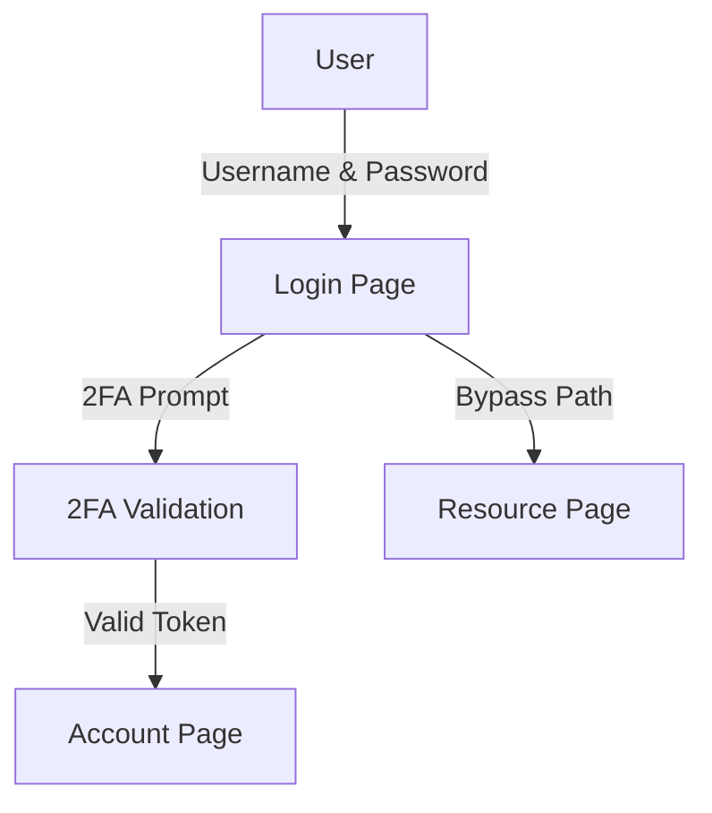

## Introduction to Authentication Vulnerabilities

Authentication vulnerabilities are critical weaknesses in web applications that allow attackers to gain unauthorized access to user accounts. Two-Factor Authentication (2FA) is designed to enhance security by requiring users to provide two different authentication factors: something they know (password) and something they have (verification code). However, even with 2FA, vulnerabilities can exist that allow attackers to bypass these additional security measures.

In this chapter, we will delve into the details of a specific type of 2FA vulnerability: the simple bypass. We will explore the underlying mechanisms, recent real-world examples, and provide a comprehensive guide on how to prevent such vulnerabilities.

### Background Theory

#### What is 2FA?

Two-Factor Authentication (2FA) is an authentication method that requires users to provide two different authentication factors to verify their identity. These factors typically include:

1. **Something you know**: A password or PIN.
2. **Something you have**: A physical device like a mobile phone or a hardware token that generates a time-based one-time password (TOTP).

The combination of these two factors significantly enhances security compared to using a password alone.

#### Why is 2FA Important?

2FA adds an extra layer of security to the authentication process. Even if an attacker manages to obtain a user's password, they would still need access to the second factor (e.g., a mobile phone) to gain entry. This makes it much harder for attackers to compromise accounts, especially those that contain sensitive information.

### Real-World Examples

#### Recent Breaches and CVEs

Several high-profile breaches have highlighted the importance of robust 2FA implementations:

- **CVE-2021-44228 (Log4Shell)**: Although this vulnerability was related to a logging library, it led to widespread exploitation of various systems. Many affected systems had weak or non-existent 2FA, allowing attackers to gain deeper access once initial entry was achieved.
  
- **Twitter Breach (2020)**: In July 2020, a group of hackers gained access to high-profile Twitter accounts, including those of Barack Obama and Elon Musk. The breach involved social engineering and exploiting a vulnerability in Twitter’s internal systems, which lacked proper 2FA enforcement.

These examples underscore the necessity of implementing strong 2FA mechanisms and ensuring they cannot be easily bypassed.

### Lab Setup and Initial Access

To understand the 2FA simple bypass vulnerability, we will walk through a practical lab scenario using the PortSwigger Web Security Academy. This lab simulates a real-world environment where an attacker has obtained a valid username and password but lacks the 2FA verification code.

#### Setting Up the Lab

1. **Accessing the Lab**:
    - Visit [PortSwigger Web Security Academy](https://portswigger.net/web-security).
    - Click on the "Sign up" button to create an account.
    - Once logged in, navigate to the "Academy" section.
    - Select "All Labs" and search for the "Authentication" module.
    - Choose "Lab 2: 2FA Simple Bypass".

2. **Initial Credentials**:
    - You have obtained a valid username (`Carlos`) and password.
    - The target is to access Carlos' account page without having the 2FA verification code.

### Understanding the Vulnerability

#### Mechanism of the 2FA Simple Bypass

The 2FA simple bypass vulnerability occurs when the application does not properly enforce 2FA requirements. Specifically, the application may allow access to certain resources or functionalities without validating the 2FA token, leading to unauthorized access.

#### Steps to Exploit the Vulnerability

1. **Identify the Target**:
    - The target is Carlos' account page.
    - You have the username and password but lack the 2FA verification code.

2. **Attempt Login**:
    - Use the obtained credentials to attempt login.
    - The application prompts for the 2FA verification code.

3. **Bypass the 2FA Check**:
    - Identify a path or functionality within the application that does not require 2FA validation.
    - Exploit this path to gain unauthorized access.

### Detailed Example

Let's consider a detailed example of how this vulnerability might manifest in a real-world application.

#### Application Architecture



In this architecture, the `Login Page` requires both username/password and 2FA validation to access the `Account Page`. However, there exists a `Bypass Path` that does not enforce 2FA, allowing unauthorized access to the `Resource Page`.

#### Code Example

Consider the following simplified code snippet for the login and resource access logic:

```python
def login(username, password, token=None):
    if check_credentials(username, password):
        if token is None:
            return "2FA Required"
        elif validate_token(token):
            return "Login Successful"
        else:
            return "Invalid Token"
    else:
        return "Invalid Credentials"

def access_resource(username, password):
    if check_credentials(username, password):
        return "Resource Access Granted"
    else:
        return "Invalid Credentials"
```

Here, the `login` function checks both credentials and the 2FA token, while the `access_resource` function only checks the credentials, bypassing the 2FA requirement.

### Detection and Prevention

#### How to Detect the Vulnerability

1. **Automated Scanning Tools**:
    - Use tools like Burp Suite, OWASP ZAP, or commercial scanners to identify paths that bypass 2FA checks.
    - Look for endpoints or functionalities that do not enforce 2FA validation.

2. **Manual Testing**:
    - Perform manual testing to simulate an attacker's actions.
    - Attempt to access resources without providing a valid 2FA token.

#### How to Prevent the Vulnerability

1. **Enforce 2FA Everywhere**:
    - Ensure that all critical functionalities and resources require 2FA validation.
    - Implement consistent 2FA enforcement across the entire application.

2. **Secure Coding Practices**:
    - Review and refactor code to ensure that 2FA validation is enforced in all relevant paths.
    - Use code review tools and static analysis to identify potential bypasses.

3. **Configuration Hardening**:
    - Configure authentication mechanisms to enforce 2FA requirements.
    - Disable any legacy or deprecated authentication methods that do not support 2FA.

#### Secure Code Fix

Let's compare the vulnerable code with the secure version:

**Vulnerable Code**:
```python
def access_resource(username, password):
    if check_credentials(username, password):
        return "Resource Access Granted"
    else:
        return "Invalid Credentials"
```

**Secure Code**:
```python
def access_resource(username, password, token):
    if check_credentials(username, password):
        if validate_token(token):
            return "Resource Access Granted"
        else:
            return "2FA Required"
    else:
        return "Invalid Credentials"
```

In the secure version, the `access_resource` function now requires a valid 2FA token, ensuring that 2FA is enforced consistently.

### Practical Labs

For hands-on practice, you can use the following labs:

- **PortSwigger Web Security Academy**: The lab described in this chapter is available on the PortSwigger Web Security Academy.
- **OWASP Juice Shop**: Another excellent platform for practicing web security concepts, including 2FA vulnerabilities.

### Conclusion

Understanding and preventing 2FA simple bypass vulnerabilities is crucial for maintaining the security of web applications. By enforcing 2FA consistently across all functionalities and using secure coding practices, developers can significantly reduce the risk of unauthorized access. Regular testing and auditing are also essential to identify and mitigate such vulnerabilities.

By mastering the concepts and techniques covered in this chapter, you will be better equipped to handle real-world authentication challenges and protect against sophisticated attacks.

---
<!-- nav -->
[[Web Security (PortSwigger)/13-Authentication Vulnerabilities/03-Lab 2 2FA simple bypass/00-Overview|Overview]] | [[02-Authentication Vulnerabilities 2FA Bypass|Authentication Vulnerabilities 2FA Bypass]]
