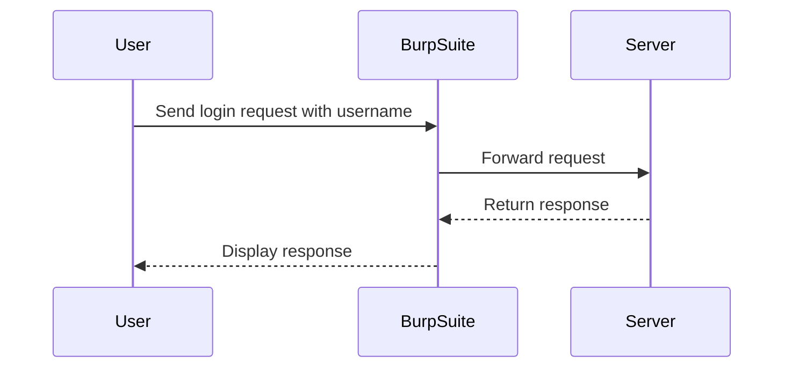

## Introduction to Authentication Vulnerabilities

Authentication vulnerabilities are among the most critical issues in web security. They allow attackers to gain unauthorized access to user accounts, leading to data breaches, financial losses, and reputational damage. One such vulnerability is **username enumeration**, where an attacker can determine whether a given username exists in the system by analyzing subtle differences in the server's responses.

### What is Username Enumeration?

Username enumeration occurs when an application provides different responses based on whether a username exists or not. This can happen through various means, such as error messages, response times, or HTTP status codes. By exploiting this behavior, an attacker can systematically try different usernames until they find a valid one.

### Why Does Username Enumeration Matter?

Understanding and preventing username enumeration is crucial because it can significantly reduce the attack surface. Once an attacker knows a valid username, they can focus their efforts on brute-forcing the password, making the attack more efficient and potentially successful.

### How Does Username Enumeration Work?

To understand how username enumeration works, consider the following scenario:

1. **Attack Setup**: An attacker wants to gain access to a user's account on a web application.
2. **Initial Reconnaissance**: The attacker starts by trying different usernames and observing the server's responses.
3. **Response Analysis**: Based on the differences in the server's responses, the attacker can infer whether a username exists or not.

### Real-World Example: CVE-2021-22205

A real-world example of username enumeration is the vulnerability identified in the **WordPress REST API** (CVE-2021-22205). This vulnerability allowed attackers to determine whether a user existed by sending a specific request to the `/wp-json/wp/v2/users` endpoint. The server would return a `200 OK` response for existing users and a `404 Not Found` response for non-existent users.

```http
GET /wp-json/wp/v2/users?slug=admin HTTP/1.1
Host: vulnerable-site.com
```

The response for an existing user might look like this:

```http
HTTP/1.1 200 OK
Content-Type: application/json; charset=UTF-8
{
    "id": 1,
    "name": "admin",
    "username": "admin",
    "first_name": "",
    "last_name": "",
    "nickname": "admin",
    "slug": "admin"
}
```

While the response for a non-existent user would be:

```http
HTTP/1.1 404 Not Found
Content-Type: application/json; charset=UTF-8
{
    "code": "rest_user_invalid_id",
    "message": "Invalid user ID.",
    "data": {
        "status": 404
    }
}
```

### Lab Setup: PortSwigger Web Security Academy

In this lab, we will use the **PortSwigger Web Security Academy** to practice identifying and exploiting username enumeration vulnerabilities. The lab is designed to simulate a real-world scenario where an attacker can determine valid usernames by analyzing subtle differences in the server's responses.

#### Accessing the Lab

1. **Sign Up**: If you do not have an account on the Web Security Academy, visit [PortSwigger.net/WebSecurity](https://portswigger.net/web-security) and click on the sign-up button.
2. **Log In**: Once you have an account, log in and navigate to the Academy section.
3. **Select Lab**: Search for the "authentication" module and select lab number four titled "Username enumeration via subtly different responses."

### Lab Objective

The objective of this lab is to enumerate a valid username and then brute-force the user's password to access their account page. We will use tools like Burp Suite to analyze the server's responses and identify the subtle differences that indicate a valid username.

### Tools and Techniques

#### Burp Suite Intruder

Burp Suite is a powerful tool for testing web applications. The Intruder module allows us to send multiple requests with different payloads and analyze the responses. This is particularly useful for identifying subtle differences in the server's responses.

#### Candidate Usernames and Passwords

For this lab, we have a list of candidate usernames and passwords that we can use to test the application. These lists are typically obtained from publicly available wordlists or generated using tools like `John the Ripper`.

### Step-by-Step Guide

#### Step 1: Access the Login Page

1. **Navigate to the Login Page**: Open the lab and navigate to the login page.
2. **Intercept Requests**: Use Burp Suite's built-in browser to intercept all requests and ensure they pass through the Burp proxy.

#### Step 2: Analyze the Response

1. **Send a Request**: Send a login request with a random username and password.
2. **Analyze the Response**: Observe the server's response. Look for differences in the HTTP status code, error messages, or response time.

```http
POST /login HTTP/1.1
Host: vulnerable-site.com
Content-Type: application/x-www-form-urlencoded

username=admin&password=password123
```

The response for an invalid username might look like this:

```http
HTTP/1.1 401 Unauthorized
Content-Type: text/html; charset=UTF-8
Content-Length: 1234

<!DOCTYPE html>
<html>
<head>
<title>Login Failed</title>
</head>
<body>
<h1>Login Failed</h1>
<p>Invalid username or password.</p>
</body>
</html>
```

While the response for a valid username but incorrect password might be:

```http
HTTP/1.1 401 Unauthorized
Content-Type: text/html; charset=UTF-8
Content-Length: 1234

<!DOCTYPE html>
<html>
<head>
<title>Login Failed</title>
</head>
<body>
<h1>Login Failed</h1>
<p>Incorrect password.</p>
</body>
</html>
```

#### Step 3: Use Burp Suite Intruder

1. **Configure Intruder**: Set up Burp Suite Intruder to send multiple login requests with different usernames.
2. **Analyze Responses**: Analyze the responses to identify subtle differences that indicate a valid username.



#### Step 4: Brute-Force the Password

Once a valid username is identified, use Burp Suite Intruder to brute-force the password by sending multiple requests with different password payloads.

### Common Pitfalls

1. **Rate Limiting**: Some applications implement rate limiting to prevent brute-force attacks. Ensure you are aware of these limits and adjust your attack accordingly.
2. **Account Lockout**: Some systems lock out accounts after multiple failed login attempts. Be cautious to avoid triggering this mechanism.

### How to Prevent / Defend Against Username Enumeration

#### Detection

1. **Logging and Monitoring**: Implement logging and monitoring to detect unusual login patterns. Look for multiple failed login attempts with different usernames.
2. **Behavioral Analysis**: Use behavioral analysis tools to identify patterns indicative of username enumeration attacks.

#### Prevention

1. **Consistent Error Messages**: Ensure that the server returns consistent error messages regardless of whether the username exists or not.
2. **Rate Limiting**: Implement rate limiting to prevent rapid-fire login attempts.
3. **Account Lockout**: Implement account lockout mechanisms to temporarily disable accounts after multiple failed login attempts.

#### Secure Coding Fixes

Compare the vulnerable and secure versions of the login handling code:

**Vulnerable Code:**

```python
def login(username, password):
    user = User.query.filter_by(username=username).first()
    if user and user.check_password(password):
        return "Login successful"
    else:
        if user:
            return "Incorrect password"
        else:
            return "Invalid username or password"
```

**Secure Code:**

```python
def login(username, password):
    user = User.query.filter_by(username=username).first()
    if user and user.check_password(password):
        return "Login successful"
    else:
        return "Invalid username or password"
```

### Hands-On Practice

To practice this lab, follow the steps outlined above using the **PortSwigger Web Security Academy**. This lab will help you understand the nuances of username enumeration and how to effectively exploit and defend against it.

### Conclusion

Understanding and preventing username enumeration is essential for maintaining the security of web applications. By analyzing subtle differences in server responses and implementing robust security measures, you can significantly reduce the risk of unauthorized access.

---
<!-- nav -->
[[Web Security (PortSwigger)/13-Authentication Vulnerabilities/05-Lab 4 Username enumeration via subtly different responses/00-Overview|Overview]] | [[02-Authentication Vulnerabilities Username Enumeration via Subtly Different Responses|Authentication Vulnerabilities Username Enumeration via Subtly Different Responses]]
