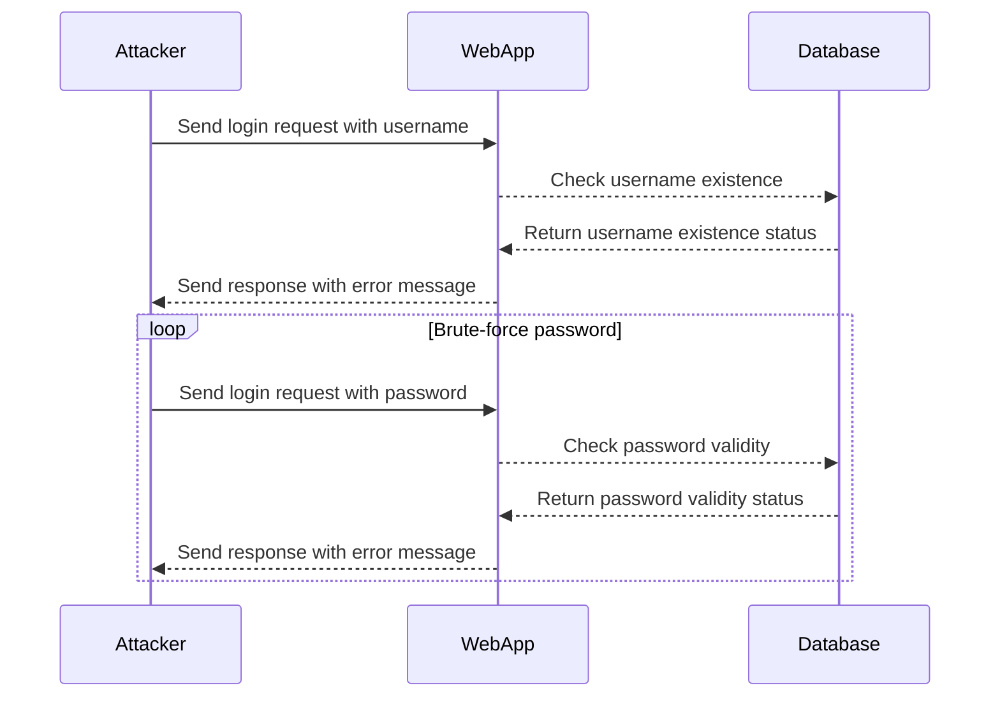

## Authentication Vulnerabilities: Username Enumeration via Subtly Different Responses

### Introduction to Authentication Vulnerabilities

Authentication vulnerabilities are among the most critical security issues in web applications. They can allow attackers to gain unauthorized access to user accounts, leading to data breaches, financial losses, and reputational damage. One such vulnerability is **username enumeration**, which occurs when an application provides different responses based on whether a username exists or not. This subtle difference can be exploited by attackers to determine valid usernames, making subsequent attacks like brute-force password guessing more feasible.

### Understanding Username Enumeration

Username enumeration is a technique used by attackers to identify valid usernames on a system. This is typically achieved by observing differences in the application's responses when a valid username is entered versus when an invalid username is entered. These differences can be in the form of error messages, response times, or even HTTP status codes.

#### Example Scenario

Consider a login form where the server responds differently depending on whether the username exists:

- **Invalid Username:** "The username you entered does not exist."
- **Valid Username, Invalid Password:** "The password you entered is incorrect."

In the given scenario, the application provides a subtle difference in the response when the username is valid but the password is incorrect. Specifically, the absence of a period at the end of the error message indicates a valid username.

### Detailed Analysis of the Scenario

Let's break down the scenario provided in the lecture:

1. **Error Messages:**
   - **Invalid Username:** "The username you entered does not exist."
   - **Valid Username, Invalid Password:** "The password you entered is incorrect"

2. **Subtle Difference:**
   - The error message for a valid username but invalid password lacks a period at the end.

This subtle difference can be exploited by an attacker to determine valid usernames. Once valid usernames are identified, the attacker can focus on brute-forcing the passwords for those usernames.

### Steps to Exploit Username Enumeration

To exploit this vulnerability, an attacker would follow these steps:

1. **Identify the Login Endpoint:**
   - Determine the URL and method (usually POST) used for the login process.

2. **Craft Requests:**
   - Send login requests with various usernames and observe the responses.

3. **Analyze Responses:**
   - Look for the subtle difference in the error messages to determine valid usernames.

4. **Brute-Force Passwords:**
   - Once valid usernames are identified, attempt to guess the corresponding passwords.

### Practical Example Using Burp Suite Intruder

Let's walk through the practical example using Burp Suite Intruder as described in the lecture.

#### Setting Up the Request

1. **Capture the Login Request:**
   - Use Burp Suite to capture the HTTP request sent during the login process.

2. **Configure Burp Suite Intruder:**
   - Import the captured request into Burp Suite Intruder.

3. **Add Payloads:**
   - Add a list of potential usernames and passwords to the Intruder payload sets.

#### Example HTTP Request

```http
POST /login HTTP/1.1
Host: example.com
Content-Type: application/x-www-form-urlencoded
Content-Length: 29

username=auto_discover&password=password1
```

#### Configuring Burp Suite Intruder

1. **Clear Existing Payloads:**
   - Remove any existing payloads by clicking "Clear."

2. **Add Username Payload:**
   - Set the username field (`auto_discover`) as the outer payload set.

3. **Add Password Payload:**
   - Set the password field (`password1`) as the inner payload set.

4. **Load Candidate Passwords:**
   - Copy and paste the list of candidate passwords into the Intruder payload set.

#### Analyzing Responses

1. **Start Attack:**
   - Click "Start Attack" to begin sending requests with different usernames and passwords.

2. **Filter Responses:**
   - Filter the responses based on the HTTP status code (e.g., 302 for successful login).

3. **Identify Successful Logins:**
   - Look for responses indicating a successful login, such as a redirect to the account page.

### Real-World Examples and Recent CVEs

#### Real-World Example: LinkedIn Username Enumeration

LinkedIn was found to be vulnerable to username enumeration due to differences in error messages. Attackers could determine valid usernames by observing the responses. This vulnerability was exploited to gather a large number of valid usernames, which were then used for targeted phishing attacks.

#### Recent CVE: CVE-2021-31166

CVE-2021-31166 describes a username enumeration vulnerability in a popular web application framework. The application provided different error messages based on whether the username existed, allowing attackers to identify valid usernames and subsequently perform brute-force attacks.

### How to Prevent / Defend Against Username Enumeration

#### Detection

1. **Monitor Logs:**
   - Regularly review logs for patterns of repeated login attempts with different usernames.

2. **Use WAF Rules:**
   - Implement Web Application Firewall (WAF) rules to detect and block suspicious login activity.

#### Prevention

1. **Standardize Error Messages:**
   - Ensure that the application provides the same generic error message regardless of whether the username exists or not.

2. **Rate Limiting:**
   - Implement rate limiting on login attempts to prevent brute-force attacks.

3. **Account Lockout Policies:**
   - Enforce account lockout policies after a certain number of failed login attempts.

#### Secure Coding Practices

1. **Consistent Response Handling:**
   - Always return a generic error message like "Invalid username or password."

2. **Example of Secure Code**

   ```python
   def authenticate(username, password):
       if check_username_exists(username):
           if check_password(username, password):
               return True
           else:
               return False
       else:
           return False
   
   def check_username_exists(username):
       # Check if the username exists in the database
       return True
   
   def check_password(username, password):
       # Check if the password matches the stored hash
       return True
   ```

   In the secure version, the application returns a consistent response regardless of whether the username exists or not.

#### Configuration Hardening

1. **Web Server Configuration:**
   - Configure the web server to return a generic error message for login failures.

2. **Application Configuration:**
   - Ensure that the application configuration enforces consistent error handling.

### Complete Example with HTTP Requests and Responses

#### Vulnerable Version

**Request:**

```http
POST /login HTTP/1.1
Host: example.com
Content-Type: application/x-www-form-urlencoded
Content-Length: 29

username=auto_discover&password=password1
```

**Response:**

```http
HTTP/1.1 401 Unauthorized
Content-Type: text/html
Content-Length: 42

The password you entered is incorrect
```

#### Secure Version

**Request:**

```http
POST /login HTTP/1.1
Host: example.com
Content-Type: application/x-www-form-urlencoded
Content-Length: 29

username=auto_discover&password=password1
```

**Response:**

```http
HTTP/1.1 401 Unauthorized
Content-Type: text/html
Content-Length: 32

Invalid username or password
```

### Mermaid Diagrams

#### Attack Chain Diagram



### Hands-On Labs

For hands-on practice with username enumeration vulnerabilities, consider the following labs:

- **PortSwigger Web Security Academy:** Offers a comprehensive lab on username enumeration.
- **OWASP Juice Shop:** Provides a real-world web application with various security vulnerabilities, including username enumeration.
- **DVWA (Damn Vulnerable Web Application):** A deliberately insecure web application for practicing web hacking techniques.

These labs provide a controlled environment to understand and mitigate authentication vulnerabilities effectively.

### Conclusion

Understanding and mitigating authentication vulnerabilities like username enumeration is crucial for securing web applications. By standardizing error messages, implementing rate limiting, and enforcing account lockout policies, organizations can significantly reduce the risk of such attacks. Regular monitoring and secure coding practices are essential to maintaining robust security measures.

---
<!-- nav -->
[[Web Security (PortSwigger)/13-Authentication Vulnerabilities/05-Lab 4 Username enumeration via subtly different responses/01-Introduction to Authentication Vulnerabilities|Introduction to Authentication Vulnerabilities]] | [[Web Security (PortSwigger)/13-Authentication Vulnerabilities/05-Lab 4 Username enumeration via subtly different responses/00-Overview|Overview]] | [[Web Security (PortSwigger)/13-Authentication Vulnerabilities/05-Lab 4 Username enumeration via subtly different responses/03-Practice Questions & Answers|Practice Questions & Answers]]
