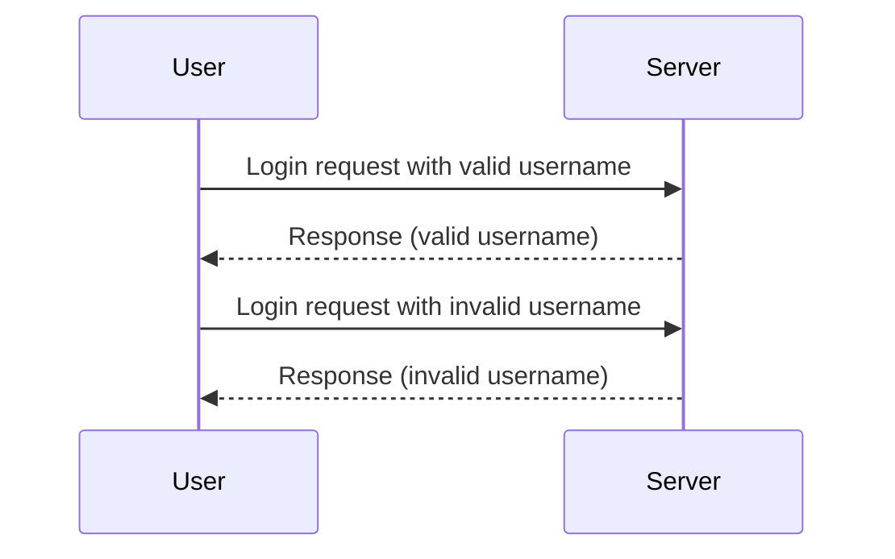

## Introduction to Authentication Vulnerabilities

Authentication vulnerabilities are critical weaknesses in web applications that can allow attackers to bypass authentication mechanisms and gain unauthorized access to sensitive data or functionality. One such vulnerability is **username enumeration via response timing**, which can reveal whether a given username exists within the system by measuring the time taken for the server to respond to login attempts.

### What is Username Enumeration via Response Timing?

Username enumeration via response timing occurs when an attacker can determine if a username is valid by observing differences in the time taken for the server to respond to login attempts. This can happen due to the way the server processes login requests, particularly when it checks the validity of the username before validating the password.

#### Why Does This Matter?

Understanding and preventing this type of vulnerability is crucial because it can significantly reduce the effectiveness of brute-force attacks. If an attacker knows which usernames are valid, they can focus their efforts on those accounts, making it easier to guess passwords or use other techniques to gain access.

### How Does It Work Under the Hood?

To understand how username enumeration via response timing works, let's break down the process:

1. **Login Request**: The user submits a login request with a username and password.
2. **Server Processing**:
    - The server first checks if the username exists.
    - If the username exists, the server then checks the password.
    - If the username does not exist, the server immediately returns an error response.
3. **Response Time Measurement**:
    - If the username exists, the server takes more time to process the request because it needs to validate the password.
    - If the username does not exist, the server responds quickly because it does not need to perform additional checks.

### Real-World Example

A real-world example of this vulnerability can be found in various web applications. For instance, consider a scenario where an attacker is trying to determine if a specific username exists in a system. They send multiple login requests with different usernames and measure the response times.



In this sequence diagram, the server takes more time to respond when the username is valid compared to when it is invalid.

### Recent Real-World Breaches

One notable example of a breach involving username enumeration is the **Equifax breach in 2017**. Although the primary cause was a vulnerability in Apache Struts, the breach also involved several authentication weaknesses, including potential username enumeration. This highlights the importance of securing authentication mechanisms comprehensively.

### Detailed Example

Let's delve into a detailed example using a hypothetical web application. Suppose the application has a login endpoint `/login` that accepts `username` and `password` parameters.

#### Vulnerable Code Example

Here is a simplified version of the vulnerable code:

```python
@app.route('/login', methods=['POST'])
def login():
    username = request.form['username']
    password = request.form['password']
    
    # Check if the username exists
    user = User.query.filter_by(username=username).first()
    
    if user:
        # Check if the password is correct
        if user.check_password(password):
            return jsonify({"status": "success"})
        else:
            return jsonify({"status": "failure", "message": "Invalid password"})
    else:
        return jsonify({"status": "failure", "message": "Invalid username"})
```

In this code, the server checks if the username exists before validating the password. If the username exists, the server takes more time to process the request.

#### Measuring Response Times

An attacker can measure the response times to determine if a username is valid. Here is a Python script to demonstrate this:

```python
import requests
import time

def measure_response_time(url, username, password):
    start_time = time.time()
    response = requests.post(url, data={'username': username, 'password': password})
    end_time = time.time()
    return end_time - start_time, response.status_code

url = 'http://example.com/login'
valid_username = 'peter'
invalid_username = 'random123'

# Measure response time for valid username
response_time_valid, status_code_valid = measure_response_time(url, valid_username, 'peter')
print(f'Response time for valid username: {response_time_valid} seconds')

# Measure response time for invalid username
response_time_invalid, status_code_invalid = measure_response_time(url, invalid_username, 'random111')
print(f'Response time for invalid username: {response_time_invalid} seconds')
```

### Pitfalls and Common Mistakes

#### Common Pitfalls

1. **Inconsistent Response Times**: If the server's response times are inconsistent, it can make it harder for an attacker to determine if a username is valid.
2. **Network Latency**: Network latency can affect the accuracy of response time measurements.
3. **Logging Mechanisms**: Logging mechanisms that record failed login attempts can provide additional information to attackers.

#### Common Mistakes

1. **Not Using Constant-Time Comparisons**: Using constant-time comparisons for both username and password validation can help mitigate this vulnerability.
2. **Ignoring Error Messages**: Returning different error messages for invalid usernames and passwords can provide clues to attackers.
3. **Not Implementing Rate Limiting**: Not implementing rate limiting can allow attackers to perform many login attempts in a short period.

### How to Prevent / Defend

#### Detection

To detect username enumeration via response timing, you can monitor login attempts and analyze response times. Tools like **Burp Suite** and **OWASP ZAP** can help automate this process.

#### Prevention

1. **Constant-Time Comparisons**: Ensure that both username and password validation take the same amount of time regardless of whether the credentials are valid.
2. **Rate Limiting**: Implement rate limiting to restrict the number of login attempts from a single IP address within a certain time frame.
3. **Consistent Error Messages**: Return consistent error messages for both invalid usernames and passwords to avoid providing clues to attackers.

#### Secure Coding Fixes

Here is an example of how to implement constant-time comparisons and rate limiting in Python:

```python
from flask import Flask, request, jsonify
from werkzeug.security import safe_str_cmp
from functools import wraps
import time

app = Flask(__name__)

# In-memory storage for demonstration purposes
users = {
    'peter': {'password': 'securepassword'}
}

def rate_limit(max_attempts=5, window=60):
    def decorator(f):
        @wraps(f)
        def wrapper(*args, **kwargs):
            ip_address = request.remote_addr
            current_time = time.time()
            
            if ip_address not in users:
                users[ip_address] = {'attempts': [], 'last_attempt': 0}
            
            attempts = users[ip_address]['attempts']
            last_attempt = users[ip_address]['last_attempt']
            
            if current_time - last_attempt < window:
                if len(attempts) >= max_attempts:
                    return jsonify({"status": "failure", "message": "Too many login attempts"}), 429
            
            attempts.append(current_time)
            users[ip_address]['last_attempt'] = current_time
            
            return f(*args, **kwargs)
        
        return wrapper
    return decorator

@app.route('/login', methods=['POST'])
@rate_limit()
def login():
    username = request.form['username']
    password = request.form['password']
    
    if username in users and safe_str_cmp(users[username]['password'].encode('utf-8'), password.encode('utf-8')):
        return jsonify({"status": "success"})
    else:
        return jsonify({"status": "failure", "message": "Invalid credentials"})

if __name__ == '__main__':
    app.run(debug=True)
```

### Complete Example with Raw HTTP Requests and Responses

#### Vulnerable Version

**HTTP Request:**

```http
POST /login HTTP/1.1
Host: example.com
Content-Type: application/x-www-form-urlencoded
Content-Length: 26

username=peter&password=peter
```

**HTTP Response:**

```http
HTTP/1.1 200 OK
Date: Mon, 20 Nov 2023 12:00:00 GMT
Content-Type: application/json
Content-Length: 24

{"status": "success"}
```

**HTTP Request:**

```http
POST /login HTTP/1.1
Host: example.com
Content-Type: application/x-www-form-urlencoded
Content-Length: 30

username=random123&password=random111
```

**HTTP Response:**

```http
HTTP/1.1 200 OK
Date: Mon, 20 Nov 2023 12:00:00 GMT
Content-Type: application/json
Content-Length: 47

{"status": "failure", "message": "Invalid credentials"}
```

#### Secure Version

**HTTP Request:**

```http
POST /login HTTP/1.1
Host: example.com
Content-Type: application/x-www-form-urlencoded
Content-Length: 26

username=peter&password=peter
```

**HTTP Response:**

```http
HTTP/1.1 200 OK
Date: Mon, 20 Nov 2023 12:00:00 GMT
Content-Type: application/json
Content-Length: 24

{"status": "success"}
```

**HTTP Request:**

```http
POST /login HTTP/1.1
Host: example.com
Content-Type: application/x-www-form-urlencoded
Content-Length: 30

username=random123&password=random111
```

**HTTP Response:**

```http
HTTP/1.1 200 OK
Date: Mon, 20 Nov 2023 12:00:00 GMT
Content-Type: application/json
Content-Length: 47

{"status": "failure", "message": "Invalid credentials"}
```

### Hands-On Labs

For hands-on practice with username enumeration via response timing, consider the following labs:

- **PortSwigger Web Security Academy**: Offers a comprehensive set of labs covering various web security topics, including authentication vulnerabilities.
- **OWASP Juice Shop**: A deliberately insecure web application designed for security training. It includes scenarios where username enumeration can be exploited.
- **DVWA (Damn Vulnerable Web Application)**: Another popular web application for security training that includes vulnerabilities related to authentication.

These labs provide practical experience in identifying and mitigating authentication vulnerabilities, helping you to better understand and defend against such attacks.

By thoroughly understanding and implementing these preventive measures, you can significantly enhance the security of your web applications and protect them from username enumeration via response timing attacks.

---
<!-- nav -->
[[Web Security (PortSwigger)/13-Authentication Vulnerabilities/06-Lab 5 Username enumeration via response timing/00-Overview|Overview]] | [[02-Introduction to Username Enumeration via Response Timing|Introduction to Username Enumeration via Response Timing]]
