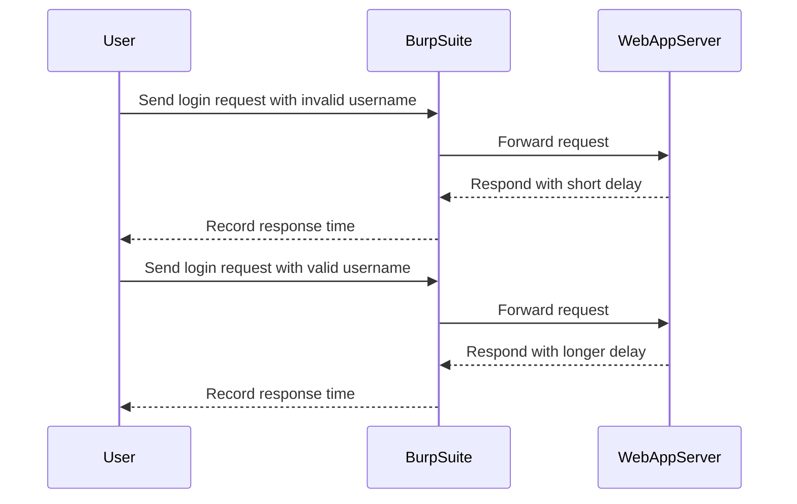

## Introduction to Username Enumeration via Response Timing

Welcome to the Web Security Academy series, where we delve deep into various aspects of web security. Today, we will explore a specific type of vulnerability known as **username enumeration via response timing**. This vulnerability allows attackers to determine whether a given username exists within a system by analyzing the time taken for the server to respond to login attempts. Understanding this vulnerability is crucial for both developers and security professionals to ensure robust authentication mechanisms.

### What is Username Enumeration?

Username enumeration is a technique used by attackers to gather information about valid usernames on a system. This can be achieved through various methods, including:

- **Response timing**: Analyzing the time taken for the server to respond to different login attempts.
- **Error messages**: Observing differences in error messages for valid versus invalid usernames.
- **HTTP status codes**: Detecting variations in HTTP status codes based on the validity of the username.

### Why Does Username Enumeration Matter?

Username enumeration can significantly weaken the security of an application. Once an attacker knows a valid username, they can focus their efforts on brute-forcing the corresponding password. This reduces the attack surface and makes it easier for them to gain unauthorized access to the system.

### How Does Username Enumeration via Response Timing Work?

In this method, the attacker sends multiple login requests with different usernames and measures the time taken for the server to respond. Typically, the server takes longer to respond when the username is valid because it needs to perform additional checks, such as verifying the password or checking user permissions.

#### Example Scenario

Consider a web application with a login form. An attacker might send two login requests:

1. **Request with an invalid username**:
    ```http
    POST /login HTTP/1.1
    Host: example.com
    Content-Type: application/x-www-form-urlencoded

    username=nonexistent&password=test
    ```

2. **Request with a valid username**:
    ```http
    POST /login HTTP/1.1
    Host: example.com
    Content-Type: application/x-www-form-urlencoded

    username=admin&password=test
    ```

The server might take longer to respond to the second request because it needs to check the password for the `admin` user.

### Real-World Examples

Recent breaches and vulnerabilities have highlighted the importance of securing against username enumeration. For instance:

- **CVE-2021-31166**: A vulnerability in a popular web application framework allowed attackers to enumerate usernames through response timing. This led to unauthorized access to sensitive data.
- **Breaches involving social media platforms**: Several high-profile breaches involved attackers using username enumeration to gather valid usernames and then brute-forcing passwords.

### Steps to Perform Username Enumeration via Response Timing

To perform username enumeration via response timing, follow these steps:

1. **Identify the Login Endpoint**: Determine the URL and method (usually POST) used for the login request.
2. **Prepare a List of Candidate Usernames**: Compile a list of potential usernames to test.
3. **Send Requests and Measure Response Times**: Send login requests with different usernames and measure the response times.
4. **Analyze the Results**: Identify usernames that result in longer response times, indicating a valid username.

### Tools and Techniques

Several tools can help automate the process of username enumeration via response timing:

- **Burp Suite**: A comprehensive toolkit for web application security testing.
- **OWASP ZAP**: Another popular tool for automated scanning and manual testing.
- **Custom Scripts**: Writing custom scripts using Python or other programming languages to automate the process.

#### Using Burp Suite

Let's walk through an example using Burp Suite to perform username enumeration via response timing.

1. **Access the Lab**: Visit the Web Security Academy at [portsfigure.net/web-security](https://portsfigure.net/web-security) and sign up for an account.
2. **Navigate to the Lab**: Log in and navigate to the "Academy" section, select "All Labs," and search for "authentication vulnerabilities." Choose "Lab Number Five: Username Enumeration via Response Timing."
3. **Set Up Burp Suite**: Ensure you are using the professional version of Burp Suite, which includes the Intruder tool.



### Common Pitfalls and Mistakes

When performing username enumeration via response timing, several common pitfalls can lead to incorrect results or false positives:

- **Network Latency**: Variations in network latency can affect response times.
- **Server Load**: High server load can cause inconsistent response times.
- **Rate Limiting**: Some systems implement rate limiting, which can skew results.

### How to Prevent / Defend Against Username Enumeration

To defend against username enumeration via response timing, consider the following strategies:

1. **Consistent Response Times**: Ensure that the server responds with consistent times regardless of the validity of the username.
2. **Rate Limiting**: Implement rate limiting to prevent attackers from making too many requests in a short period.
3. **Error Message Standardization**: Use generic error messages that do not reveal whether the username is valid.
4. **Account Lockout Policies**: Implement policies that lock out accounts after a certain number of failed login attempts.

#### Secure Coding Practices

Here is an example of how to implement consistent response times in a login function:

```python
import time

def login(username, password):
    start_time = time.time()
    
    # Simulate database lookup
    time.sleep(0.5)
    
    # Check if username exists
    if username in valid_usernames:
        # Simulate password verification
        time.sleep(0.5)
        
        if password == valid_passwords[username]:
            return "Login successful"
        else:
            return "Invalid password"
    else:
        return "Invalid username"

# Example usage
print(login("admin", "test"))
print(login("nonexistent", "test"))
```

### Detection and Monitoring

To detect and monitor for username enumeration attempts, consider the following:

- **Logging and Monitoring**: Implement logging and monitoring to track login attempts and identify patterns indicative of enumeration.
- **Security Information and Event Management (SIEM)**: Use SIEM tools to correlate events and detect anomalies.
- **Behavioral Analysis**: Analyze user behavior to identify unusual patterns that may indicate enumeration attempts.

### Conclusion

Understanding and defending against username enumeration via response timing is essential for maintaining the security of web applications. By implementing consistent response times, rate limiting, and other defensive measures, developers can significantly reduce the risk of unauthorized access.

### Practice Labs

For hands-on practice, consider the following labs:

- **PortSwigger Web Security Academy**: Offers a variety of labs focused on web security, including authentication vulnerabilities.
- **OWASP Juice Shop**: A deliberately insecure web application for practicing web security skills.
- **DVWA (Damn Vulnerable Web Application)**: A PHP/MySQL web application that demonstrates common web application vulnerabilities.

By engaging with these labs, you can gain practical experience in identifying and mitigating username enumeration vulnerabilities.

---
<!-- nav -->
[[Web Security (PortSwigger)/13-Authentication Vulnerabilities/06-Lab 5 Username enumeration via response timing/01-Introduction to Authentication Vulnerabilities|Introduction to Authentication Vulnerabilities]] | [[Web Security (PortSwigger)/13-Authentication Vulnerabilities/06-Lab 5 Username enumeration via response timing/00-Overview|Overview]] | [[03-Authentication Vulnerabilities Username Enumeration via Response Timing|Authentication Vulnerabilities Username Enumeration via Response Timing]]
