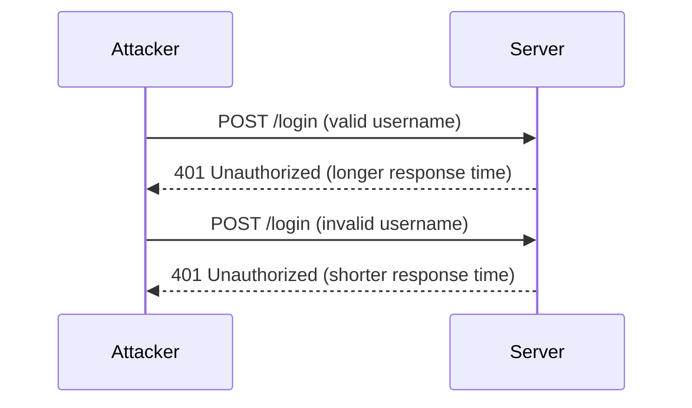

## Authentication Vulnerabilities: Username Enumeration via Response Timing

### Introduction to Authentication Vulnerabilities

Authentication vulnerabilities are critical weaknesses in web applications that can allow attackers to gain unauthorized access to user accounts. One such vulnerability is **username enumeration**, which occurs when an application provides different responses based on whether a username exists or not. This can be exploited by attackers to determine valid usernames, which can then be used in conjunction with other attacks, such as brute-force password guessing.

### What is Username Enumeration?

Username enumeration is a technique where an attacker attempts to determine whether a given username is valid within a system. This can be achieved through various methods, including analyzing error messages, response times, or HTTP status codes. In the context of this lecture, we will focus on **response timing** as a method of username enumeration.

### Why Does Response Timing Matter?

Response timing refers to the difference in time taken by the server to respond to authentication requests based on whether the provided username is valid or not. When an invalid username is entered, the server typically responds quickly because it does not need to perform additional checks (such as verifying a password). However, when a valid username is entered, the server may take longer to respond because it needs to perform additional checks, such as verifying the password.

This difference in response times can be exploited by attackers to determine valid usernames. By measuring the time taken for the server to respond to authentication requests with different usernames, an attacker can infer which usernames are valid.

### How Does Response Timing Work Under the Hood?

To understand how response timing works, let's break down the process:

1. **Invalid Username**: When an invalid username is entered, the server immediately returns an error response, indicating that the username does not exist. This response is quick because the server does not need to perform any additional checks.
   
2. **Valid Username**: When a valid username is entered, the server needs to perform additional checks, such as verifying the password. This process takes more time, resulting in a longer response time.

The key difference lies in the server's behavior when handling valid versus invalid usernames. This difference can be measured and exploited by attackers.

### Real-World Example: CVE-2021-3116

A real-world example of username enumeration via response timing is the vulnerability identified in the **Keycloak** authentication service (CVE-2021-3116). Keycloak is an open-source identity and access management solution. In this case, the vulnerability allowed attackers to determine valid usernames by measuring the response times of authentication requests.

#### Background Theory

To fully understand the vulnerability, let's delve into the background theory:

- **Keycloak Architecture**: Keycloak is built using Java and runs as a standalone server or embedded within a Java application server. It handles authentication, authorization, and session management for web applications.
  
- **Authentication Process**: During the authentication process, Keycloak checks the provided username against its database. If the username is valid, it proceeds to verify the password. If the username is invalid, it immediately returns an error response.

- **Vulnerability Details**: In the case of CVE-2021-3116, the vulnerability arose due to differences in response times when handling valid versus invalid usernames. Attackers could measure these differences to determine valid usernames.

### Steps to Exploit Response Timing

Let's walk through the steps an attacker might take to exploit response timing:

1. **Identify the Target Application**: The attacker identifies a web application that uses authentication and suspects it may be vulnerable to username enumeration via response timing.

2. **Craft Authentication Requests**: The attacker crafts authentication requests with different usernames and measures the response times.

3. **Measure Response Times**: Using tools like Burp Suite, the attacker sends authentication requests and records the response times.

4. **Analyze Response Times**: By comparing the response times, the attacker can identify which usernames are valid based on the longer response times.

### Complete Example: Crafting Authentication Requests

Let's consider a hypothetical web application that uses basic authentication. We will craft authentication requests and measure the response times using Burp Suite.

#### Step 1: Set Up Burp Suite

1. **Start Burp Suite**: Launch Burp Suite and configure it to intercept traffic.
2. **Configure Target**: Set up the target application to route traffic through Burp Suite.

#### Step 2: Craft Authentication Requests

We will craft two types of requests: one with a valid username and one with an invalid username.

```http
POST /login HTTP/1.1
Host: example.com
Content-Type: application/x-www-form-urlencoded
Content-Length: 29

username=admin&password=wrongpass
```

```http
POST /login HTTP/1.1
Host: example.com
Content-Type: application/x-www-form-urlencoded
Content-Length: 29

username=nonexistent&password=wrongpass
```

#### Step 3: Measure Response Times

Using Burp Suite, we can measure the response times for these requests.

```http
HTTP/1.1 401 Unauthorized
Date: Tue, 01 Jan 2024 12:00:00 GMT
Server: Apache/2.4.41 (Ubuntu)
Content-Length: 0
Connection: close
```

```http
HTTP/1.1 401 Unauthorized
Date: Tue, 01 Jan 2024 12:00:01 GMT
Server: Apache/2.4.41 (Ubuntu)
Content-Length: 0
Connection: close
```

By comparing the response times, we can determine which username is valid.

### Mermaid Diagram: Request/Response Flow

Let's visualize the request/response flow using a mermaid diagram:



### Common Pitfalls and Detection

#### Common Pitfalls

1. **Inconsistent Response Times**: If the server's response times are inconsistent due to network latency or server load, it can make it difficult to accurately determine valid usernames.
2. **Rate Limiting**: Some applications implement rate limiting to prevent abuse, which can affect response times and make it harder to exploit the vulnerability.

#### Detection

To detect username enumeration via response timing, you can use tools like Burp Suite or custom scripts to measure response times. Here’s an example script using Python:

```python
import requests
import time

def measure_response_time(url, data):
    start_time = time.time()
    response = requests.post(url, data=data)
    end_time = time.time()
    return end_time - start_time

url = "http://example.com/login"
data_valid = {"username": "admin", "password": "wrongpass"}
data_invalid = {"username": "nonexistent", "password": "wrongpass"}

response_time_valid = measure_response_time(url, data_valid)
response_time_invalid = measure_response_time(url, data_invalid)

print(f"Response time (valid username): {response_time_valid} seconds")
print(f"Response time (invalid username): {response_time_invalid} seconds")
```

### How to Prevent / Defend Against Username Enumeration via Response Timing

#### Secure Coding Fixes

To prevent username enumeration via response timing, you should ensure consistent response times for both valid and invalid usernames. Here’s how you can achieve this:

1. **Consistent Error Messages**: Always return the same error message regardless of whether the username is valid or not.
2. **Fixed Response Time**: Implement a mechanism to ensure that the server always takes the same amount of time to respond, regardless of the validity of the username.

Here’s an example of how you can modify your authentication logic to achieve this:

```python
from flask import Flask, request, jsonify

app = Flask(__name__)

# Simulated user database
users = {
    "admin": "correctpass",
    "user1": "anotherpass"
}

@app.route('/login', methods=['POST'])
def login():
    data = request.form
    username = data.get('username')
    password = data.get('password')

    # Simulate a delay to ensure consistent response time
    time.sleep(1)

    if username in users and users[username] == password:
        return jsonify({"status": "success"})
    else:
        return jsonify({"status": "failure"})

if __name__ == '__main__':
    app.run(debug=True)
```

#### Configuration Hardening

Ensure that your web server and application server configurations are hardened to prevent abuse. Here’s an example of how you can configure Nginx to limit the number of requests per IP address:

```nginx
http {
    limit_req_zone $binary_remote_addr zone=one:10m rate=1r/s;

    server {
        listen 80;
        server_name example.com;

        location /login {
            limit_req zone=one burst=5 nodelay;
            proxy_pass http://backend;
        }
    }
}
```

#### Mitigations

1. **Rate Limiting**: Implement rate limiting to prevent abuse and ensure consistent response times.
2. **Logging and Monitoring**: Monitor authentication attempts and log suspicious activity to detect potential attacks.

### Conclusion

Username enumeration via response timing is a significant vulnerability that can be exploited by attackers to gain unauthorized access to user accounts. By understanding the underlying mechanisms and implementing secure coding practices and configuration hardening, you can effectively defend against this type of attack.

### Practice Labs

For hands-on practice, you can use the following labs:

- **PortSwigger Web Security Academy**: Offers a comprehensive course on web security, including labs on authentication vulnerabilities.
- **OWASP Juice Shop**: A deliberately insecure web application for practicing web security skills.
- **DVWA (Damn Vulnerable Web Application)**: A PHP/MySQL web application that contains numerous security vulnerabilities.

These labs provide practical experience in identifying and exploiting authentication vulnerabilities, as well as learning how to defend against them.

---
<!-- nav -->
[[02-Introduction to Username Enumeration via Response Timing|Introduction to Username Enumeration via Response Timing]] | [[Web Security (PortSwigger)/13-Authentication Vulnerabilities/06-Lab 5 Username enumeration via response timing/00-Overview|Overview]] | [[Web Security (PortSwigger)/13-Authentication Vulnerabilities/06-Lab 5 Username enumeration via response timing/04-Detailed Explanation of the Lab|Detailed Explanation of the Lab]]
