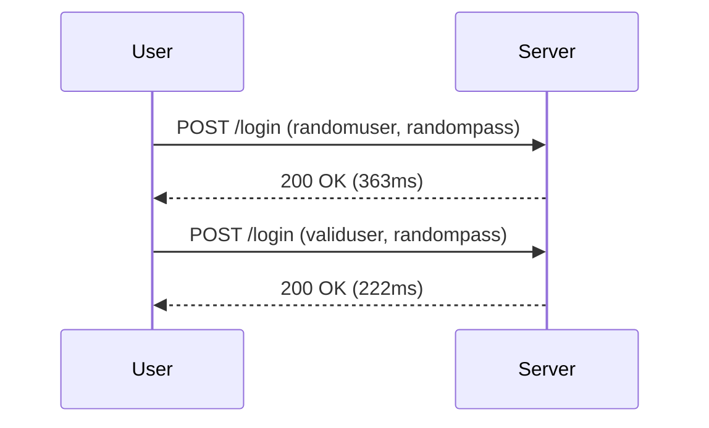

## Understanding Authentication Vulnerabilities

### Introduction to Authentication Vulnerabilities

Authentication vulnerabilities are critical weaknesses in web applications that can allow attackers to bypass authentication mechanisms and gain unauthorized access to user accounts. One such vulnerability is **username enumeration via response timing**, which can reveal whether a given username exists in the system based on the time taken to respond to login attempts.

### What is Username Enumeration via Response Timing?

Username enumeration via response timing occurs when an application takes different amounts of time to process login attempts for valid versus invalid usernames. This can inadvertently disclose information about the existence of a username, thereby aiding an attacker in the brute-force process of guessing passwords.

#### Why Does This Matter?

Understanding this vulnerability is crucial because it can significantly reduce the effort required for an attacker to compromise user accounts. By knowing which usernames are valid, an attacker can focus their efforts on those accounts, making brute-force attacks more efficient.

#### How Does It Work Under the Hood?

When a user submits a login attempt, the server processes the request and checks the validity of the username and password. If the username is valid, the server may perform additional checks, such as verifying the password or checking for account lockouts. These additional steps can introduce delays, which can be measured by an attacker.

### Real-World Examples

Recent real-world examples of username enumeration vulnerabilities include:

- **CVE-2021-3427**: A vulnerability in the WordPress REST API allowed attackers to enumerate usernames by measuring the time taken to process requests.
- **CVE-2020-14882**: A vulnerability in the Joomla CMS allowed attackers to determine the existence of a username by observing the response time.

These examples highlight the importance of securing authentication mechanisms against such vulnerabilities.

### Steps to Identify and Exploit Username Enumeration via Response Timing

To identify and exploit username enumeration via response timing, follow these steps:

1. **Identify the Login Endpoint**:
   - Determine the URL and method (GET/POST) used for login attempts.
   
2. **Measure Response Times**:
   - Send login requests with both valid and invalid usernames and measure the response times.

3. **Analyze Differences**:
   - Compare the response times for valid and invalid usernames to identify patterns.

### Example Scenario

Let's consider a scenario where an attacker wants to exploit username enumeration via response timing on a web application.

#### Step 1: Identify the Login Endpoint

The login endpoint is typically found in the HTML form or through network traffic analysis. Suppose the login endpoint is `https://example.com/login`.

#### Step 2: Measure Response Times

The attacker sends login requests with both valid and invalid usernames and measures the response times.

```http
POST /login HTTP/1.1
Host: example.com
Content-Type: application/x-www-form-urlencoded

username=randomuser&password=randompass
```

Response:

```http
HTTP/1.1 200 OK
Date: Tue, 01 Mar 2022 12:00:00 GMT
Content-Length: 123
Content-Type: text/html

Invalid username or password.
```

#### Step 3: Analyze Differences

The attacker notices that the response time for an invalid username is significantly longer than for a valid one.



### Common Pitfalls

- **Inconsistent Response Times**: Network latency and server load can cause inconsistent response times, making it difficult to distinguish between valid and invalid usernames.
- **Account Lockout Mechanisms**: Some applications implement account lockout mechanisms that can interfere with timing-based attacks.

### How to Prevent / Defend Against Username Enumeration via Response Timing

#### Detection

To detect username enumeration via response timing, monitor login attempts and analyze response times. Tools like Burp Suite can help automate this process.

#### Prevention

1. **Consistent Response Times**:
   - Ensure that the server responds within a consistent time frame regardless of the validity of the username.
   
2. **Rate Limiting**:
   - Implement rate limiting to prevent excessive login attempts from a single IP address.
   
3. **Account Lockout Mechanisms**:
   - Use account lockout mechanisms that do not reveal information about the existence of a username.

#### Secure Coding Fixes

Here is an example of how to implement consistent response times in a secure manner:

```python
import time

def authenticate(username, password):
    # Simulate database lookup
    time.sleep(0.5)  # Consistent delay
    
    if username == "validuser" and password == "validpass":
        return True
    else:
        return False
```

#### Configuration Hardening

Ensure that your web server and application configurations are hardened against timing attacks. For example, configure Nginx to enforce consistent response times:

```nginx
server {
    listen 80;
    server_name example.com;

    location /login {
        proxy_pass http://backend;
        proxy_read_timeout 10s;  # Enforce consistent read timeout
    }
}
```

### Conclusion

Username enumeration via response timing is a significant vulnerability that can be exploited by attackers to gain unauthorized access to user accounts. By understanding the underlying mechanisms and implementing appropriate defenses, you can protect your web applications from such attacks.

### Practice Labs

For hands-on practice with authentication vulnerabilities, consider the following labs:

- **PortSwigger Web Security Academy**: Offers comprehensive modules on authentication vulnerabilities, including username enumeration.
- **OWASP Juice Shop**: Provides a vulnerable web application for practicing various security techniques, including authentication vulnerabilities.
- **DVWA (Damn Vulnerable Web Application)**: A deliberately insecure web application for practicing penetration testing and security assessments.

By engaging with these labs, you can gain practical experience in identifying and defending against authentication vulnerabilities.

---
<!-- nav -->
[[05-How to Prevent  Defend Against Username Enumeration|How to Prevent  Defend Against Username Enumeration]] | [[Web Security (PortSwigger)/13-Authentication Vulnerabilities/06-Lab 5 Username enumeration via response timing/00-Overview|Overview]] | [[Web Security (PortSwigger)/13-Authentication Vulnerabilities/06-Lab 5 Username enumeration via response timing/07-Conclusion|Conclusion]]
