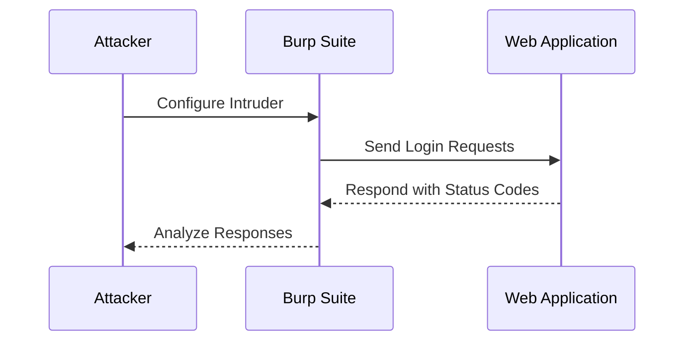
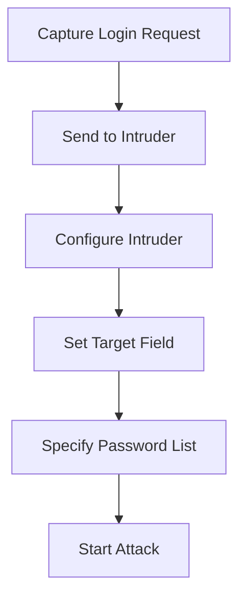
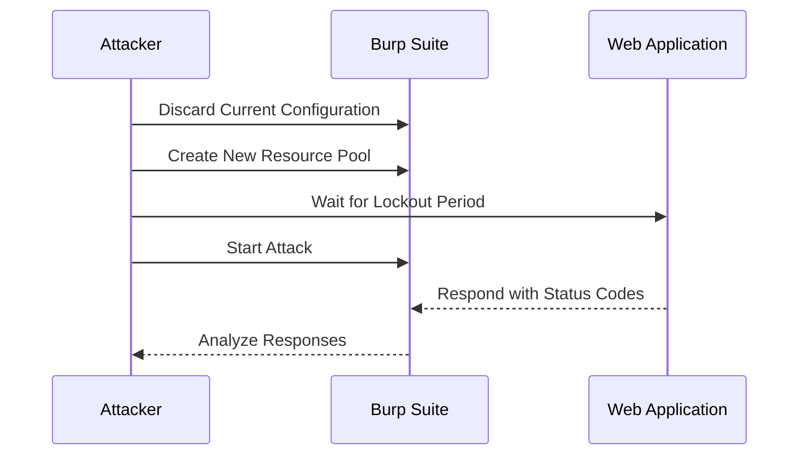
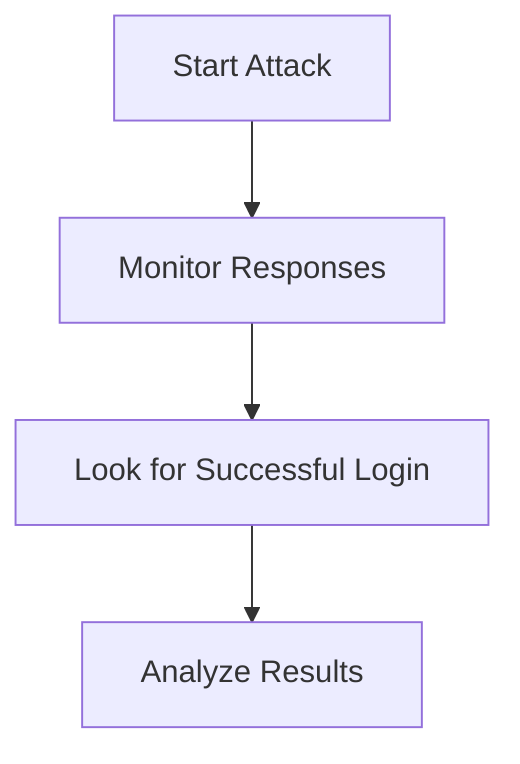
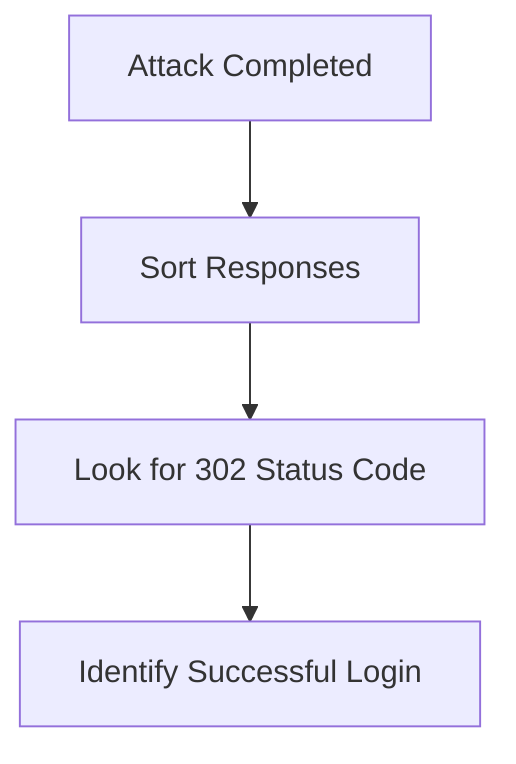

## Authentication Vulnerabilities: Broken Brute Force Protection IP Block

### Introduction to Authentication Vulnerabilities

Authentication vulnerabilities are critical weaknesses in web applications that allow attackers to gain unauthorized access to user accounts. One common type of authentication vulnerability is broken brute force protection, which occurs when an application fails to effectively limit the number of login attempts an attacker can make. This allows attackers to perform brute-force attacks, systematically trying different combinations of usernames and passwords until they find a valid combination.

### Understanding Brute Force Attacks

A brute force attack is a method used by attackers to guess passwords through systematic trial and error. The attacker tries every possible combination of characters until the correct password is found. This process can be time-consuming, especially for strong passwords, but it becomes feasible with automated tools and weak or common passwords.

#### Example: Real-World Breach

One notable example of a breach due to weak authentication is the LinkedIn data breach in 2012. Hackers obtained over 167 million user passwords, many of which were stored in plain text or using weak hashing algorithms. This allowed them to easily crack the passwords and gain unauthorized access to user accounts.

### Importance of Brute Force Protection

To mitigate the risk of brute force attacks, web applications must implement effective brute force protection mechanisms. These mechanisms typically involve rate limiting, account lockouts, and CAPTCHAs. Rate limiting restricts the number of login attempts per unit of time, while account lockouts temporarily disable an account after a certain number of failed login attempts. CAPTCHAs are used to verify that the login attempt is being made by a human rather than an automated script.

### Lab Scenario: Broken Brute Force Protection

In this lab scenario, we will simulate a brute force attack on a web application that lacks proper brute force protection. The goal is to demonstrate how an attacker can exploit this vulnerability to gain unauthorized access to user accounts.

#### Setting Up the Attack

The first step is to set up the attack environment. We will use Burp Suite Intruder to automate the brute force attack. Burp Suite is a popular tool used by penetration testers to test the security of web applications.



### Configuring Burp Suite Intruder

To configure Burp Suite Intruder, follow these steps:

1. **Capture the Login Request**: First, capture the login request using Burp Suite's Proxy. This request will contain the username and password fields.
2. **Send to Intruder**: Right-click on the captured request and select "Send to Intruder."
3. **Configure Intruder**: In the Intruder tab, configure the attack parameters. Set the target field to the password field and specify the list of potential passwords to try.

#### Example Configuration

Here is an example of how to configure Burp Suite Intruder:



### Resource Pool Configuration

In the given scenario, the initial attack configuration used a resource pool with a maximum of 10 concurrent requests. This resulted in the attacker being locked out of the system due to too many simultaneous login attempts. To avoid this, we need to adjust the resource pool settings.

#### Adjusting Resource Pool Settings

1. **Discard Current Configuration**: Discard the current resource pool configuration.
2. **Create New Resource Pool**: Create a new resource pool with a maximum of 1 concurrent request.
3. **Wait for Lockout Period**: Wait for the lockout period to expire before starting the attack.



### Starting the Attack

Once the resource pool is configured correctly, start the attack. Since the resource pool is set to one concurrent request, the attack will proceed slowly, avoiding the lockout mechanism.

#### Monitoring the Attack

Monitor the attack progress by observing the responses from the web application. Look for status codes indicating successful login attempts.



### Analyzing the Results

After the attack completes, analyze the results to identify successful login attempts. Look for status codes such as 302, which indicate a successful redirect after a successful login.

#### Example Analysis

Here is an example of how to analyze the results:



### Identifying the Target Account

In this scenario, the target account is `carlos`. Look for the 302 status code associated with the `carlos` account to confirm a successful login.

#### Example Response

Here is an example of a successful login response:

```http
HTTP/1.1 302 Found
Date: Tue, 01 Aug 2023 12:00:00 GMT
Server: Apache/2.4.41 (Ubuntu)
Location: /dashboard
Content-Length: 0
Content-Type: text/html; charset=UTF-8

```

### How to Prevent / Defend Against Brute Force Attacks

To prevent brute force attacks, implement the following measures:

1. **Rate Limiting**: Limit the number of login attempts per unit of time.
2. **Account Lockouts**: Temporarily disable accounts after a certain number of failed login attempts.
3. **CAPTCHAs**: Use CAPTCHAs to verify that the login attempt is being made by a human.
4. **Strong Password Policies**: Enforce strong password policies to reduce the likelihood of weak passwords being used.

#### Secure Coding Practices

Implement secure coding practices to prevent brute force attacks. Here is an example of a secure login function:

```python
def authenticate(username, password):
    # Check if the account is locked
    if is_account_locked(username):
        return False
    
    # Increment the failed login counter
    increment_failed_login_counter(username)
    
    # Check if the password is correct
    if check_password(username, password):
        reset_failed_login_counter(username)
        return True
    else:
        # Check if the account should be locked
        if should_lock_account(username):
            lock_account(username)
        return False
```

#### Secure Configuration

Ensure that the web application is properly configured to prevent brute force attacks. Here is an example of a secure configuration for an Apache server:

```apache
<Directory "/var/www/html">
    AuthType Basic
    AuthName "Restricted Content"
    AuthUserFile /etc/apache2/.htpasswd
    Require valid-user
    LimitRequestBody 1024
</Directory>
```

### Conclusion

In conclusion, broken brute force protection is a critical vulnerability that can be exploited by attackers to gain unauthorized access to user accounts. By implementing effective brute force protection mechanisms and following secure coding practices, web applications can significantly reduce the risk of brute force attacks.

### Practice Labs

For hands-on practice, consider the following labs:

- **PortSwigger Web Security Academy**: Offers a variety of labs focused on web security, including authentication vulnerabilities.
- **OWASP Juice Shop**: A deliberately insecure web application for practicing web security skills.
- **DVWA (Damn Vulnerable Web Application)**: A PHP/MySQL web application that contains numerous security vulnerabilities.

These labs provide a safe environment to practice and learn about authentication vulnerabilities and how to defend against them.

---
<!-- nav -->
[[Web Security (PortSwigger)/13-Authentication Vulnerabilities/07-Lab 6 Broken brute force protection IP block/01-Introduction to Authentication Vulnerabilities|Introduction to Authentication Vulnerabilities]] | [[Web Security (PortSwigger)/13-Authentication Vulnerabilities/07-Lab 6 Broken brute force protection IP block/00-Overview|Overview]] | [[03-Authentication Vulnerabilities Broken Brute Force Protection and IP Block|Authentication Vulnerabilities Broken Brute Force Protection and IP Block]]
