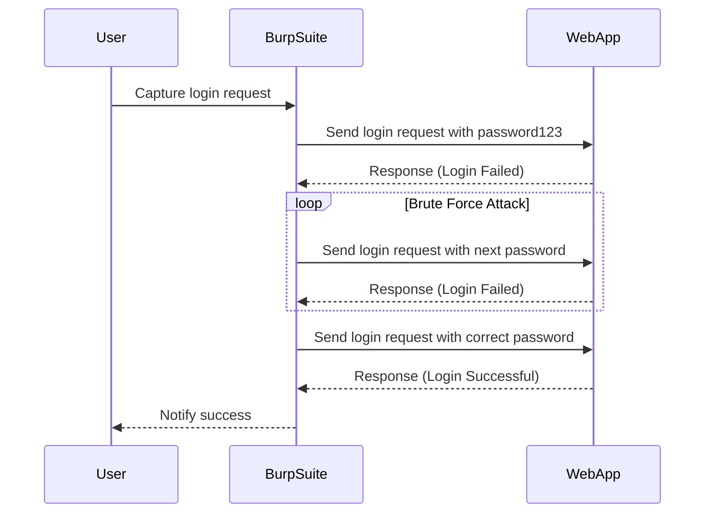

## Lab Setup: Broken Brute Force Protection IP Block

To understand and mitigate this vulnerability, we will work through a practical lab scenario. The lab is titled "Broken Brute Force Protection IP Block" and is part of the Web Security Academy series.

### Accessing the Lab

To access the lab, follow these steps:

1. **Sign Up for Web Security Academy**:
    - Visit the URL `portswigger.net/web-security`.
    - Click on the sign-up button to create an account.
    - Once signed up, log in to your account.

2. **Navigate to the Lab**:
    - Click on the "Academy" tab.
    - Select "All Labs".
    - Search for "authentication vulnerabilities".
    - Select lab number six titled "Broken Brute Force Protection IP Block".

### Lab Objective

The objective of this lab is to exploit the logic flaw in the password brute force protection mechanism and brute force the victim's password. The victim's username is `Carlos`, and you have a list of candidate passwords.

### Tools Required

For this lab, you will need the following tools:

- **Burp Suite Professional**: A comprehensive toolkit for web application security testing.
- **Candidate Password List**: A list of potential passwords to try.

### Setting Up Burp Suite

1. **Start Burp Suite**:
    - Launch Burp Suite Professional.
    - Ensure that the proxy is running and configured to intercept traffic.

2. **Configure Browser**:
    - Set your browser to use Burp Suite as a proxy.
    - Navigate to the lab URL to ensure traffic is being intercepted by Burp Suite.

### Understanding the Vulnerability

The vulnerability in this lab is a broken brute force protection mechanism. Specifically, the application does not effectively block IP addresses after multiple failed login attempts. This allows an attacker to perform a brute force attack by repeatedly attempting different passwords.

### Exploiting the Vulnerability

To exploit the vulnerability, you will use Burp Suite's Intruder tool to automate the process of trying different passwords.

#### Step-by-Step Exploitation

1. **Capture Login Request**:
    - Open the login page of the lab.
    - Use Burp Suite's proxy to capture the login request.
    - The request should look similar to the following:

    ```http
    POST /login HTTP/1.1
    Host: lab.example.com
    Content-Length: 29
    Content-Type: application/x-www-form-urlencoded

    username=Carlos&password=password123
    ```

2. **Set Up Intruder**:
    - Send the captured request to Burp Suite's Intruder.
    - Configure the Intruder to use the candidate password list.
    - Set the attack type to "Sniper" mode.
    - Add the password parameter to the payload position.

3. **Run the Attack**:
    - Start the Intruder attack.
    - Monitor the responses to identify a successful login attempt.

### Full HTTP Request and Response

Here is a complete example of the HTTP request and response during the brute force attack:

```http
POST /login HTTP/1.1
Host: lab.example.com
Content-Length: 29
Content-Type: application/x-www-form-urlencoded

username=Carlos&password=password123
```

Response:

```http
HTTP/1.1 200 OK
Date: Mon, 01 Jan 2024 00:00:00 GMT
Server: Apache/2.4.41 (Ubuntu)
Content-Length: 123
Content-Type: text/html; charset=UTF-8

<!DOCTYPE html>
<html>
<head>
<title>Login</title>
</head>
<body>
<h1>Login Successful</h1>
<p>Welcome, Carlos!</p>
</body>
</html>
```

### Mermaid Diagram: Brute Force Attack Flow



### Common Pitfalls

- **Insufficient Rate Limiting**: Not setting a low enough threshold for failed login attempts.
- **No Account Lockout**: Failing to temporarily lock an account after multiple failed attempts.
- **Weak Passwords**: Using easily guessable passwords makes brute force attacks more likely to succeed.

### How to Prevent / Defend Against Brute Force Attacks

#### Detection

- **Logging and Monitoring**: Implement logging for failed login attempts and monitor for unusual patterns.
- **Security Information and Event Management (SIEM)**: Use SIEM tools to detect and alert on suspicious activity.

#### Prevention

- **Rate Limiting**: Limit the number of login attempts within a specified time frame.
- **Account Lockout**: Temporarily lock an account after a certain number of failed login attempts.
- **IP Blocking**: Block the IP address of an attacker after multiple failed login attempts.
- **Captcha Verification**: Require users to complete a captcha challenge after a certain number of failed login attempts.

#### Secure Coding Fixes

##### Vulnerable Code

```python
def authenticate(username, password):
    user = get_user_by_username(username)
    if user and user.password == password:
        return True
    return False
```

##### Secure Code

```python
import time

failed_attempts = {}

def authenticate(username, password):
    if username in failed_attempts and time.time() - failed_attempts[username] < 60:
        raise Exception("Too many failed attempts. Please try again later.")
    
    user = get_user_by_username(username)
    if user and user.password == password:
        return True
    else:
        failed_attempts[username] = time.time()
        return False
```

### Configuration Hardening

#### Nginx Configuration

```nginx
http {
    limit_req_zone $binary_remote_addr zone=login_limit:10m rate=5r/m;
    
    server {
        location /login {
            limit_req zone=login_limit burst=10 nodelay;
            
            if ($request_method = POST) {
                set $block 1;
            }
            
            if ($block) {
                return 429;
            }
        }
    }
}
```

#### Apache Configuration

```apache
<IfModule mod_security2.c>
    SecRule REQUEST_METHOD "@streq POST" "id:1001,phase:1,t:none,nolog,pass"
    SecRule REQUEST_URI "@streq /login" "id:1002,phase:1,t:none,nolog,pass"
    SecRule IP "@pmFromFile ip_blacklist.txt" "id:1003,phase:1,t:none,deny,status:403,msg:'IP blocked'"
</IfModule>
```

### Hands-On Practice

For hands-on practice, you can use the following labs:

- **PortSwigger Web Security Academy**: Offers a variety of labs to practice web security techniques.
- **OWASP Juice Shop**: A deliberately insecure web application for practicing web security skills.
- **DVWA (Damn Vulnerable Web Application)**: A PHP/MySQL web application that is riddled with vulnerabilities.

These labs provide a safe environment to practice and understand the concepts covered in this chapter.

### Conclusion

Understanding and mitigating authentication vulnerabilities, particularly broken brute force protection, is crucial for securing web applications. By implementing proper rate limiting, account lockout, IP blocking, and captcha verification, you can significantly reduce the risk of brute force attacks. Regularly monitoring and updating your security measures ensures that your application remains secure against evolving threats.

---
<!-- nav -->
[[04-Authentication Vulnerabilities Broken Brute Force Protection|Authentication Vulnerabilities Broken Brute Force Protection]] | [[Web Security (PortSwigger)/13-Authentication Vulnerabilities/07-Lab 6 Broken brute force protection IP block/00-Overview|Overview]] | [[Web Security (PortSwigger)/13-Authentication Vulnerabilities/07-Lab 6 Broken brute force protection IP block/06-Practice Questions & Answers|Practice Questions & Answers]]
