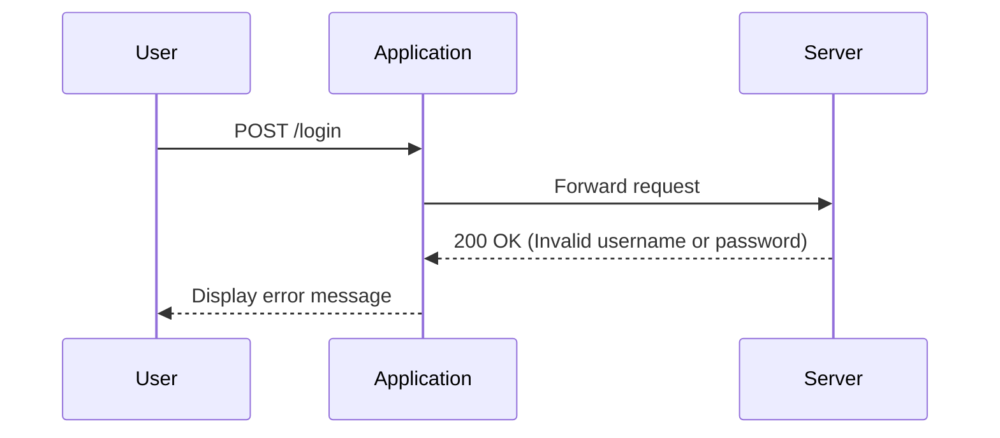

## Introduction to Authentication Vulnerabilities

Authentication vulnerabilities are critical weaknesses in web applications that allow attackers to gain unauthorized access to user accounts. One such vulnerability is **username enumeration via account lock**, which occurs when an application reveals whether a given username exists through account lock mechanisms. This can significantly aid an attacker in identifying valid usernames, which can then be used in brute-force attacks to guess passwords.

### Background Theory

#### What is Username Enumeration?

Username enumeration is a technique where an attacker tries to determine whether a specific username exists within a system. This can be done through various methods, including analyzing error messages, timing differences, or other behavioral patterns of the application.

#### Why Does Username Enumeration Matter?

Understanding whether a username exists is crucial for an attacker because it narrows down the scope of potential targets. Once a valid username is identified, the attacker can focus on guessing the corresponding password, often through brute-force or dictionary attacks.

#### How Does Account Locking Work?

Account locking is a security measure designed to prevent brute-force attacks by temporarily disabling an account after a certain number of failed login attempts. However, if implemented incorrectly, it can inadvertently reveal information about the existence of a username.

### Real-World Examples

#### Recent Breaches and CVEs

One notable example of a breach involving username enumeration is the **LinkedIn breach** in 2012. Attackers were able to identify valid usernames and then use brute-force techniques to guess passwords. Another example is the **Adobe breach** in 2013, where attackers exploited weak password storage practices and potentially used username enumeration to narrow down their targets.

### Lab Setup and Environment

To understand and exploit this vulnerability, we will use the **PortSwigger Web Security Academy**. This platform provides a controlled environment to practice and learn about various web security concepts.

#### Accessing the Lab

1. Visit [PortSwigger Web Security Academy](https://portswigger.net/web-security).
2. Sign up for an account if you don't already have one.
3. Log in and navigate to the **Academy** section.
4. Search for the **authentication labs** and select **lab number seven** titled **username enumeration via account lock**.

### Exploiting Username Enumeration via Account Lock

#### Step-by-Step Mechanics

1. **Identify the Login Endpoint**: The first step is to identify the login endpoint of the application. This is typically a form that accepts a username and password.

2. **Analyze Error Messages**: Observe the error messages returned by the server when incorrect credentials are provided. Look for differences in the error messages based on whether the username exists or not.

3. **Use Burp Suite**: Utilize Burp Suite to intercept and analyze HTTP requests and responses. This will help in identifying patterns that indicate the existence of a username.

4. **Automate with Burp Intruder**: Use Burp Intruder to automate the process of sending multiple login attempts with different usernames. This will help in quickly identifying valid usernames.

#### Full HTTP Request and Response Example

```http
POST /login HTTP/1.1
Host: vulnerable-app.example.com
Content-Type: application/x-www-form-urlencoded
Content-Length: 29

username=admin&password=wrongpass
```

```http
HTTP/1.1 200 OK
Date: Mon, 20 Nov 2023 12:00:00 GMT
Server: Apache/2.4.41 (Ubuntu)
Content-Type: text/html; charset=UTF-8
Content-Length: 1234

<!DOCTYPE html>
<html>
<head>
    <title>Login</title>
</head>
<body>
    <h1>Login Failed</h1>
    <p>Invalid username or password.</p>
</body>
</html>
```

#### Analyzing the Response

Notice the `Content-Length` and the body content. If the username does not exist, the server might return a different error message or a different length.

### Mermaid Diagrams

#### Sequence Diagram for Username Enumeration



### Exploitation Steps

1. **Enumerate Valid Usernames**:
    - Use Burp Intruder to send multiple login attempts with different usernames.
    - Analyze the responses to identify valid usernames.

2. **Brute-Force Passwords**:
    - Once valid usernames are identified, use a password cracking tool like **John the Ripper** or **Hashcat** to guess the passwords.

3. **Access the Account Page**:
    - After successfully logging in, navigate to the account page to confirm successful exploitation.

### Code Examples

#### Python Script for Brute-Forcing Passwords

```python
import requests

def brute_force_password(username, password_list):
    url = "http://vulnerable-app.example.com/login"
    for password in password_list:
        data = {
            "username": username,
            "password": password
        }
        response = requests.post(url, data=data)
        if "Welcome" in response.text:
            print(f"Success! Username: {username}, Password: {password}")
            break

# Example usage
password_list = ["password", "123456", "admin"]
brute_force_password("admin", password_list)
```

### Common Pitfalls and Mistakes

1. **Incorrect Analysis of Error Messages**: Failing to correctly interpret the differences in error messages can lead to missed opportunities for identifying valid usernames.
2. **Over-Throttling**: Automated tools like Burp Intruder should be configured carefully to avoid triggering account locks prematurely.
3. **Ignoring Timing Differences**: Some applications may reveal information through subtle timing differences, which can be overlooked if not analyzed carefully.

### How to Prevent / Defend

#### Detection

1. **Monitor Login Attempts**: Implement logging and monitoring of login attempts to detect unusual patterns.
2. **Behavioral Analysis**: Use machine learning models to detect anomalies in login behavior.

#### Prevention

1. **Consistent Error Messages**: Ensure that error messages are consistent regardless of whether the username exists or not.
2. **Rate Limiting**: Implement rate limiting on login attempts to prevent brute-force attacks.
3. **Account Locking Mechanisms**: Use account locking mechanisms that do not reveal information about the existence of a username.

#### Secure Coding Fixes

##### Vulnerable Code

```python
def login(username, password):
    user = User.query.filter_by(username=username).first()
    if user and user.check_password(password):
        return "Login Successful"
    else:
        return "Invalid username or password"
```

##### Secure Code

```python
def login(username, password):
    user = User.query.filter_by(username=username).first()
    if user:
        if user.check_password(password):
            return "Login Successful"
        else:
            return "Invalid username or password"
    else:
        time.sleep(2)  # Simulate delay to hide timing difference
        return "Invalid username or password"
```

### Conclusion

Understanding and exploiting username enumeration via account lock is crucial for both attackers and defenders. By mastering these techniques, you can better protect your applications against such vulnerabilities. Always ensure that your applications are secure by implementing robust error handling, rate limiting, and consistent error messages.

### Practice Labs

For hands-on experience with this topic, consider the following labs:

- **PortSwigger Web Security Academy**: Lab 7 - Username enumeration via account lock.
- **OWASP Juice Shop**: Various labs related to authentication vulnerabilities.
- **DVWA**: Multiple levels of difficulty for practicing authentication attacks.

By thoroughly understanding and practicing these concepts, you can become proficient in identifying and mitigating authentication vulnerabilities.

---
<!-- nav -->
[[Web Security (PortSwigger)/13-Authentication Vulnerabilities/08-Lab 7 Username enumeration via account lock/00-Overview|Overview]] | [[02-Authentication Vulnerabilities Username Enumeration via Account Lockout|Authentication Vulnerabilities Username Enumeration via Account Lockout]]
