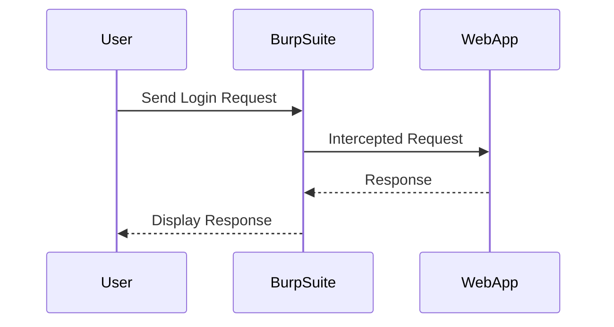
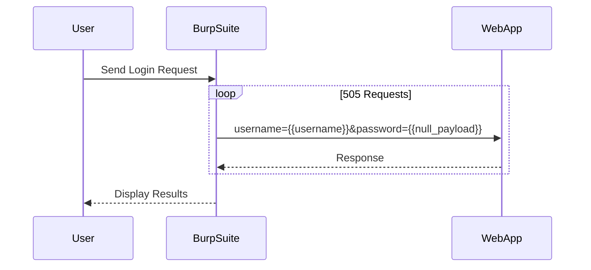

## Authentication Vulnerabilities: Username Enumeration via Account Lockout

### Background Theory

Authentication vulnerabilities are critical issues in web security that can lead to unauthorized access to user accounts. One such vulnerability is **username enumeration via account lockout**, which allows attackers to determine whether a given username exists within a system by observing the behavior of the authentication mechanism.

#### What is Username Enumeration?

Username enumeration occurs when an attacker can determine whether a specific username is valid by analyzing the responses from the server. This can happen through various means, including error messages, response times, or account lockout mechanisms.

#### Why Does Username Enumeration Matter?

Understanding whether a username is valid is a crucial first step for an attacker attempting to gain unauthorized access. Once an attacker knows a valid username, they can focus their efforts on brute-forcing or guessing the corresponding password.

#### How Does Username Enumeration via Account Lockout Work?

When a user enters an incorrect password multiple times, many systems implement an account lockout mechanism to prevent brute-force attacks. However, if the system provides different responses for valid versus invalid usernames, an attacker can use this information to identify valid usernames.

### Real-World Examples

#### Recent CVEs and Breaches

One notable example of username enumeration leading to security breaches is the **CVE-2021-31166** vulnerability in the WordPress plugin "WP User Frontend." This vulnerability allowed attackers to enumerate usernames by observing the behavior of the registration form.

Another example is the breach at **Yahoo** in 2017, where attackers were able to enumerate usernames and subsequently compromise millions of accounts.

### Tools and Techniques

To demonstrate the process of username enumeration via account lockout, we will use a tool called **Burp Suite**, specifically the Intruder module. Burp Suite is a popular web application security testing platform that includes tools for intercepting and manipulating HTTP traffic.

#### Setting Up Burp Suite Intruder

1. **Install Burp Suite**: Download and install Burp Suite from the official website.
2. **Configure Proxy**: Set up Burp Suite as a proxy in your browser settings.
3. **Intercept Traffic**: Use Burp Suite to intercept HTTP traffic between your browser and the target web application.

#### Configuring Intruder

1. **Select Target Request**: Capture a login request using Burp Suite's proxy.
2. **Send to Intruder**: Right-click the captured request and select "Send to Intruder."

#### Payloads and Attack Configuration

In the provided transcript, the lecturer mentions using two types of payloads: **pitchfork** and **cluster bomb**. Let's understand these in detail:

- **Pitchfork**: This payload type sends a single payload to multiple positions in the request. It is useful when you want to test a single value across multiple fields.
- **Cluster Bomb**: This payload type sends multiple payload sets, with each set containing a different combination of values. It is useful when you need to test multiple values across multiple fields.

#### Step-by-Step Configuration

1. **Payloads Tab**:
    - **Position 1**: Add a list of usernames.
    - **Position 2**: Generate five null payloads.



2. **Attack Type**: Select "Cluster Bomb."
3. **Resource Pool**: Set the number of concurrent threads (e.g., 10).

#### Example Code

Here is a complete example of how to configure the Intruder module in Burp Suite:

```plaintext
POST /login HTTP/1.1
Host: example.com
Content-Type: application/x-www-form-urlencoded

username={{username}}&password={{null_payload}}
```



### Pitfalls and Common Mistakes

1. **Incorrect Payload Selection**: Using the wrong payload type can lead to incorrect results. Ensure you use "Cluster Bomb" for multiple payload sets.
2. **Insufficient Requests**: Not sending enough requests can result in missed detections. Ensure you send a sufficient number of requests to cover all combinations.
3. **Ignoring Response Analysis**: Simply observing status codes may not be enough. Analyze the entire response, including headers and body content.

### Detection and Prevention

#### How to Detect

1. **Monitor Login Attempts**: Implement logging and monitoring of login attempts to detect unusual patterns.
2. **Analyze Response Times**: Measure response times to identify discrepancies that may indicate username enumeration attempts.
3. **Review Logs**: Regularly review logs for failed login attempts and unusual activity.

#### How to Prevent

1. **Consistent Error Messages**: Ensure that the server returns consistent error messages regardless of whether the username is valid or not.
2. **Account Lockout Mechanism**: Implement a delay after a certain number of failed login attempts to slow down brute-force attacks.
3. **Rate Limiting**: Apply rate limiting to limit the number of login attempts from a single IP address within a given time frame.

#### Secure Coding Fixes

Here is an example of how to implement a secure login mechanism:

**Vulnerable Code**:

```python
def authenticate(username, password):
    user = User.query.filter_by(username=username).first()
    if user and user.check_password(password):
        return True
    else:
        return False
```

**Secure Code**:

```python
import time

def authenticate(username, password):
    user = User.query.filter_by(username=username).first()
    if user:
        if user.check_password(password):
            return True
        else:
            time.sleep(2)  # Delay to slow down brute-force attacks
            return False
    else:
        time.sleep(2)  # Delay to slow down brute-force attacks
        return False
```

### Complete Example

Here is a complete example of a secure login mechanism with rate limiting:

**Secure Code**:

```python
from flask import Flask, request
from flask_limiter import Limiter

app = Flask(__name__)
limiter = Limiter(app, key_func=lambda: request.remote_addr)

@app.route('/login', methods=['POST'])
@limiter.limit("10/minute")  # Limit to 10 requests per minute
def login():
    username = request.form['username']
    password = request.form['password']
    
    user = User.query.filter_by(username=username).first()
    if user:
        if user.check_password(password):
            return "Login successful"
        else:
            time.sleep(2)
            return "Invalid credentials"
    else:
        time.sleep(2)
        return "Invalid credentials"

if __name__ == '__main__':
    app.run(debug=True)
```

### Conclusion

Understanding and preventing username enumeration via account lockout is crucial for maintaining the security of web applications. By implementing consistent error messages, account lockout mechanisms, and rate limiting, you can significantly reduce the risk of such attacks.

### Hands-On Practice

For hands-on practice, consider using the following labs:

- **PortSwigger Web Security Academy**: Offers a comprehensive set of labs covering various web security topics, including authentication vulnerabilities.
- **OWASP Juice Shop**: A deliberately insecure web application designed for security training and research.
- **DVWA (Damn Vulnerable Web Application)**: A PHP/MySQL web application that is riddled with vulnerabilities for educational purposes.

These labs provide practical experience in identifying and mitigating authentication vulnerabilities, including username enumeration via account lockout.

---
<!-- nav -->
[[Web Security (PortSwigger)/13-Authentication Vulnerabilities/08-Lab 7 Username enumeration via account lock/01-Introduction to Authentication Vulnerabilities|Introduction to Authentication Vulnerabilities]] | [[Web Security (PortSwigger)/13-Authentication Vulnerabilities/08-Lab 7 Username enumeration via account lock/00-Overview|Overview]] | [[Web Security (PortSwigger)/13-Authentication Vulnerabilities/08-Lab 7 Username enumeration via account lock/03-Practice Questions & Answers|Practice Questions & Answers]]
