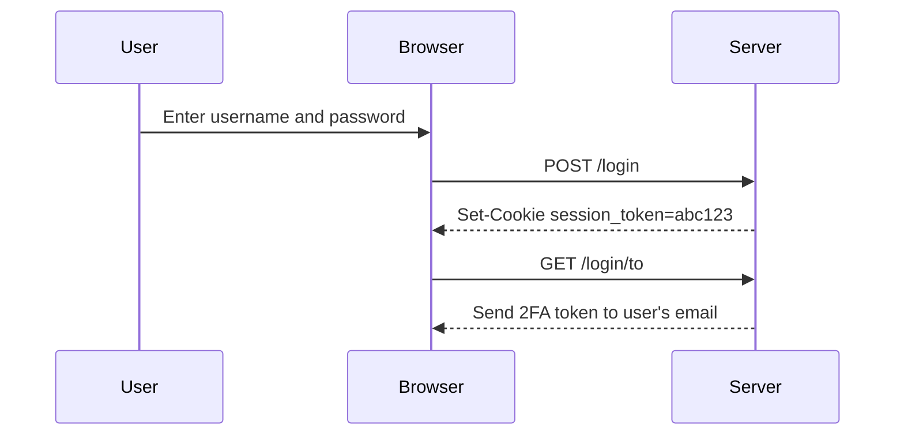
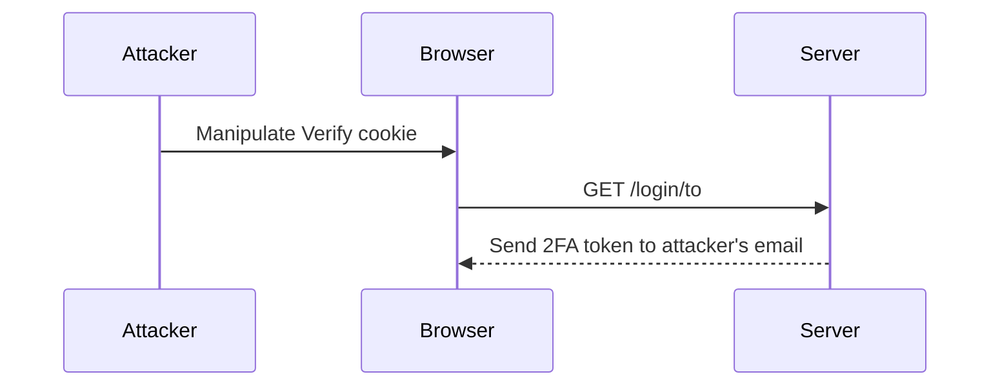

## Introduction to Authentication Vulnerabilities

Authentication vulnerabilities are critical weaknesses in web applications that allow attackers to bypass or manipulate the authentication mechanisms designed to protect user accounts. These vulnerabilities can lead to unauthorized access, data theft, and other severe consequences. In this chapter, we will delve deep into a specific type of authentication vulnerability related to two-factor authentication (2FA) and explore how it can be exploited and prevented.

### Background Theory

Authentication is the process of verifying the identity of a user attempting to access a system. Typically, this involves a combination of something the user knows (like a password), something the user has (like a physical token), and something the user is (like biometric data). Two-factor authentication (2FA) adds an additional layer of security by requiring users to provide two different forms of identification.

In the context of web applications, 2FA often involves sending a verification code to the user’s registered email or phone number after they enter their username and password. This ensures that even if an attacker gains access to the user’s credentials, they would still need access to the user’s secondary device to complete the authentication process.

### Understanding the Vulnerability

The vulnerability described in the lecture transcript involves a flaw in the 2FA mechanism of a web application. Specifically, the issue lies in how the 2FA token is generated and sent to the user. Let's break down the components involved:

1. **Login Request**: A POST request to the login page that includes the username and password.
2. **2FA Token Generation Endpoint**: An endpoint that generates the 2FA token and sends it to the user’s email address.
3. **Session Management**: Cookies used to maintain the session across requests.
4. **Verification Cookie**: A cookie named `Verify` that contains the username of the user.

#### Detailed Analysis

When a user attempts to log in, the following steps occur:

1. **POST Request to Login Page**:
    ```http
    POST /login HTTP/1.1
    Host: example.com
    Content-Type: application/x-www-form-urlencoded
    Content-Length: 29

    username=admin&password=secret
    ```

2. **2FA Token Generation**:
    The application generates a 2FA token and sends it to the user’s email address. This is done via an endpoint `/login/to`.

    ```http
    GET /login/to HTTP/1.1
    Host: example.com
    Cookie: session_token=abc123; Verify=admin
    ```

Here, the `session_token` cookie maintains the session, and the `Verify` cookie contains the username `admin`. The issue arises because the `Verify` cookie is used to determine the recipient of the 2FA token.

#### Exploitation

An attacker can exploit this vulnerability by manipulating the `Verify` cookie to send the 2FA token to a different user’s email address. For example, if an attacker sets the `Verify` cookie to `attacker`, the 2FA token will be sent to the email associated with the `attacker` user instead of the intended user.

```http
GET /login/to HTTP/1.1
Host: example.com
Cookie: session_token=abc123; Verify=attacker
```

This allows the attacker to intercept the 2FA token and potentially gain access to the user’s account.

### Real-World Examples

This type of vulnerability has been observed in various real-world scenarios. For instance, in the past, some web applications have had similar issues where the 2FA token was sent to the wrong user due to improper handling of session management and cookies.

One notable example is the breach at a major financial institution where attackers were able to manipulate the 2FA process by exploiting a similar vulnerability. This led to unauthorized access to customer accounts and significant financial losses.

### How to Prevent / Defend

To prevent such vulnerabilities, it is crucial to implement proper session management and ensure that sensitive information like usernames are not exposed in cookies or other easily accessible areas.

#### Secure Coding Practices

1. **Avoid Storing Sensitive Information in Cookies**: Instead of storing the username in a cookie, use server-side session management to track the user’s session.
   
   ```python
   # Vulnerable Code
   response.set_cookie('Verify', user.username)

   # Secure Code
   session['username'] = user.username
   ```

2. **Use Secure Cookies**: Ensure that cookies are marked as `HttpOnly` and `Secure` to prevent them from being accessed by JavaScript and transmitted over HTTPS.

   ```http
   Set-Cookie: session_token=abc123; HttpOnly; Secure
   ```

3. **Validate User Input**: Always validate and sanitize user input to prevent injection attacks and other forms of manipulation.

   ```python
   # Vulnerable Code
   verify_username = request.cookies.get('Verify')

   # Secure Code
   verify_username = request.session.get('username')
   ```

#### Detection and Prevention Tools

1. **Static Application Security Testing (SAST)**: Use tools like SonarQube, Fortify, or Veracode to scan your codebase for vulnerabilities related to session management and cookie handling.

2. **Dynamic Application Security Testing (DAST)**: Use tools like Burp Suite, OWASP ZAP, or Acunetix to test your application in a live environment and identify runtime vulnerabilities.

3. **Configuration Hardening**: Ensure that your web server and application configurations are hardened against common vulnerabilities. For example, configure your web server to enforce HTTPS and mark cookies as `HttpOnly`.

   ```nginx
   server {
       listen 443 ssl;
       ssl_certificate /etc/nginx/ssl/certificate.crt;
       ssl_certificate_key /etc/nginx/ssl/certificate.key;

       location / {
           add_header Set-Cookie "session_token=abc123; HttpOnly; Secure";
       }
   }
   ```

### Mermaid Diagrams

#### Session Management Flow



#### Exploitation Sequence



### Practice Labs

For hands-on practice with authentication vulnerabilities, consider the following labs:

- **PortSwigger Web Security Academy**: Offers a comprehensive set of labs covering various aspects of web security, including authentication vulnerabilities.
- **OWASP Juice Shop**: A deliberately insecure web application for practicing web security skills.
- **DVWA (Damn Vulnerable Web Application)**: A PHP/MySQL web application that is riddled with vulnerabilities for educational purposes.
- **WebGoat**: An interactive, gamified training application for learning about web security.

These labs provide realistic environments to test and understand the concepts discussed in this chapter.

### Conclusion

Understanding and preventing authentication vulnerabilities is crucial for maintaining the security of web applications. By implementing proper session management, avoiding the storage of sensitive information in cookies, and using secure coding practices, developers can significantly reduce the risk of such vulnerabilities. Regular testing and hardening of configurations are also essential to ensure the security of web applications.

---
<!-- nav -->
[[01-Introduction to 2FA Broken Logic|Introduction to 2FA Broken Logic]] | [[Web Security (PortSwigger)/13-Authentication Vulnerabilities/09-Lab 8 2FA broken logic/00-Overview|Overview]] | [[03-Authentication Vulnerabilities 2FA Broken Logic|Authentication Vulnerabilities 2FA Broken Logic]]
