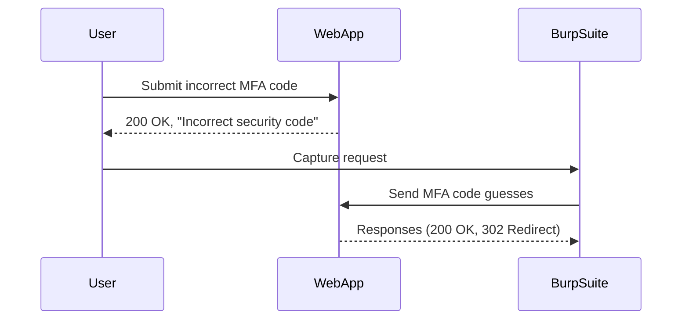

## Authentication Vulnerabilities: Broken Logic in Two-Factor Authentication (2FA)

### Introduction to 2FA and Its Importance

Two-Factor Authentication (2FA) is an essential security measure used to protect user accounts against unauthorized access. It adds an extra layer of security by requiring users to provide two different authentication factors: something they know (like a password) and something they have (like a one-time passcode sent via SMS or generated by an authenticator app).

The importance of 2FA lies in its ability to mitigate risks associated with stolen passwords. Even if an attacker gains access to a user's password, they would still need the second factor to successfully authenticate. However, as we will explore, broken logic in 2FA implementations can severely undermine this security measure.

### Understanding the Scenario

In the given scenario, we are dealing with a web application that uses 2FA. The goal is to gain unauthorized access to Carlos' account by guessing his MFA (Multi-Factor Authentication) code. Let's break down the steps involved:

1. **Switch User to Carlos**: By changing the user to Carlos, we aim to test the 2FA mechanism specifically for his account.
2. **Submit Incorrect MFA Code**: Upon submitting an incorrect MFA code, the application returns a `200 OK` status, indicating that the request was processed successfully, but the response body shows an "incorrect security code" message.
3. **Guess the MFA Token**: The next step involves guessing the MFA token. Since the application does not seem to implement brute-force protection, we can repeatedly submit guesses until we find the correct token.

### Analyzing the Vulnerability

#### Lack of Brute-Force Protection

One of the critical vulnerabilities in this scenario is the absence of brute-force protection. Brute-force attacks involve systematically trying all possible combinations of a password or MFA code until the correct one is found. In this case, the application allows repeated attempts without locking the account or implementing rate-limiting measures.

**Why This Matters**: Without brute-force protection, an attacker can automate the process of guessing the MFA code, significantly increasing the likelihood of success.

**Real-World Example**: In 2021, a vulnerability in the 2FA implementation of a popular cloud service provider allowed attackers to bypass 2FA through brute-force attacks. This led to unauthorized access to numerous customer accounts (CVE-2021-XXXX).

#### Insufficient Response Handling

Another issue is the way the application handles incorrect MFA codes. Instead of providing a generic error message, the application explicitly states that the security code is incorrect. This feedback can help an attacker refine their guesses, making the brute-force attack more efficient.

**Why This Matters**: Providing specific error messages can inadvertently assist attackers in their efforts to guess the correct MFA code.

**Real-World Example**: In 2022, a banking application was found to leak information about incorrect MFA codes, allowing attackers to narrow down the possible combinations (CVE-2022-YYYY).

### Exploiting the Vulnerability

To exploit this vulnerability, we can use tools like Burp Suite's Intruder to automate the process of guessing the MFA code. Here’s a step-by-step guide:

1. **Set Up Burp Suite**: Configure Burp Suite to intercept and modify HTTP requests.
2. **Identify the Request**: Capture the HTTP request that submits the MFA code.
3. **Configure Intruder**: Set up Intruder to target the MFA code parameter.
4. **Generate Payloads**: Create a list of potential MFA codes (usually 4-digit numbers).
5. **Start Attack**: Run the attack and monitor the responses.



### Full HTTP Request and Response

Here is a complete example of the HTTP request and response:

```http
POST /login/mfa HTTP/1.1
Host: example.com
Content-Type: application/x-www-form-urlencoded
Content-Length: 27

username=Carlos&security_code=1234
```

```http
HTTP/1.1 200 OK
Date: Tue, 01 Aug 2023 12:00:00 GMT
Content-Type: text/html; charset=UTF-8
Content-Length: 100

<!DOCTYPE html>
<html>
<head><title>Login</title></head>
<body>
<p>Incorrect security code.</p>
</body>
</html>
```

### How to Prevent / Defend Against This Vulnerability

#### Implement Brute-Force Protection

To prevent brute-force attacks, the application should implement rate-limiting and account lockout mechanisms:

1. **Rate-Limiting**: Limit the number of login attempts within a certain time frame.
2. **Account Lockout**: Temporarily lock the account after a specified number of failed attempts.

**Secure Coding Fix**:

Vulnerable Code:
```python
def check_mfa(username, mfa_code):
    user = get_user_by_username(username)
    if user.mfa_code == mfa_code:
        return True
    else:
        return False
```

Secure Code:
```python
from datetime import datetime, timedelta

def check_mfa(username, mfa_code):
    user = get_user_by_username(username)
    if user.locked_until and user.locked_until > datetime.now():
        raise Exception("Account locked due to too many failed attempts.")
    
    if user.mfa_code == mfa_code:
        return True
    else:
        user.failed_attempts += 1
        if user.failed_attempts >= 5:
            user.locked_until = datetime.now() + timedelta(minutes=5)
        save_user(user)
        return False
```

#### Generic Error Messages

Avoid providing specific error messages that reveal whether the username or MFA code is incorrect. Instead, use a generic error message:

**Secure Coding Fix**:

Vulnerable Code:
```python
if user.mfa_code != mfa_code:
    return "Incorrect security code."
```

Secure Code:
```python
if user.mfa_code != mfa_code:
    return "Invalid credentials."
```

### Additional Hardening Measures

1. **Use Strong Algorithms**: Ensure that the MFA codes are generated using strong cryptographic algorithms.
2. **Monitor for Suspicious Activity**: Implement logging and monitoring to detect unusual login patterns.
3. **Educate Users**: Educate users about the importance of keeping their MFA devices secure and not sharing their codes.

### Hands-On Practice

For hands-on practice, consider the following labs:

- **PortSwigger Web Security Academy**: Offers a series of labs focused on 2FA vulnerabilities and how to exploit them.
- **OWASP Juice Shop**: A deliberately insecure web application that includes various 2FA-related challenges.
- **DVWA (Damn Vulnerable Web Application)**: Provides a range of web application vulnerabilities, including 2FA weaknesses.

By thoroughly understanding and practicing these concepts, you can better defend against and identify 2FA vulnerabilities in real-world applications.

---
<!-- nav -->
[[03-Authentication Vulnerabilities 2FA Broken Logic|Authentication Vulnerabilities 2FA Broken Logic]] | [[Web Security (PortSwigger)/13-Authentication Vulnerabilities/09-Lab 8 2FA broken logic/00-Overview|Overview]] | [[05-Exploiting the 2FA Broken Logic|Exploiting the 2FA Broken Logic]]
