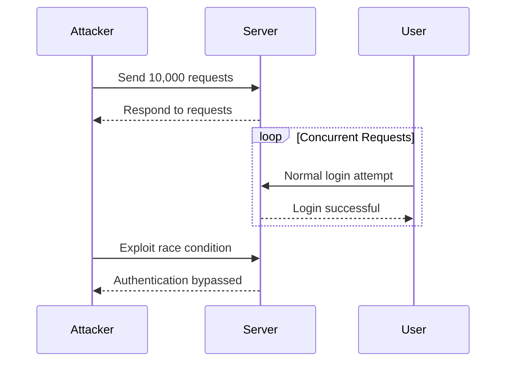

## Multi-Threading in Web Security

### Background Theory

Multi-threading is a technique used in programming to allow multiple threads of execution to run concurrently within a single process. This can significantly speed up tasks that involve performing many operations simultaneously, such as making multiple HTTP requests to a server. In the context of web security, multi-threading can be particularly useful for testing authentication mechanisms, especially when dealing with large numbers of requests.

### Why Multi-Threading Matters

When testing authentication mechanisms, such as two-factor authentication (2FA), it is often necessary to send a large number of requests to the server to simulate various attack scenarios. Without multi-threading, sending 10,000 individual requests would take an extremely long time, potentially making the testing impractical or unfeasible. By using multi-threading, these requests can be sent concurrently, drastically reducing the overall time required.

### How Multi-Threading Works

In Python, one of the most commonly used languages for web security testing, multi-threading can be implemented using the `threading` module. Here’s a basic example of how to use multi-threading to make multiple HTTP requests:

```python
import threading
import requests

def send_request(url):
    response = requests.get(url)
    print(f"Response from {url}: {response.status_code}")

def main():
    url = "http://example.com"
    threads = []

    for _ in range(10000):
        thread = threading.Thread(target=send_request, args=(url,))
        threads.append(thread)
        thread.start()

    for thread in threads:
        thread.join()

if __name__ == "__main__":
    main()
```

### Real-World Example: CVE-2021-21972

CVE-2021-21972 is a real-world example where multi-threading could have been used to test the vulnerability. This CVE involved a race condition in the authentication mechanism of a web application, allowing attackers to bypass authentication by making concurrent requests. Using multi-threading, security researchers could have simulated the attack scenario more effectively.

### Pitfalls of Multi-Threading

While multi-threading can significantly speed up the testing process, it also introduces several challenges:

1. **Resource Management**: Managing resources efficiently is crucial. Too many threads can lead to resource exhaustion, causing the system to slow down or crash.
2. **Thread Safety**: Ensuring that shared resources are accessed safely is essential to avoid data corruption or inconsistent states.
3. **Complexity**: Multi-threaded code can be more complex and harder to debug than single-threaded code.

### How to Prevent / Defend

#### Detection

To detect potential issues related to multi-threading, you can use tools like `gdb` for debugging or `Valgrind` for memory leak detection. Additionally, static analysis tools like `SonarQube` can help identify concurrency-related issues in your code.

#### Prevention

1. **Use Thread-Safe Data Structures**: Ensure that shared data structures are thread-safe. For example, use `threading.Lock` to synchronize access to shared resources.
2. **Limit the Number of Threads**: Set a reasonable limit on the number of threads to avoid resource exhaustion.
3. **Use High-Level Concurrency Libraries**: Libraries like `concurrent.futures` provide higher-level abstractions that simplify multi-threading.

#### Secure Code Fix

Here’s an example of how to securely implement multi-threading in Python:

**Vulnerable Code:**

```python
import threading
import requests

def send_request(url):
    response = requests.get(url)
    print(f"Response from {url}: {response.status_code}")

def main():
    url = "http://example.com"
    threads = []

    for _ in range(10000):
        thread = threading.Thread(target=send_request, args=(url,))
        threads.append(thread)
        thread.start()

    for thread in threads:
        thread.join()

if __name__ == "__main__":
    main()
```

**Secure Code:**

```python
import threading
import requests

def send_request(url, lock):
    with lock:
        response = requests.get(url)
        print(f"Response from {url}: {response.status_code}")

def main():
    url = "http://example.com"
    threads = []
    lock = threading.Lock()

    for _ in range(10000):
        thread = threading.Thread(target=send_request, args=(url, lock))
        threads.append(thread)
        thread.start()

    for thread in threads:
        thread.join()

if __name__ == "__main__":
    main()
```

### Complete Example: HTTP Requests and Responses

Let’s consider a scenario where we are testing a 2FA mechanism. We will send multiple HTTP requests to simulate the attack scenario.

**HTTP Request:**

```http
GET /login HTTP/1.1
Host: example.com
User-Agent: Mozilla/5.0
Accept: */*
```

**HTTP Response:**

```http
HTTP/1.1 200 OK
Date: Mon, 27 Mar 2023 12:00:00 GMT
Server: Apache/2.4.41 (Ubuntu)
Content-Type: text/html; charset=UTF-8
Content-Length: 1234
Connection: close

<!DOCTYPE html>
<html>
<head>
<title>Login</title>
</head>
<body>
<form action="/submit" method="POST">
<input type="text" name="username" placeholder="Username">
<input type="password" name="password" placeholder="Password">
<button type="submit">Login</button>
</form>
</body>
</html>
```

### Mermaid Diagram: Attack Chain



### Hands-On Labs

For hands-on practice with multi-threading in web security, consider the following labs:

- **PortSwigger Web Security Academy**: Offers a variety of labs that cover different aspects of web security, including authentication vulnerabilities.
- **OWASP Juice Shop**: A deliberately insecure web application that includes various security challenges, including those related to authentication.
- **DVWA (Damn Vulnerable Web Application)**: Another popular web application for practicing web security techniques, including multi-threading attacks.

By mastering multi-threading in the context of web security, you can significantly enhance your ability to test and secure web applications against various attack vectors.

---
<!-- nav -->
[[07-How to Prevent  Defend Against 2FA Broken Logic|How to Prevent  Defend Against 2FA Broken Logic]] | [[Web Security (PortSwigger)/13-Authentication Vulnerabilities/09-Lab 8 2FA broken logic/00-Overview|Overview]] | [[09-Understanding Two-Factor Authentication (2FA)|Understanding Two-Factor Authentication (2FA)]]
